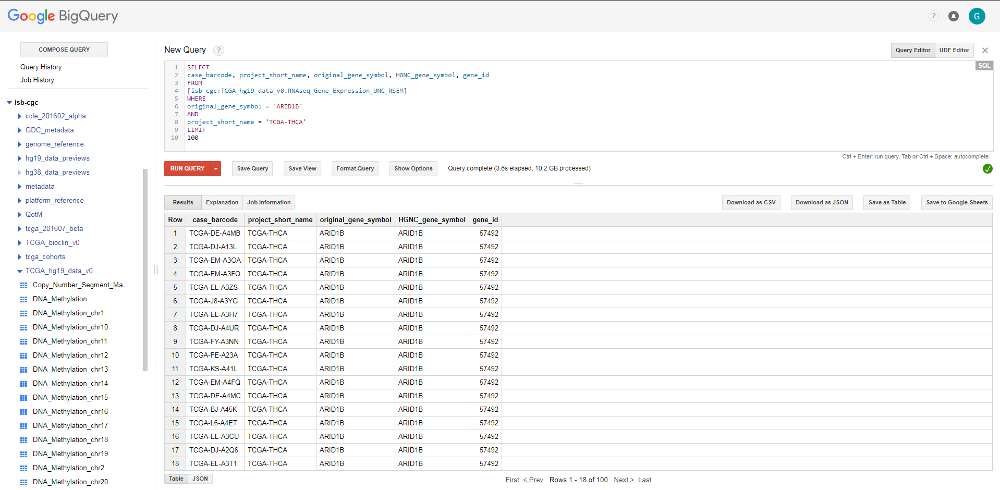
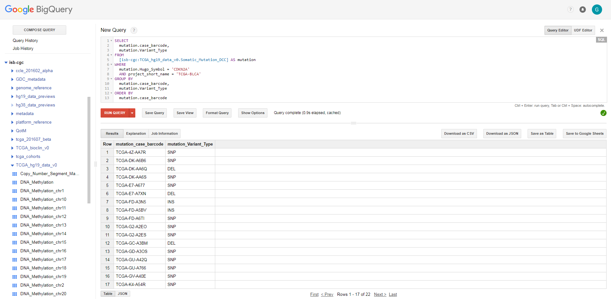
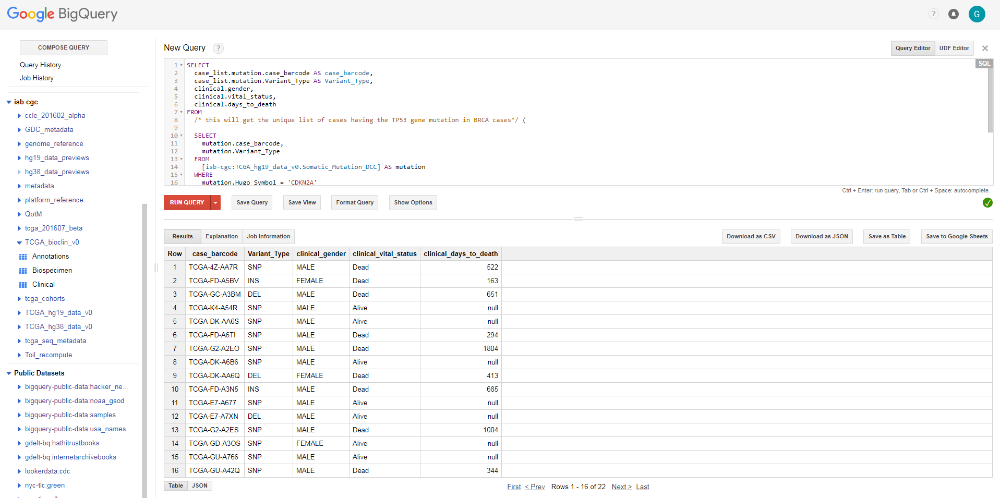
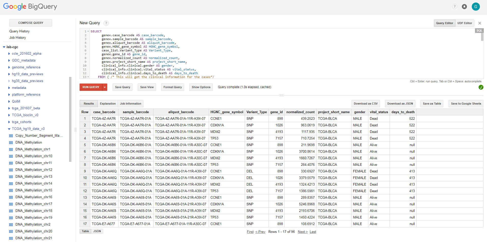

==================================
Walk Through of Google BigQuery
==================================
This will serve as a guide to navigate through the Google web-interface for BigQuery and do some introductory queiries using ISB-CGC hosted TCGA data.  For those who would rather use R or Python to programmatically interact with BigQuery, detailed tutorials are provided `here <http://isb-cancer-genomics-cloud.readthedocs.org/en/latest/sections/progapi/Tutorials.html>`_.

***************
Gaining Access
***************
Please refer to documentation on `how to access BigQuery from the Google Console <HowToAccessBigQueryFromTheGoogleCloudPlatform.html>`_ if you have not done this before. 

Also to add ISB-CGC data to your BigQuery platform please refer to the documentaion for `linking ISB-CGC data to BigQuery in the Google Console <LinkingBigQueryToIsb-cgcProject.html>`_.

*****************************
ISB-CGC Data Sets in BigQuery
*****************************
ISB-CGC maintains multiple `data sets in BigQuery <../../data/data2/data_in_BQ.html>`__ including:

* `TCGA clinical, biospecimen and molecular data <../../data/data2/data_in_BQ.html#tcga-clinical-biospecimen-and-molecular-data>`__
* `TARGET clinical, biospecimen and molecular data <../../data/data2/data_in_BQ.html#target-clinical-biospecimen-and-molecular-data>`__
* `A wide variety of related metadata <../../data/data2/data_in_BQ.html#additional-metadata>`__

With the exception of the COSMIC mutation data, all data in BigQuery is open for general use.

************************
Syntax Queries Examples
************************
Below are some sample queries that will get you started using BigQuery and these ISB-CGC datasets for your own analyses.  One easy way is to use the BigQuery web UI (see screenshot below).  See Google's `BigQuery Web UI Tutorial <https://developers.google.com/bigquery/docs/hello_bigquery_gui>`_ for more general details of how to use this tool.

The examples below show the question that is being asked, and an example BigQuery SQL syntax that can be used to find the answer.  Try it yourself by pasting the query into your own instance of the BigQuery web UI.

Getting information from one table
##################################

**Q: Find all THCA participants with UNC HiSeq gene expression data for the ARID1B gene**

.. code-block:: sql

    SELECT
      case_barcode, project_short_name, original_gene_symbol, HGNC_gene_symbol, gene_id
    FROM
      [isb-cgc:TCGA_hg19_data_v0.RNAseq_Gene_Expression_UNC_RSEM]
    WHERE
      original_gene_symbol = 'ARID1B'
    AND
      project_short_name = 'TCGA-THCA' LIMIT 100
  

  
Getting information from more than one table (Joining)
######################################################

**Q: For bladder cancer patients that have mutations in the CDKN2A (cyclin-dependent kinase inhibitor 2A) gene, what types of mutations are they, what is their gender, vital status, and days to death - and for 3 downstream genes (MDM2 (MDM2 proto-oncogene), TP53 (tumor protein p53), CDKN1A (cyclin-dependent kinase inhibitor 1A)), what are the gene expression levels for each patient?**

This question was chosen as an interesting example because the p53/Rb pathway is commonly involved in bladder cancer (see `TCGA Network paper <https://tcga-data.nci.nih.gov/docs/publications/blca_2013/>`_ "Comprehensive Molecular Characterization of Urothelial Bladder Carcinoma", Figure 4).

This is a complex question that requires information from four tables.  We will build up this complex query in three stages.

Stage 1
*******
Finding the patients with bladder cancer that have mutations in the CDKN2A gene, and displaying the patient ID and 
the type of mutation

.. code-block:: sql

    SELECT
      mutation.case_barcode,
      mutation.Variant_Type
    FROM
      [isb-cgc:TCGA_hg19_data_v0.Somatic_Mutation_DCC] AS mutation
    WHERE
      mutation.Hugo_Symbol = 'CDKN2A'
      AND project_short_name = 'TCGA-BLCA'
    GROUP BY
      mutation.case_barcode,
      mutation.Variant_Type
    ORDER BY
      mutation.case_barcode

   
We now have the list of patients that have a mutation in the CDKN2A gene and the type of mutation.

Notice that we have named the "isb-cgc:TCGA_hg19_data_v0.Somatic_Mutation_DCC" table "mutation" using the AS statement.  This is useful for easier reading and composing of complex queries.

Stage 2
*******
Bringing in the patient data from the ISB-CGC TCGA Clinical table so that we can see each patient's gender, vital status and days to death.

.. code-block:: sql

    SELECT
      case_list.mutation.case_barcode AS case_barcode,
      case_list.mutation.Variant_Type AS Variant_Type,
      clinical.gender,
      clinical.vital_status,
      clinical.days_to_death
    FROM
      /* this will get the unique list of cases having the TP53 gene mutation in BRCA cases*/ (
      
      SELECT
        mutation.case_barcode,
        mutation.Variant_Type
      FROM
        [isb-cgc:TCGA_hg19_data_v0.Somatic_Mutation_DCC] AS mutation
      WHERE
        mutation.Hugo_Symbol = 'CDKN2A'
        AND project_short_name = 'TCGA-BLCA'
      GROUP BY
        mutation.case_barcode,
        mutation.Variant_Type
      ORDER BY
        mutation.case_barcode,
        ) AS case_list /* end case_list */
    JOIN
      [isb-cgc:TCGA_bioclin_v0.Clinical] AS clinical
    ON
      case_list.case_barcode = clinical.case_barcode
  

   
We now have combined information from two tables through a join.  Notice in particular the join syntax, 
and the fact that
for the join (inner join by default), the fields that are identiical between the mutation table and the clinical table is "case_barcode".  

Stage 3
*******
Show the gene expression levels for the 4 genes of interest, and order them by case id (Case Barcode) and gene name (HGNC_gene_symbol).  
  
.. code-block:: sql

    SELECT
      genex.case_barcode AS case_barcode,
      genex.sample_barcode AS sample_barcode,
      genex.aliquot_barcode AS aliquot_barcode,
      genex.HGNC_gene_symbol AS HGNC_gene_symbol,
      case_list.Variant_Type AS Variant_Type,
      genex.gene_id AS gene_id,
      genex.normalized_count AS normalized_count,
      genex.project_short_name AS project_short_name,
      clinical_info.clinical.gender AS gender,
      clinical_info.clinical.vital_status AS vital_status,
      clinical_info.clinical.days_to_death AS days_to_death
    FROM ( /* This will get the clinical information for the cases*/
      SELECT
        case_list.mutation.Variant_Type AS Variant_Type,
        case_list.mutation.case_barcode AS case_barcode,
        clinical.gender,
        clinical.vital_status,
        clinical.days_to_death
      FROM
        /* this will get the unique list of casess having the CDKN2A gene mutation in bladder cancer BLCA cases*/ (
        
        SELECT
          mutation.case_barcode,
          mutation.Variant_Type
        FROM
          [isb-cgc:TCGA_hg19_data_v0.Somatic_Mutation_DCC] AS mutation
        WHERE
          mutation.Hugo_Symbol = 'CDKN2A'
          AND project_short_name = 'TCGA-BLCA'
        GROUP BY
          mutation.case_barcode,
          mutation.Variant_Type
        ORDER BY
          mutation.case_barcode,
          ) AS case_list /* end case_list */
      INNER JOIN
        [isb-cgc:TCGA_bioclin_v0.Clinical] AS clinical
      ON
        case_list.case_barcode = clinical.case_barcode /* end clinical annotation */ ) AS clinical_info
    INNER JOIN
      [isb-cgc:TCGA_hg19_data_v0.RNAseq_Gene_Expression_UNC_RSEM] AS genex
    ON
      genex.case_barcode = case_list.case_barcode
    WHERE
      genex.HGNC_gene_symbol IN ('MDM2',
        'TP53',
        'CDKN1A',
        'CCNE1')
    ORDER BY
      case_barcode,
      HGNC_gene_symbol

We have now gotten all the data together in one table for further analysis.  

Note that the final join surrounds the previous join top and bottom.  This is common method of doing joins.

You can either download the results from a query in either CSV or JSON format, or save it for further analysis in Google BigQuery by the "Save as Table" button.  As the next section describes, large queries continuing to combine multiple tables in a gene query may be limited by cost and resources, saving results as intermediate tables is a solution to these issues.

*********************************************
Saving Query Results in other BigQuery Tables
*********************************************
You can easily save Query results in intermediate tables in your project, allowing others to view and use them.  Details from Google on how to do that is `here <https://cloud.google.com/bigquery/bigquery-web-ui>`_.  If your query gets too complex it can take too long to run.  Creating intermediate result tables can be a good approach to obtain the same result more quickly and at a lower cost. 

*****************************
For Additional Google Support
*****************************
Google provides its users with a detailed explanation of BigQuery and how it works. 

 -https://cloud.google.com/bigquery/what-is-bigquery 

Google also provides a query reference guide 

 -https://cloud.google.com/bigquery/query-reference 

***************
Important Note
***************
`Here <https://cloud.google.com/bigquery/pricing>`_ is information about how much does it costs to use BigQuery.  Queries are billed according to how much data is scanned during the course of the query, and the rate is $5 per TB, although the first 1 TB is free each month.
You can keep an eye on your GCP expenses on your Google Cloud Platform `Console home page <https://console.cloud.google.com/home/dashboard>`_.
