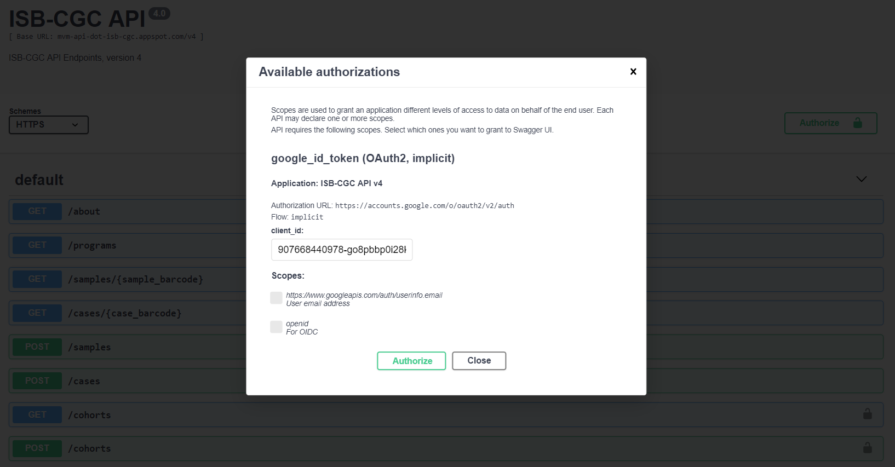
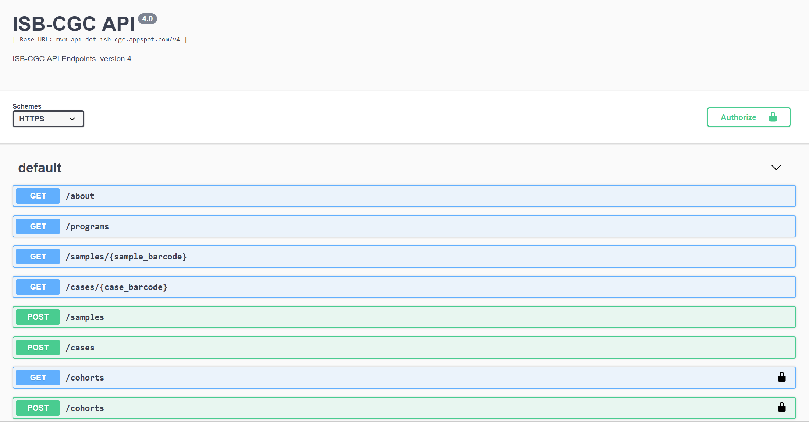
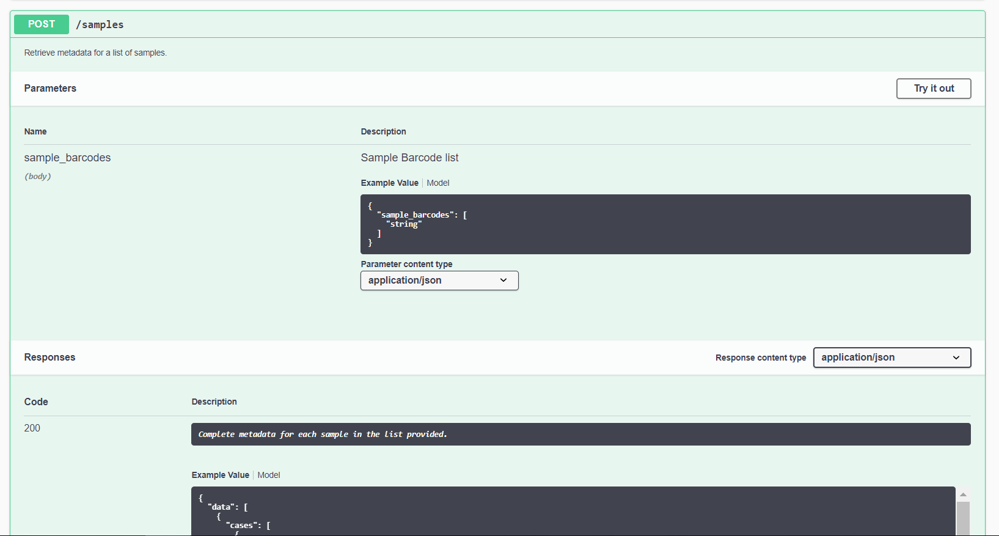
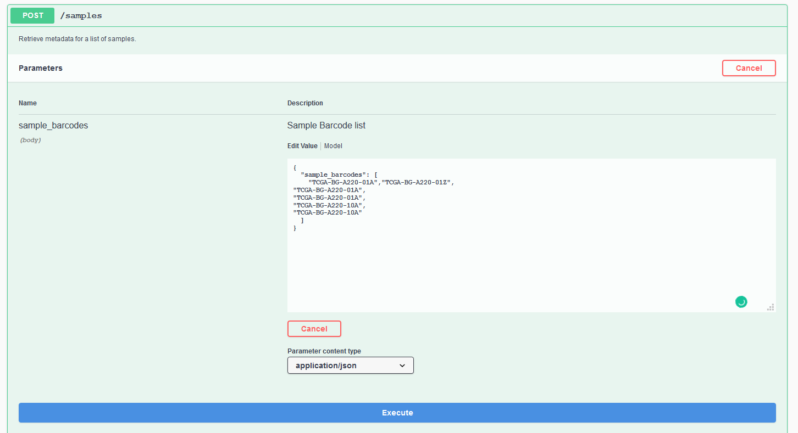
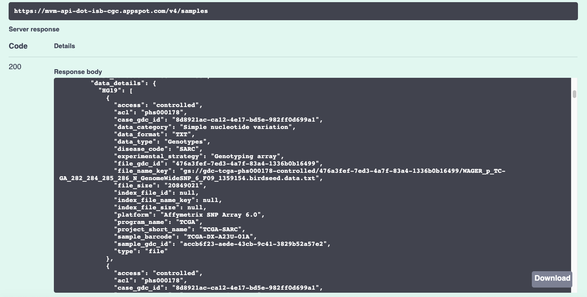

*************
ISB-CGC APIs
*************

ISB-CGC APIs v4
===============

`ISB-CGC-API-v4 <https://api-dot-isb-cgc.appspot.com/v4/swagger/>`_

About
======

API stands for Application Programming Interface. An API is a software intermediary that allows two applications to talk to each other.
In other words, an API is the messenger that delivers your request to the provider that you’re requesting it from and then delivers the
response back to you. Programmatic access to data within the ISB-CGC platform uses a combination of ISB-CGC APIs and `Swagger UI
<https://swagger.io/>`_ documentation.

The ISB-CGC API provides an interface to the ISB-CGC metadata stored in BigQuery, and consists of several “endpoints”, implemented using Google Cloud Endpoints. Programmatic access to ISB-CGC data and metadata is provided through ISB-CGC APIs built on Google's OpenAPI Endpoints. A `SwaggerUI interface <https://api-dot-isb-cgc.appspot.com/v4/swagger/>`_ is also available to try out the APIs and view their documentation. User-generated data such as cohort definitions, and user functions such as registering GCP projects is also available through the ISB-CGC API Endpoints. 

Some example use-cases include:

- Obtaining detailed metadata about a particular patient or sample
- Creating (or retrieving a previously saved) cohort of patients and samples, based on a defined set of criteria
- Retrieving a cohort's file manifest using the cohort ID
- Retrieve a cohort's file manifest based on filters provided
- Register, refresh, and unregister a specified Google Cloud Project

**Note that all user-generated APIs require identity credentials for use.**

Authorization
=============

The ISB-CGC APIs can be used programmatically with R and python. Some of the APIs can be accessed without authorization such as the programs, samples, and cases APIS but other APIs such as the cohorts and gcp APIs require authorization to access. This authorization is not related to controlled-access data: these endpoints do not operate on or directly return any controlled data. Instead, authorization is related to saving or retrieving cohorts because cohorts are private to the user who created the cohort (and anyone the cohort owner has chosen to share the cohort with).

Programmatic Authorization
--------------------------

In order to access the APIs that require ISB-CGC authorization, you will need a credentials file available on your local machine or on your VM. One way to create a credentials file is as follows:
1. Clone the ISB-CGC scripts git repository to your local machine
2. Run the isb_auth.py script either through the command line or within python
3. If you are running the ISB-CGC APIs on a VM, upload your credentials

Swagger UI Authorization
------------------------

Authorize your Swagger UI session by clicking the 'Authorize' button and completing the information required in the pop-up authorization model pictured below:

**Please Note:** Both scopes are required.

ISB-CGC API v4.0 UI Demo
=======================

The `ISB-CGC API v4.0 UI <https://api-dot-isb-cgc.appspot.com/v4/swagger/>`_ can be used to see details about each endpoint, and also provides a convenient interface to test an endpoint through your web browser. 

The primary organizing principle subsetting and working with the TCGA data is a Cohort which is a list of samples. Users may create and share cohorts using the ISB-CGC web-app and then programmatically access them using the Swagger UI. (TCGA samples are identified using a 16-character “barcode” e.g. TCGA-B9-7268-01A, while patients are identified using the 12-character prefix, i.e. TCGA-B9-7268, of the sample barcode. Other datasets such as CCLE may use other less standardized naming conventions).

To get a better understanding of Swagger UI, let’s explore the Swagger ISB-CGC in depth. In the ISB-CGC example, the site is generated using Swagger UI.  All parameters and responses are in JSON format. 

The APIs are grouped as follows:

 - Samples
 - Cases
 - Files
 - Cohorts
 - Users

Make a Request
--------------

First, authorize your Swagger UI session with the 'Authorize' button.

Now let’s make a request:

    Expand the  `POST samples endpoint <https://api-dot-isb-cgc.appspot.com/v4/swagger/#/default/getSampleMetadataList>`_ by clicking on the ‘POST/samples’ line. 

    Click 'Try it out'

After you click 'Try it out', the example value in the Request Body field becomes editable.

In the 'sample barcode value field', change string to list of samples you wish you return information on. 

Click 'Execute'

Request Response
----------------

Swagger UI submits the request and shows the curl code that was submitted. The ‘Response body’ section shows the response to the request. If you click the ‘Download’ button, you are able to download the response in JSON format.

Nuances when using the APIs
===========================

- Any special characters in the input field will cause the endpoint to fail. e.g. spacing in input box.

- Please make sure to delete all fields not being used.

- Case barcode centric endpoints only pull file paths specific to case entries.

- Sample centric endpoints pull file paths specific to sample entries.

- Cohorts made in CloudSQL(web app) will differ in sample counts from cohorts made with BigQuery tables(APIs). Samples which correspond to pathology slide images are in the CloudSQL tables but not the BigQuery tables.

