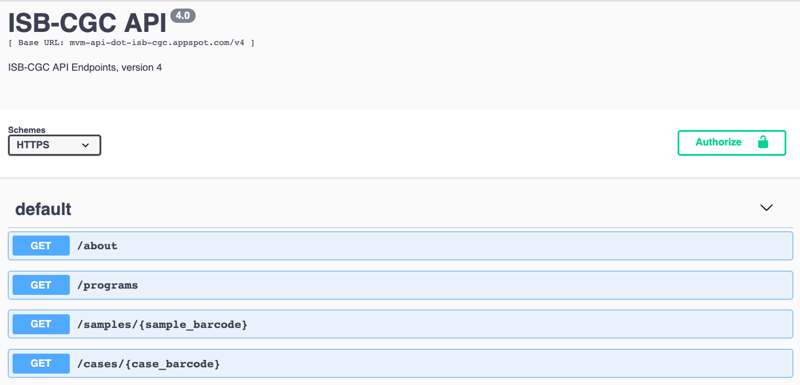
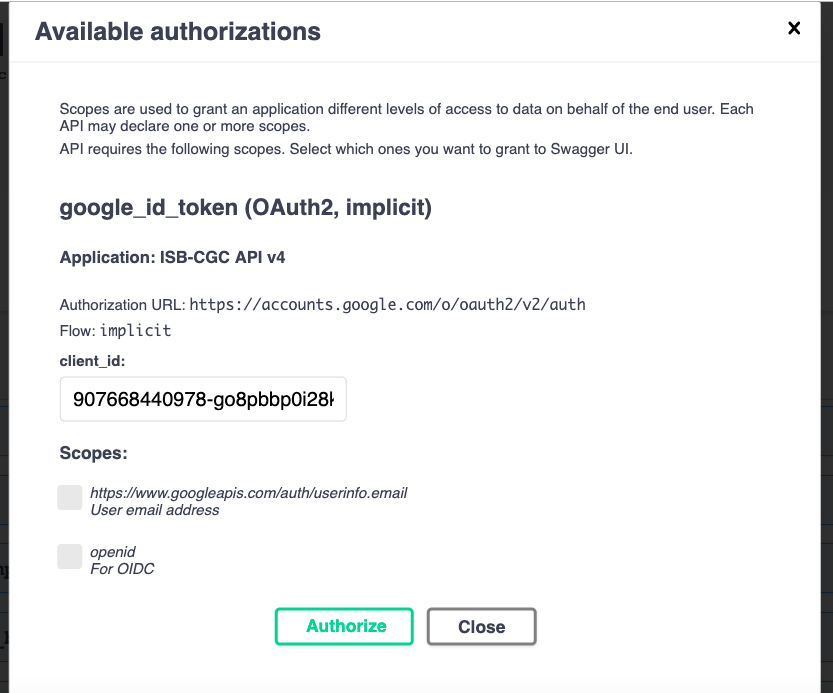
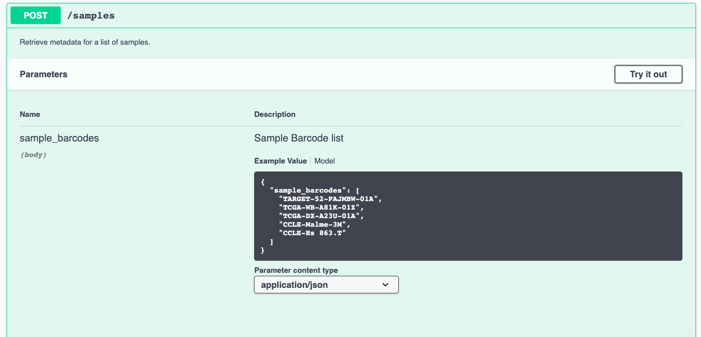
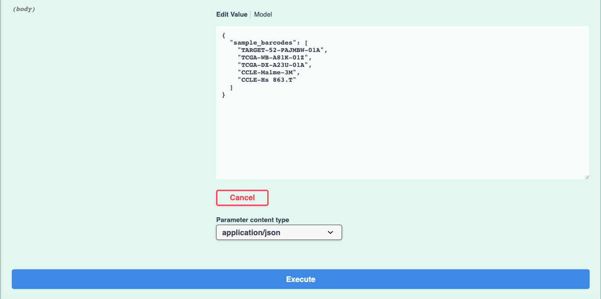

***************************
ISB-CGC API Tutorial
***************************

Programmatic access to data within the ISB-CGC platform uses a combination of ISB-CGC APIs and `Swagger UI <https://swagger.io/>`_ documentation. 

The ISB-CGC API provides an interface to the ISB-CGC metadata stored in BigQuery, and consists of several “endpoints”, implemented using Google Cloud Endpoints. Details about these endpoints can be found below. 

Some example use-cases include:

 - obtaining detailed metadata about a particular patient or sample;
 - creating (or retrieving a previously saved) cohort of patients and samples, based on a defined set of criteria;
 - retrieving a cohort's file manifest using the cohort ID;
 - retrieve a cohort's file manifest based on filters provided;
 - register, refresh, unregister a specified Google Cloud Project;

The `ISB-CGC API v4.0 <https://mvm-api-dot-isb-cgc.appspot.com/v4/swagger#/>`_ can be used to see details about each endpoint, and also provides a convenient interface to test an endpoint through your web browser. 

The primary organizing principle  subsetting and working with the TCGA data is a Cohort which isa list of samples. Users may create and share cohorts using the ISB-CGC web-app and then programmatically access them using the Swagger UI. (TCGA samples are identified using a 16-character “barcode” e.g. TCGA-B9-7268-01A, while patients are identified using the 12-character prefix, i.e. TCGA-B9-7268, of the sample barcode. Other datasets such as CCLE may use other less standardized naming conventions).

Demo of Swagger UI
===================

To get a better understanding of Swagger UI, let’s explore the Swagger ISB-CGC in depth. In the ISB-CGC example, the site is generated using Swagger UI.  All parameters and responses are in JSON format. 

The APIs are grouped as follows:

 - samples
 - cases
 - samples
 - files
 - cohorts
 - users

Authorize your request
======================

Before making any requests, you would normally authorize your session by clicking the 'Authorize' button and completing the information required in the pop-up authorization model pictured below:

**Please Note:** Both scopes are required.

Make a Request
---------------

Now let’s make a request:

    Expand the  `POST samples endpoint <https://mvm-api-dot-isb-cgc.appspot.com/v4/swagger#/default/getSampleMetadataList>`_.   by clicking on the ‘POST/samples’ line. 

    Click 'Try it out'.

After you click 'Try it out', the example value in the Request Body field becomes editable.

In the 'sample barcode value field', change string to list of samples you wish you return information on. 

Click 'Execute'

Swagger UI submits the request and shows the curl code that was submitted. The ‘Response body’ section shows the response to the request. If you click the ‘Download’ button, you are able to download the response in JSON format.

.. image:: response-body.png
   :scale: 50
   :align: center 

Nuances when using the APIs
===========================

Any special characters in the input field will cause the endpoint to fail. e.g. spacing in inout box.

Please make sure to delete all fields not being used.

Case barcode centric endpoints only pull TCGA and CCLE hg19 data details e.g file paths. 

Use sample centric endpoint to pull hg38 centric data details using the endpoints.

