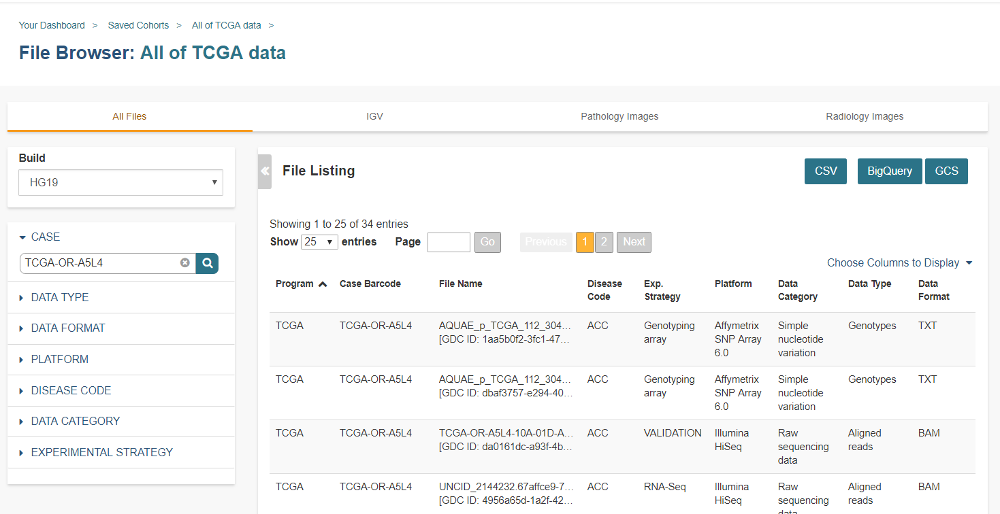
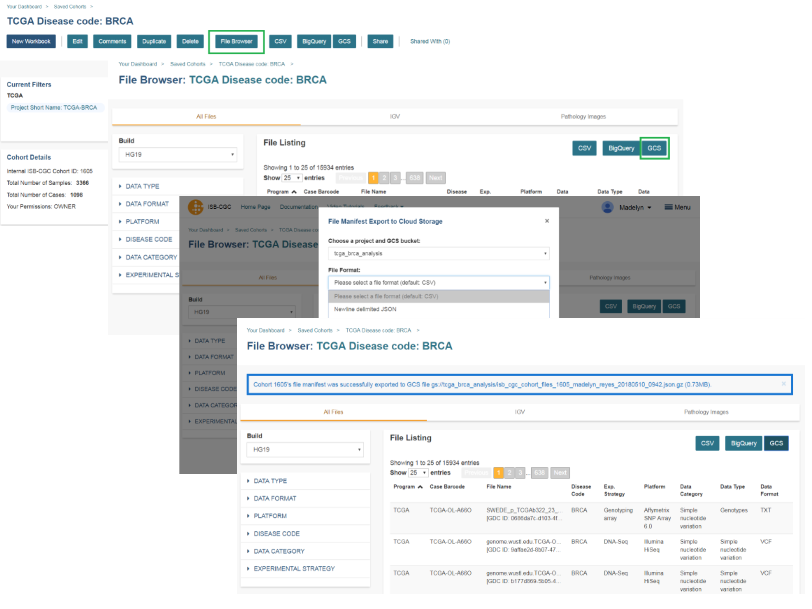
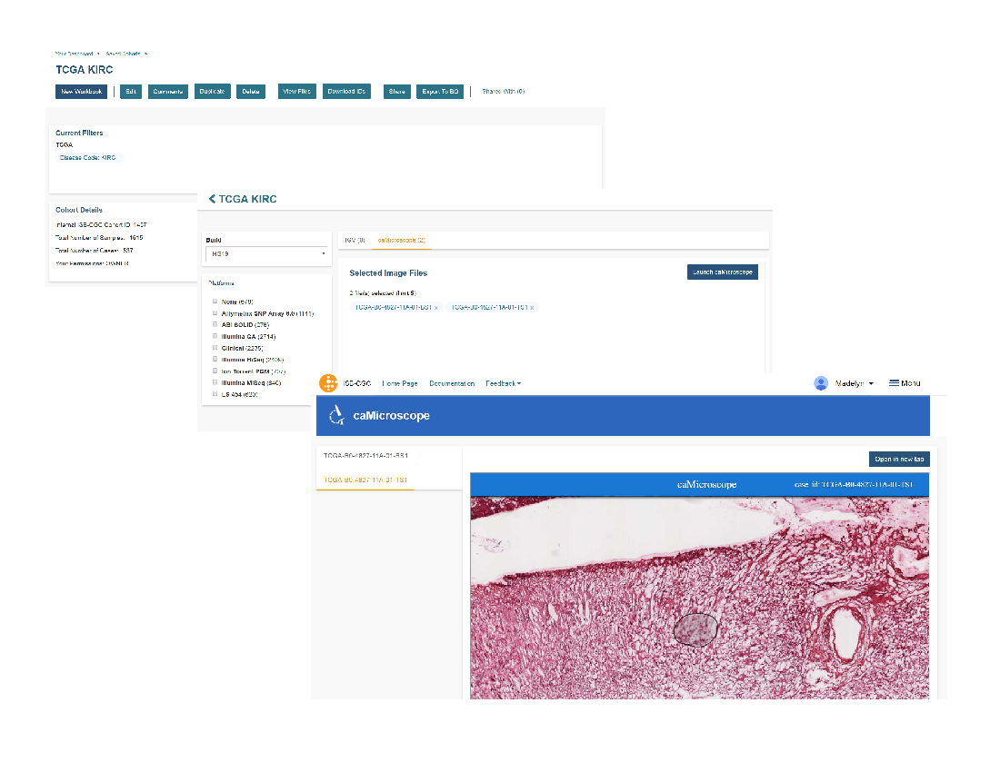
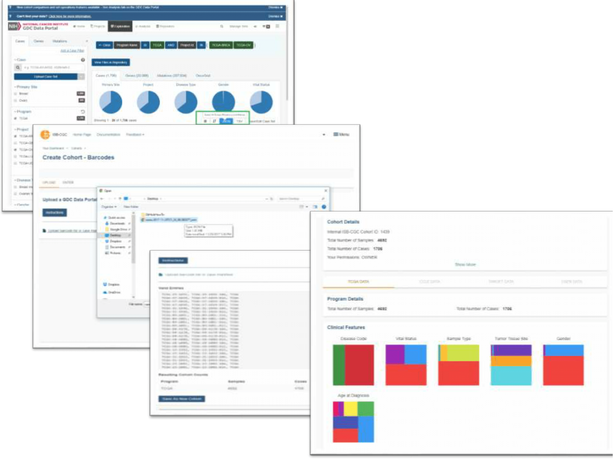
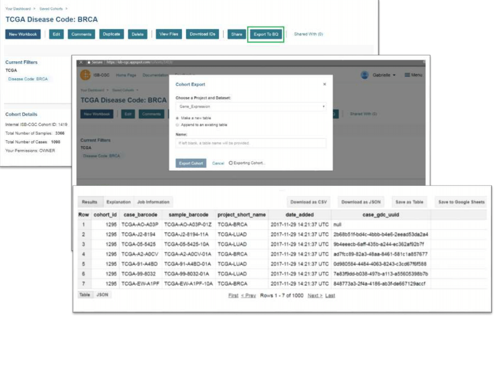

************************
Feature Alerts
************************

*May 21, 2019*

**FEATURE ALERT:**  Log into the @ISB_CGC web app and check out the new default gene list feature! When using SeqPeek, OncoGrid, or an OncoPrint analyses you are given a default gene list with genes with a consensus score of six or higher! For more information please go `here. <https://isb-cancer-genomics-cloud.readthedocs.io/en/latest/sections/webapp/Workbooks.html#creating-and-saving-a-workbook>`_

.. image:: images/Default_list_FINAL.PNG
   :scale: 25
   :align: center

*August 6, 2018*

**Feature Alert:**  When working with the File Browser you now have the ability to search all tabs by case barcode! For more infromation about the File Browser page please go `here. <http://isb-cancer-genomics-cloud.readthedocs.io/en/latest/sections/webapp/Saved-Cohorts.html#file-browser-page>`_

*June 25, 2018*

**Feature Alert:**  Log into the @ISB_CGC web app and check out our new image viewers!  Look at #TCGA #Radiology and #Histology images from the same patient, powered by #caMicroscope and Orthanc @orthancserver . #TCIA #cancerimaging #tsid #imaging  #quantitativeimaging  #FOAMrad .  Now you can see and use the depth of the TCGA dataset, using the Google Cloud @GCPCloud!! Thank you to all our collaborators.  Try them out: `Pathology Images <http://isb-cancer-genomics-cloud.readthedocs.io/en/latest/sections/webapp/Saved-Cohorts.html#using-the-image-pathology-viewer>`_ and `Radiology Images <http://isb-cancer-genomics-cloud.readthedocs.io/en/latest/sections/webapp/OsimisWebViewer.html>`_

.. image:: images/Pathology_TCGA_FD_A3B6.png
   :scale: 25
   :align: center

.. image:: images/FD-A3B6-CT-Pelvis_smaller.gif
   :scale: 25
   :align: center

*May 10, 2018*

**Feature Alert:**  You are now able to export to Google Cloud Storage an entire cohort file manifest by genomic build using the File Browser page Export to GCS feature! For more information please go `here. <http://isb-cancer-genomics-cloud.readthedocs.io/en/latest/sections/webapp/Saved-Cohorts.html#export-file-list-to-google-cloud-storage>`_

*April 6, 2018*

**Feature Alert:**  You are now able to BigQuery an entire cohort file manifest by genomic build using the File Browser page Export to BQ feature! For more information please go `here. <http://isb-cancer-genomics-cloud.readthedocs.io/en/latest/sections/webapp/Saved-Cohorts.html#export-file-list-to-bigquery>`_

.. image:: images/ExportBQTweet-1.png
   :scale: 25
   :align: center

*January 10, 2018*

**FeatureAlert:** You can now view TCGA pathology images using caMicroscope on the ISB-CGC website. For more information please go `here. <http://isb-cancer-genomics-cloud.readthedocs.io/en/latest/sections/webapp/Saved-Cohorts.html#viewing-a-pathology-image>`_

*December 11, 2017*

**Feature Alert:** You can now create a cohort by uploading a .JSON or a .TSV file from the Genomic Data Commons(GDC) using the new barcode upload feature! For more information please go `here. <http://isb-cancer-genomics-cloud.readthedocs.io/en/latest/sections/webapp/Saved-Cohorts.html#upload-tab>`_

*December 11, 2017*

**Feature Alert:** - You can now send a cohort you have created in the web application to a new BigQuery table or append an existing table!  For more information please go `here. <http://isb-cancer-genomics-cloud.readthedocs.io/en/latest/sections/webapp/Saved-Cohorts.html#cohort-details-page>`_

