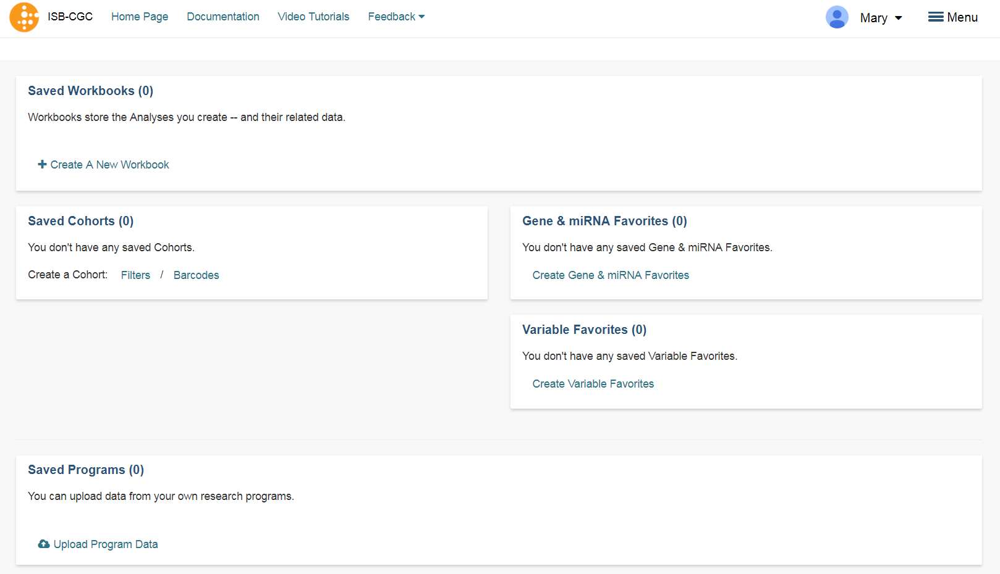
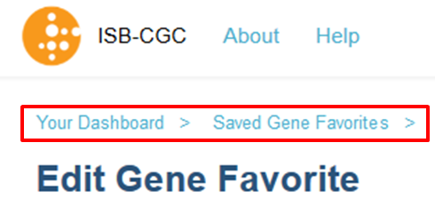

****************
Dashboard
****************

Upon signing in with a Google account identity, you will be presented with the following page:

This is your personal "Dashboard" where your Analyses, Gene and miRNA Lists, Variable Lists, Cohorts, and Saved Programs are readily accessible.  Descriptions of how to use each component of this user interface are provided in the individual subsections of this user guide.

Multiple Sample Analyses can be grouped into Workbooks (and saved for later use, editing, and sharing). Workbooks are used to group together multiple related analyses, and can be used for sharing groups of analysis results with specific groups of people.  For example, you may use one Workbook for an on-going study of gene mutations and pathways involved in Head and Neck Cancer (with one research group you are part of), and use a different Workbook for another on-going study with a different set of collaborators in which you are 
investigating survival-time after diagnosis for patients with different types of lung cancers. Think of workbooks as containers in which you can create and group related analyses, and which you can share with specific colleagues.

**Breadcrumbs** show you where you are in the Web App as you move from one section to another (figure below).  
These are live links, and can be used to rapidly navigate from one section of the interface to another.

