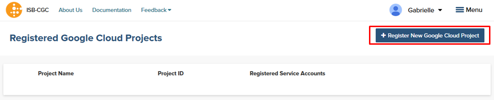
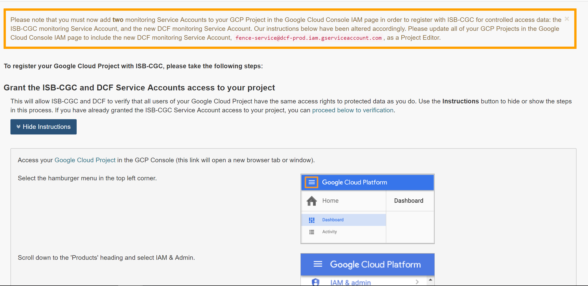
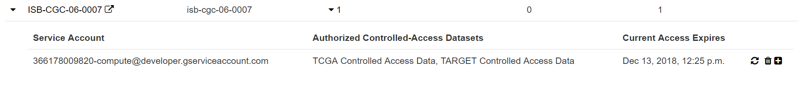

************************************************
Accessing TCGA Controlled Data
************************************************
Accesssing TCGA controlled-access data is done in two different manners, depending if you are doing it through interactive computing (e.g. the Web Application, BigQuery, R Studio), or programmatically (e.g. a program running from a Google Virtual Machine Compute Engine you have started).  Below the methods are described.  Please note, you can use both methods at the same time, they are not mutually exclusive.

Accessing TCGA Data Through the Interactive Computing 
=====================================================
To obtain access to TCGA controlled-access data for interactive computing (things that you run while interacting with controlled data such as the Web Application, R, R Studio, Command Line Interfaces, Cloud Datalab etc.)
you must associate your Google identity with a valid NIH login that is associated with a dbGaP project 
(either an eRA account ID or an NIH account User ID).  This is done through the Web Application where an association
is created when you have successfully authenticated through NIH.  Your NIH identity will then be 
checked against the current dbGaP whitelist to verify that you are authorized to view and access
the TCGA controlled data.

Visit `electronic Research Administration (eRA) <http://era.nih.gov>`_ for more information on 
registering for a NIH eRA account. NIH staff may utilize their NIH log-in. 
(For additional instructions, please refer to `Data Access Request Instructions <http://www.genome.gov/20019654>`_, 
dbGap Data Access `Request Portal <http://dbgap.ncbi.nlm.nih.gov/aa/wga.cgi?login=&page=login>`_, 
and `Understanding Data Security <http://isb-cancer-genomics-cloud.readthedocs.org/en/latest/sections/data/data2/TCGA_Data_Security.html>`_). 

Once you have authenticated to NIH via the web-app, and your dbGaP authorization has been verified, the 
Google identity associated with your account will have access to the controlled-data for 24 hours.

For more information on applying for dbGaP authorization to access TCGA controlled access, please see our 
Frequently Asked Questions (FAQ) 
`page <http://http://isb-cancer-genomics-cloud.readthedocs.org/en/latest/sections/FAQ.html?>`_ 
or the "How to" `Apply for Controlled Access Data Video <http://www.youtube.com/watch?v=-3tUBeKbP5c>`_.

Linking your NIH and Google identities
--------------------------------------
To link your NIH identity with your Google identity (ie the Google account you used to login to the ISB-CGC system), 
select the "persona" icon next to your login name (A in the image below) after you have signed in to the ISB-CGC Web Application.  

.. image:: personaeicon-NIHLoginAssoc.png
   :scale: 50
   :align: center

You will then see the following page:

.. image:: NIHAssociationPage.png
   :scale: 50
   :align: center
   
Now you need to associate your Google identity with your NIH identity.  (Your NIH identity is the one associated
with your dbGaP application and authorization to work with TCGA controlled data.) 
To do this, select the "Associate with eRA Commons Account" link (highlighted in diagram above, and labeled A).  
You will then be re-directed to an NIH login page to be authenticated by NIH:

.. image:: iTrust.png
   :scale: 50
   :align: center

If you have an eRA identification, use this to sign in through panel A (see example above).  
If you have an NIH PIV card, use that to sign in through panel B on this page (see above).  
Once you have been authenticated by NIH, and your NIH identity has been verified to be on
the current dbGaP whitelist, you will have access to controlled data for 24 hours.  
(To renew your access, you will need to repeat this process.)

.. image:: LogInandUnlink.png
   :scale: 50
   :align: center

Please note: the ISB-CGC system will enforce one-to-one relationship between NIH identities
and Google identites.  In other words, a single NIH identity may not be used to attempt to
gain access to to controlled data by multiple Google identities.
If you need to *unlink* your eRA account from your Google account (for example if you want to
change which Google identity you use to sign in to the ISB-CGC platform), you may do so by
selecting "Unlink <GoogleID> from the NIH username <eRA Commons ID>" (link B in the screen above).

There is the unusual instance that your NIH identity has been registered with another Google identity (e.g. with another Google identity you own).  In that instance you will see the screen below:

.. image:: eRAlinkedtoAnotherGoogle.png
   :scale: 50
   :align: center
   
If this happens, please go to that account and "unlink" your eRA from that account (see description above).  You will then be able to register your eRA account with your other Google identity.  If you are not able to resolve the issue, contact us at feedback@isb-cgc.org and we will help you resolve it.   

To end your web-app session, just "Sign Out" by using the pull-down below your name 
(see image below, A).  After you sign out from the ISB-CGC web-app, your Google identity may 
still be signed in to your browser, so you may want to also sign out of the browser.

.. image:: SignOut.png
   :scale: 50
   :align: center

Extending Your Access by 24 hours From Now
------------------------------------------
Once you have received permission to view controlled access data, your user login page will look like the screenshot below. If you need to extend your access to controlled data for another 24 hours from now (e.g. if your compute job is still running on data that is controlled access), select the link "Extend controlled access period to 24 hours from now" (red box on figure below).  Your time of access will be extended to 24 hours from the time you push the link. 

.. image:: 24hrExtension.png
   :scale: 50
   :align: center

Accessing TCGA Data Programmatically 
====================================
When using Google to run programs to access data in Google Virtual Machines (GCE), it is a "service account" of your Google Cloud Project (GCP) that is used as the authentication ID to run your program.  You will only have a service account if you have a GCP, service accounts are not associated with Google Identities (such as those you use for accessing gmail, ISB-CGC Web Application, etc.).  When you start a GCP, there is a default service account that is associated with the GCP (see below for details on how to find that).  If you like, you can also define other service accounts for a GCP, allowing you flexibility to use different permissions associated with a service account for different programs. 

To obtain access to TCGA controlled-access data from a program you need to register at least one service account from your GCP with ISB-CGC.  This will allow programs running from Virtual Machines of the Google Compute Engine in your GCP to use controlled access data for up to 7 days.

NOTES: 

- to allow flexibility while working with different research teams and different processes, you can have many GCPs registered with ISB-CGC, as well as many service accounts registered per GCP.)
- if your program tries to access data stored in a controlled access area after the 7 day expiration, it will get an error describing that access is denied.  To prevent this, we have enabled the ability to add another 7 days to the access (if your program is running long), see below for directions.  You may also wish to adjust your program to the posibility that data access may be denied.

Requirements for Registering a Google Cloud Project Service Account
--------------------------------------------------
To be able to register your Google Cloud Poject and at least one service account to handle controlled access data the following must all be true:

- at any time, ALL members of the project MUST be authorized to use the data set (be a registered dbGaP "PI" or "downloader") (see dbGap Data Access `Request Portal <http://dbgap.ncbi.nlm.nih.gov/aa/wga.cgi?login=&page=login>`_, and `Understanding Data Security <http://isb-cancer-genomics-cloud.readthedocs.org/en/latest/sections/data/data2/TCGA_Data_Security.html>`_ for more details).
- all members of the project will have had to register their Google ID with ISB-CGC by using the ISB-CGC Web Application
- all members of the project will have had to associate their Google ID with ISB-CGC with an NIH Identity (see the "Linking your NIH and Google identities" section of this page above for instructions on how to do this).

If ANY of these requirements are not met, your GCP and ANY associated service accounts will be disabled to use controlled access data.  Emails will be sent to the GCP owners if this permission is revoked.

Registering your Google Cloud Project Service Account
------------------------------------
To register your GCP and its Service Account with ISB-CGC, select the "persona" icon next to your login name (see first image above), which takes you to the following page:

.. image:: RegisteredGCPs.png
   :scale: 50
   :align: center
   
Select the "Register a Google Cloud Project" link.  That takes you to the following page:

   
Select the "+ Register New Google Cloud Project" button.  That takes you to the following instruction page (note, screenshot below is only the top half of the page):

   
Please fill out the form following the instructions that are provided.  You must enter your GCP ID and enable the isb-cgc service account as an editor in your project to move on to the next step.  Once you have completed these steps you will be presented at the bottom of the same page a listing of the members of your GCP you registering (see screenshot below):

.. image:: GCPMembers.png
   :scale: 50
   :align: center
   
Pushing the "Register" button will take you to the next screen:

   
Select "Register Service Account" from the drop down menu on the left of the GCP you want to add a service account to.  You will be requested to enter your service account ID (see screenshot below).  Addtionally, select the "Yes" checkbox indicating that you will be using the account to access controlled data and select the Controlled Dataset you will are requesting programmatic access to.

.. image:: RegisterAServiceAccountFirstScreen.png
   :scale: 50
   :align: center
   
Once you click the "Button" at the bottom of the page, you will be presented with a list of the users of the GCP project, if they have registered with ISB-CGC through the Web Application, if they have an eRA Commons ID (or NIH ID) registered with ISB-CGC, and if they are authorized to use the selected controlled access dataset (see screenshot below).  All columns MUST have a green check-mark in them for each user before your service account can be registered.

.. image:: ServiceAcctRegTable.png
   :scale: 50
   :align: center
   
If all the requirements for registering a service account are met, the account will be registered.  If not, the service account will only be registered for Open Datasets.  The final screen below shows the final registered data set (shown by selecting the drop-down menu beside the service account count highlighted in red).

Managing your Google Cloud Project(s) and Service Account(s)
---------------------------------------------------
Once your GCP(s) and Service Account(s) are registered, you can add more and remove existing accounts by following the methods below.  In addition, there are methods to either extend the use of a service account for another 7 days, and reauthorize a service account after you have corrected the errors that caused it to have its permissions revoked.  Below are the details of how to perform these operations.

Adding additional Google Cloud Projects
~~~~~~~~~~~~~~~~~~~~~~
To add additional Google Cloud Projects (GCPs) that you own to be able run programs programmatically select the "+ Register New Google Cloud Project" button from the "Registered Google Cloud Projects" page (see screenshot below).

Deleting Google Cloud Projects
~~~~~~~~~~~~~
To delete a GCP that is registed, select the "Unregister Project" button from the dropdown menu beside the project your are removing on the "Registered Google Cloud Projects" page (see screenshot below).

Adding additional service accounts to a given Google Cloud Project
~~~~~~~~~~~~~~~~~~~~~~~~~~~~~~~~~~~~~~~~~~~~~~~~~
To add additional service accounts to a given GCP reselect the "Register Service Account" from the dropdown menu beside the project that has the service account (see screenshot below). 

Deleting Service Accounts from Google Cloud Projects
~~~~~~~~~~~~~~~~~~~~~~~~~~~~~~~~~~~
To delete a service account from an GCP (not allowing it to be used to programmatically access controlled data), push the "trashcan" icon beside the service account (see screenshot below).

.. image:: DeleteServiceAccount.png
   :scale: 50
   :align: center

Extending Your Service Account Access by 7 Days From Now
~~~~~~~~~~~~~~~~~~~~~~~~~~~~~~~~~~~~~~~~~~~~~~~~~~~~~~~~
Once you have registered a Service Account, you have 7 days before the access is automatically revoked.  To extend the service account access another 7 days (e.g. if your program is still running), select the "refresh" icon beside the service account (see screenshot below).

.. image:: RefreshServiceAccount.png
   :scale: 50
   :align: center

Reauthorizing a Google Cloud Project(s) Service Account(s) after it was revoked permission
~~~~~~~~~~~~~~~~~~~~~~~~~~~~~~~~~~~~~~~~~~~~~~~~~~~~~~~~~~~~~~~~~~~~~~~~~
Your service account may have its permissions revoked (because, for example, you have added a member to the GCP who is not authorized to use that controlled data). If this happens, the Google Cloud Project owner will be sent an email with a description of which Service Account on which Google Cloud Project and which user caused the removal from the Access Control List. To reauthorize the service account 1) remedy the situation that caused the initial revokation of the service account and 2) select the "refresh" icon beside the service account (see screenshot below).

.. image:: RefreshServiceAccount.png
   :scale: 50
   :align: center

Available TCGA Data: Open- and Controlled-Access
================================================

Open Access Data 
----------------

All of the open-access data hosted by the ISB-CGC is immediately accessible to all users, without
NIH authentication nor dbGaP authorization required.  These open-access data can be explored
both through the Web Application and through the `Programmatic User Interface <../Prog-APIs.rst>`_.  
For additional details about all hosted data sets, please see this `section <../Hosted-Data.rst>`_.

The **Open-Access** TCGA data hosted by the ISB-CGC Platform includes:

• Clinical (de-identified) and Biospecimen data: these data were originally provided in XML files (Level-1) by the DCC;
• Somatic mutation data: these data were originally provided in MAF files (Level-2) by the DCC;
• DNA copy-number segments: these data were originally provided as segmentation files (Level-3) by the DCC;
• DNA methylation data: these data were originally provided as TSV files (Level-3) by the DCC;
• Gene (mRNA) expression data: these data were originally provided as TSV files (Level-3) by the DCC;
• microRNA expression data: these data were originally provided as TSV files (Level-3) by the DCC;
• Protein expression data: these data were origially provided as TSV files (Level-3) by the DCC; and
• TCGA Annotations data: annotations were obtained from the TCGA Annotations Manager

Controlled-Access Data
----------------------

Controlled-access data is accessible only to users who have been authenticated by NIH
and whose dbGaP authorization has been verified.

The **Controlled-Access** TCGA data hosted by the ISB-CGC Platform includes:

• SNP array CEL files: these Level-1 data files were provided by the DCC and include over 22,000 files for both tumor and matched-normal samples;
• VCF files: these Level-2 data files were provided by the DCC and include over 15,000 files produced by several different centers (primarily Broad and BCGSC);
• MAF files: these *protected* mutation files (Level-2) were provided by the DCC (note that these files were not generated uniformly for all tumor types);
• DNA-seq BAM files: these Level-1 data files were provided by CGHub (roughly 90% of these BAM files containe exome data, the remaining 10% contain whole-genome data);
• mRNA- and microRNA-seq BAM and/or FASTQ files: these Level-1 data files were provided by CGHub;
• finally, BAM index (BAI) files are available for all BAM files;

Your Responsibilities 
---------------------
You should think about securing controlled data within the context of your GCP project in the same way 
that you would think about securing controlled data that you might download to a file-server or 
compute-cluster at your own institution. Your responsibilities for data protection are the same in a 
cloud environment. For more information, please refer to 
`NIH Security Best Practices for Controlled-Access Data <http://www.ncbi.nlm.nih.gov/projects/gap/cgi-bin/GetPdf.cgi?document_name=dbgap_2b_security_procedures.pdf>`_.

NIH has tried to provide as much information as possible for PIs, institutional signing officials (SOs) and 
the IT staff who will be supporting these projects, to make sure they understand their responsibilities.” 
(Ref: `The Cloud, dbGaP and the NIH blog post 03.27.2015 <http://datascience.nih.gov/blog/cloud>`_)

