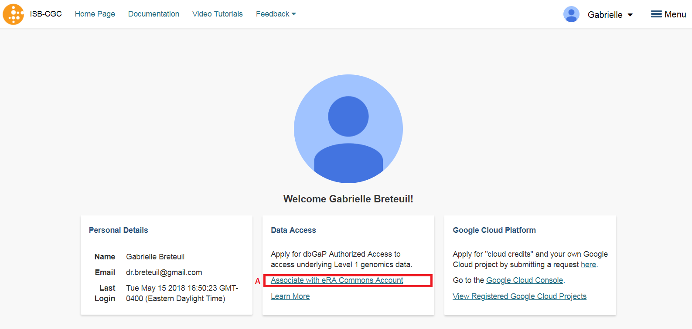
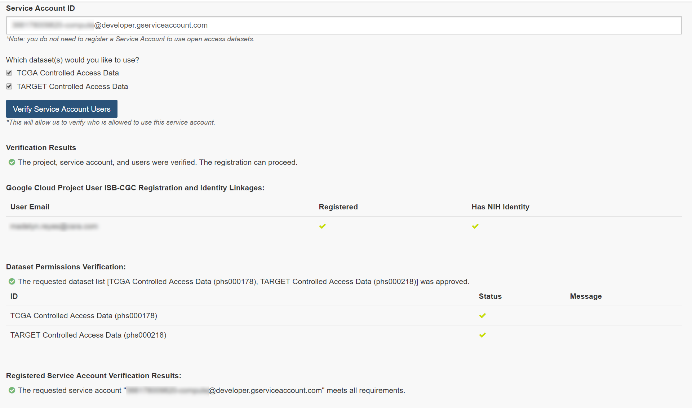

************************************************
Accessing Controlled Data
************************************************
Accesssing **controlled data** is done in two different manners, depending if you are doing it through interactive computing (*eg* the Web App or R Studio), or programmatically (*eg* a program running from a Google Virtual Machine Compute Engine you have started).  In some cases you will be using your *personal* credentials while in other cases a "service account" will be acting on your behalf, using its own credentials.  Below the methods are described.  Please note, you can use both methods at the same time, they are not mutually exclusive.

Interactive Access to Controlled Data 
======================================
Before you can access *any* controlled-data hosted by the ISB-CGC,
you must first associate (or "link") your Google identity (which you use to sign in to the ISB-CGC Web App and
access the Google Cloud) with a valid NIH login associated with a dbGaP data-access request
(either an eRA account ID or an NIH account User ID).  This is done through the Web App: you will 
first be redirected to an NIH login page, and once you have successfully authenticated,
ISB-CGC will store an association between your NIH identity and your Google identity.
(Note that this should be a one-to-one association.)

Once you have authenticated, ISB-CGC will check which dataset(s) you have been authorized
(by dbGaP) to access.  ISB-CGC obtains an updated whitelist for each of the hosted datasets from
dbGaP every day.  If you have just recently been granted access by dbGaP, there may be a 24 hour
delay before you will be able to request access to these data on ISB-CGC.

Visit `electronic Research Administration (eRA) <http://era.nih.gov>`_ for more information on 
registering for a NIH eRA account. NIH staff may utilize their NIH log-in. 
(For additional instructions, please refer to `Data Access Request Instructions <http://www.genome.gov/20019654>`_, 
dbGap Data Access `Request Portal <http://dbgap.ncbi.nlm.nih.gov/aa/wga.cgi?login=&page=login>`_, 
and `Understanding Data Security <http://isb-cancer-genomics-cloud.readthedocs.org/en/latest/sections/data/data2/TCGA_Data_Security.html>`_). 

Once you have authenticated to NIH via the Web App, and your dbGaP authorization has been verified, the 
Google identity associated with your account will have access to the controlled-data for 24 hours.

For more information on applying for dbGaP authorization to access controlled data, please see our 
Frequently Asked Questions (FAQ) 
`page <http://http://isb-cancer-genomics-cloud.readthedocs.org/en/latest/sections/FAQ.html?>`_ 
or the "How to" `Apply for Controlled Access Data Video <http://www.youtube.com/watch?v=-3tUBeKbP5c>`_.

Linking your NIH and Google identities
--------------------------------------
To link your NIH identity with your Google identity (ie the Google account you used to login to the ISB-CGC system), 
select the "persona" icon next to your login name (A in the image below) after you have signed in to the ISB-CGC Web App.  

.. image:: personaeicon-NIHLoginAssoc.png
   :scale: 50
   :align: center

You will then see the following page:

   
Now you need to associate your Google identity with your NIH identity.  (Your NIH identity is the one associated
with your dbGaP application and authorization to work with controlled data.) 
To do this, select the "Associate with eRA Commons Account" link (highlighted in diagram above, and labeled A).  
You will then be re-directed to an NIH login page to be authenticated by NIH:

.. image:: iTrust.png
   :scale: 50
   :align: center

If you have an eRA identification, use this to sign in through panel A (see example above).  
If you have an NIH PIV card, use that to sign in through panel B on this page (see above).  
Once you have been authenticated by NIH, and your NIH identity has been verified to be on
the current dbGaP whitelist, you will have access to controlled data for 24 hours.  
(To renew your access, you will need to repeat this process.)

.. image:: LogInandUnlink.png
   :scale: 50
   :align: center

Please note: the ISB-CGC system will enforce a one-to-one relationship between NIH identities
and Google identites.  In other words, a single NIH identity may not be used to attempt to
gain access to controlled data by multiple, different Google identities.
If you need to *unlink* your eRA account from your Google account (for example if you want to
change which Google identity you use to sign in to the ISB-CGC platform), you may do so by
selecting "Unlink <GoogleID> from the NIH username <eRA Commons ID>" (link B in the screen above).

In the unusual instance that your NIH identity has been registered with another Google identity 
(*eg* with another Google identity you own), you will see the screen below:

.. image:: eRAlinkedtoAnotherGoogle.png
   :scale: 50
   :align: center
   
If this happens, please sign in with that other account and "unlink" your eRA from that account i
(see description above).  You will then be able to register your eRA account with the desired Google identity.  
If you are not able to resolve the issue, contact us at feedback@isb-cgc.org and we will help you resolve it.   

To end your Web App session, just "Sign Out" by using the pull-down below your name 
(see image below, A).  After you sign out from the ISB-CGC Web App, your Google identity may 
still be signed in to your browser, so you may want to also sign out of the browser.

.. image:: SignOut.png
   :scale: 50
   :align: center

Extending Your Access by 24 hours 
-----------------------------------
Once you have received permission to view controlled access data, your user login page will look 
like the screenshot below. If you need to extend your access to controlled data for another 24 
hours from now (*eg* if you have a compute job which is using these Google credientials to access 
controlled data and it is still running), select the link "Extend controlled access 
period to 24 hours from now" (red box on figure below).  
Your time of access will be extended to 24 hours from the time you push the link. 

.. image:: 24hrExtension.png
   :scale: 50
   :align: center

Accessing Controlled Data from a GCE VM
=======================================
This section only applies to ISB-CGC users with access to a Google Cloud Platform (GCP) 
`project <https://cloud.google.com/resource-manager/docs/creating-managing-projects>`_.
GCP projects are automatically configured with a "Compute Engine default service account"
which you can find on the `IAM & Admin page <https://console.cloud.google.com/iam-admin/iam/project>`_ of the 
`Cloud Console <https://console.cloud.google.com/home/dashboard>`_.  You can create additional
service accounts for special purposes, but most users will be able to just use this one
default service account.

When running on a Google Compute Engine (GCE) VM (virtual machine), a "service account" associated with
your Google Cloud Project (GCP) is generally acting on your behalf and those are the credentials being
used rather than your personal credentials.  (If you want to learn more about service accounts, please
refer to the Google `documentation <https://cloud.google.com/iam/docs/service-accounts>`_.)

In order for this **service account** to access controlled data, you must register it with ISB-CGC.
Once this process has completed successfully, this service account will be able to access controlled
data for up to 7 days.

NOTES: 

- to allow flexibility while working with different research teams and different processes, you can have many GCPs registered with ISB-CGC, as well as many service accounts registered per GCP
- if the service account (*ie* any program running on a VM using the service account's credentials) tries to access controlled data after the 7 day expiration, it will get an Access Denied error; to prevent this from causing problems with long-running jobs, you can extend access by another 7 days (see below);

Requirements for Registering a Google Cloud Project Service Account
--------------------------------------------------------------------
To be able to register your GCP Project and at least one service account to access controlled data the following must all be true:

- you must be an **owner** of the GCP project (because you will need to add an ISB-CGC service account as a new projet member)
- at any time, ALL members of the project MUST be authorized to use the data set (*ie* be a registered dbGaP "PI" or "downloader") (see dbGap Data Access `Request Portal <http://dbgap.ncbi.nlm.nih.gov/aa/wga.cgi?login=&page=login>`_, and `Understanding Data Security <http://isb-cancer-genomics-cloud.readthedocs.org/en/latest/sections/data/data2/TCGA_Data_Security.html>`_ for more details).
- all members of the project have signed in to the ISB-CGC Web App *at least once*
- all members of the project have authenticated via the NIH login page and thereby linked their NIH identity to their Google identity

If ANY of these requirements are not met, your GCP and ANY associated service accounts will **not** be able to access controlled data.  An automated email will be sent to the GCP project owner(s) if data access is revoked.

Registering your Google Cloud Project Service Account
--------------------------------------------------------------
To register your GCP and its Service Account with ISB-CGC, select the "persona" icon next to your login name (see first image above), which takes you to the following page:

.. image:: RegisteredGCPs.png
   :scale: 50
   :align: center
   
Select the "Register a Google Cloud Project" link.  That takes you to the following page:

.. image:: RegisterAGCPForm.png
   :scale: 50
   :align: center
   
Please fill out the form following the instructions that are provided.  You must enter your GCP ID and enable the isb-cgc service account as an editor in your project to move on to the next step.  Once you have completed these steps you will be presented at the bottom of the same page a listing of the members of your GCP you registering (see screenshot below):

.. image:: GCPMembers.png
   :scale: 50
   :align: center
   
Pushing the "Register" button will take you to the next screen:

.. image:: 0007projectregistered.PNG
   :scale: 50
   :align: center
   
Select "Register Service Account" from the drop down menu on the left of the GCP you want to add a service account to.  You will be requested to enter your service account ID (see screenshot below).  Addtionally, select the "Yes" checkbox indicating that you will be using the account to access controlled data and select the Controlled Dataset(s) you plan to access.

.. image:: RegisterAServiceAccountFirstScreen.png
   :scale: 50
   :align: center
   
Once you click the "Button" at the bottom of the page, you will be presented with a list of the users of the GCP project, if they have registered with ISB-CGC through the Web Application, if they have an eRA Commons ID (or NIH ID) registered with ISB-CGC, and if they are authorized to use the selected controlled access dataset (see screenshot below).  All columns MUST have a green check-mark in them for each user before your service account can be registered.

   
If all the requirements for registering a service account are met, the account will be registered.  If not, the service account will only be registered for Open Datasets.  The final screen below shows the final registered data set (shown by selecting the drop-down menu beside the service account count highlighted in red).

.. image:: ServiceAcctRegSuccess.PNG
   :scale: 50
   :align: center

Managing your Google Cloud Project(s) and Service Account(s)
---------------------------------------------------
Once your GCP(s) and Service Account(s) are registered, you can add or remove additional service accounts by following the instructions below.
You can also extend the use of a service account for another 7 days, or reauthorize a service account after you have corrected errors that
previously caused it to have its permissions revoked.

Adding additional Google Cloud Projects
~~~~~~~~~~~~~~~~~~~~~~~~~~~~~~~~~~~~~~~~~~~
To add additional Google Cloud Projects (GCPs) that you own to be able run programs programmatically 
select the "+ Register New Google Cloud Project" button from the "Registered Google Cloud Projects" page (see screenshot below).

.. image:: RegisterAnotherGCP.PNG
   :scale: 50
   :align: center

Deleting Google Cloud Projects
~~~~~~~~~~~~~~~~~~~~~~~~~~~~~~~~~~~~
To delete a GCP that is registed, select the "Unregister Project" button from the dropdown menu beside the project your are removing on the "Registered Google Cloud Projects" page (see screenshot below).

.. image:: UnregisterAGCP.PNG
   :scale: 50
   :align: center

Adding additional service accounts to a given Google Cloud Project
~~~~~~~~~~~~~~~~~~~~~~~~~~~~~~~~~~~~~~~~~~~~~~~~~~~~~~~~~~~~~~~~~~~~~~~~~
To add additional service accounts to a given GCP reselect the "Register Service Account" from the dropdown menu beside the project that has the service account (see screenshot below). 

.. image:: 0007projectregistered.PNG
   :scale: 50
   :align: center

Deleting Service Accounts from Google Cloud Projects
~~~~~~~~~~~~~~~~~~~~~~~~~~~~~~~~~~~~~~~~~~~~~~~~~~~~~~~~~~~
To delete a service account from an GCP (not allowing it to be used to programmatically access controlled data), push the "trashcan" icon beside the service account (see screenshot below).

.. image:: DeleteServiceAccount.PNG
   :scale: 50
   :align: center

Extending Your Service Account Access by 7 Days 
~~~~~~~~~~~~~~~~~~~~~~~~~~~~~~~~~~~~~~~~~~~~~~~~~~~~~~~~
Once you have registered a Service Account, you have 7 days before the access is automatically revoked.  To extend the service account access another 7 days (*eg* if your program is still running), select the "refresh" icon beside the service account (see screenshot below).

.. image:: RefreshServiceAccount.PNG
   :scale: 50
   :align: center

Reauthorizing a Google Cloud Project(s) Service Account(s)
~~~~~~~~~~~~~~~~~~~~~~~~~~~~~~~~~~~~~~~~~~~~~~~~~~~~~~~~~~~~~~~~~~~~~~~~~
Your service account may have its permissions revoked (because, for example, the 7-day limit has expired, or 
you have added a member to the GCP who is not authorized to use that controlled data). If permissions 
were revoked because an unauthorized user was added to the project,  
the Google Cloud Project owner will be sent an email specifying the Service Account, GCP Project, and user
which resulted in the access being revoked.  
To reauthorize the service account 1) remedy the problem that resulted in access being denied,
and 2) select the "refresh" icon beside the service account (see screenshot below).

.. image:: RefreshServiceAccount.PNG
   :scale: 50
   :align: center

Your Responsibilities 
---------------------

You should think about securing controlled data within the context of your GCP project in the same way 
that you would think about securing controlled data that you might download to a file-server or 
compute-cluster at your own institution. Your responsibilities for data protection are the same in a 
cloud environment. For more information, please refer to 
`NIH Security Best Practices for Controlled-Access Data <http://www.ncbi.nlm.nih.gov/projects/gap/cgi-bin/GetPdf.cgi?document_name=dbgap_2b_security_procedures.pdf>`_.

NIH has tried to provide as much information as possible for PIs, institutional signing officials (SOs) and 
the IT staff who will be supporting these projects, to make sure they understand their responsibilities.” 
(Ref: `The Cloud, dbGaP and the NIH blog post 03.27.2015 <http://datascience.nih.gov/blog/cloud>`_)

