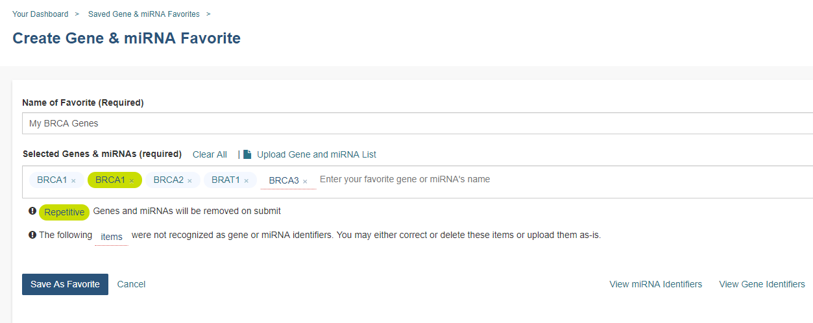

****************
Genes and miRNAs
****************

This feature allows you to create and manage Gene and miRNA lists for inclusion in workbooks and use in subsequent analyses.  

Create a Gene & miRNA Favorite
################################

Selecting **Create Gene & miRNA Favorites** from the **GENES & miRNAs** menu dropdown displays the **Create Gene & miRNA Favorites** screen. 

To create a new Gene & miRNA Favorite:

- Name your new favorite; you can create many favorites and use them later when working with workbooks.
- Specify the Gene(s) and/or miRNA(s) to include in this list. You can do this by:

  * Uploading a pre-existing list using the Upload Gene and miRNA List link
  * Entering Genes and miRNAs by typing them into the input box (with auto-completion support). 
  
    - To aid in Gene selection, you can access the HGNC portal (Hugo Gene Nomenclature Committee) via the `View Gene Identifiers <http://www.genenames.org/>`_ link.
    - To aid in miRNA selection, you can access the miRBase via the `View miRNA Identifiers <http://www.mirbase.org/cgi-bin/mirna_summary.pl?org=hsa>`_ link. 
    - If duplicate symbols are entered they will be marked for your deletion or automatically dropped when the list is saved. If an unrecognized item is entered it will also be flagged for your attention.  
- Click **Save As Favorite**.

Manage Gene & miRNA Favorites
###############################

Selecting **Manage Gene & miRNA Favorites** from the **GENES & miRNAs** menu dropdown displays the **Saved Gene & miRNA Favorites** screen. This screen displays your saved Gene & miRNA Favorites and allows you to edit or delete them, as well as start a new workbook using your favorite.

Clicking on the **Create New Favorite** button will take you to the **Create Gene & miRNA Favorite** screen.

Select Genes & miRNAs for a New Workbook
########################################

Selecting **Select Genes & miRNAs for a New Workbook** from the **GENES & miRNAs** menu dropdown displays the **Data Source | Gene & miRNA Favorites** screen. This screen displays your saved Gene & miRNA Favorites and allows you to apply them to a new workbook.

- Check the box adjacent to your favorite and click the **Apply to New Worksheet** button to create a new workbook using your Gene & miRNA Favorite.
- Click the **Apply New Gene & miRNA List** button to create a new favorite. This takes you to the **Create Gene & miRNA Favorite** screen.

**Resources for understanding and working with miRNAs and gene identifiers:**

- The `National Human Genome Research Institute (NHGRI) <http://www.genome.gov/glossary/index.cfm>`_ created the Talking Glossary of Genetic Terms to help everyone understand the terms and concepts used in genetic research.  In addition to definitions, specialists in the field of genetics share their descriptions of terms, and many terms include images, animation and links to related terms.
- The `miRBase <http://www.mirbase.org/index.shtml>`_ created a microRNA database center to enable researchers to understand the published miRNA sequences and annotations.  
- `Hugo Gene Nomenclature Committee (HGCN) <http://www.genenames.org>`_ 
- `National Center for Biotechnology Information (NCBI) <http://www.ncbi.nlm.nih.gov>`_
