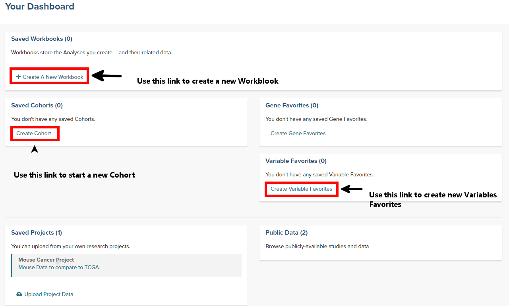
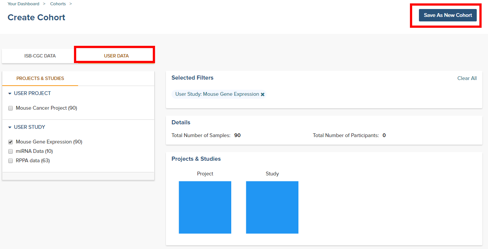
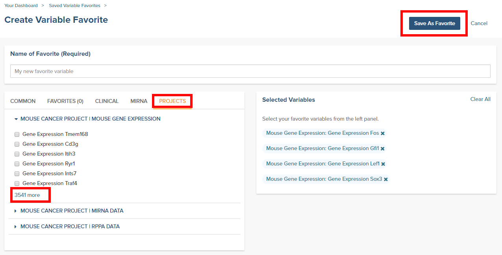
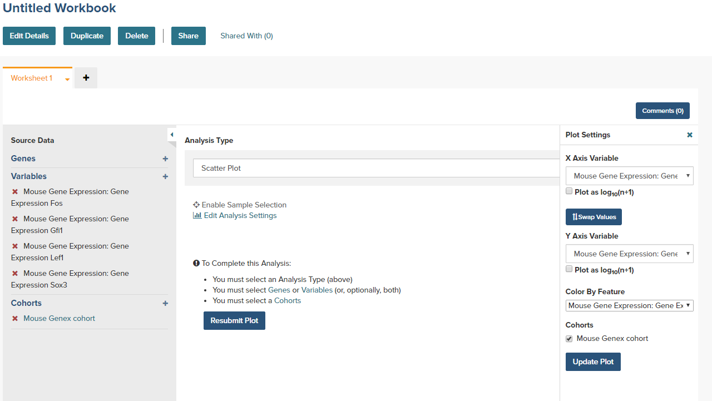

##############################
Graphing User Data
##############################

Once a user has `uploaded their own data`_ to the Web App, that data can be visualized using the same graphing tools that are available for graphing TCGA, CCLE, TARGET and BEATAML1.0 data.  However, the process for graphing user data is slightly different from how it is done for that data.

.. _uploaded their own data: http://isb-cancer-genomics-cloud.readthedocs.io/en/latest/sections/webapp/program_data_upload.html

Important sections on the Web App Dashboard
############################################
The boxes in the figure below are links that are used to graph user data.

Step 1: Create a Cohort from your project
##########################################
* From the Web App Dashboard, click on **Create Cohort**.
* Click on the **User Data** tab and select the project or study that will be the cohort.
* Save as a new cohort.

Step 2: Create a Variables Favorite
####################################
* From the Web App Dashboard, click on **Create Variable Favorites**.
* Click on the **Projects** tab to see the user supplied studies.
* Select the variables that will be available to graph.  Note that if the study has a large number of selections, using the browser search function can help locate the item.
* Give the variables a name and click on the **Save as Favorite** button.

Step 3: Graph the Favorites in a Workbook
#########################################
* From the Web App Dashboard, click on **Create a new Workbook**.
* Under the **Source Data** heading, select the Variables and Cohorts that you wish to use in the graph.  In each case you will be brought to a page listing all of the available Variables or Cohorts.  Simply select the desired ones and then click the **Add to Workbook** button.
* Under the **Analysis Type** heading, select the appropriate graph type.  This will cause a window to slide in from the right.
* Fill in the X and Y axis variables, select a variable to use for coloring and finally select the cohort to use.  

* Click on the **Update Plot** button to have the system gather the data and generate the plot.
* If changes need to be made to the plot, click on the **Edit Analysis Settings** link to bring back the graph dialog box. 

.. image:: GraphingGraphed.png
