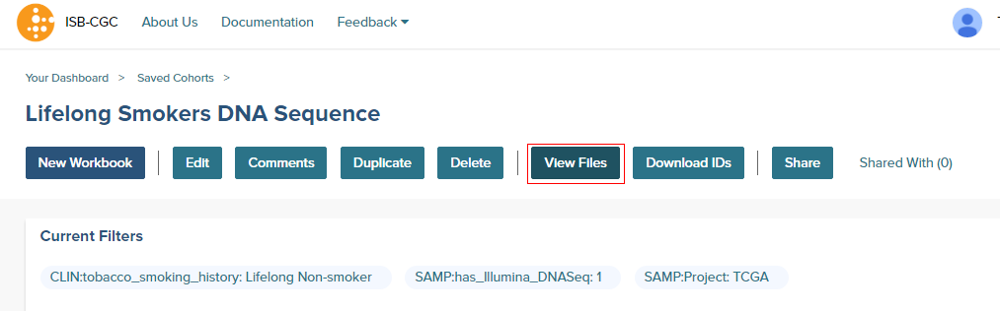
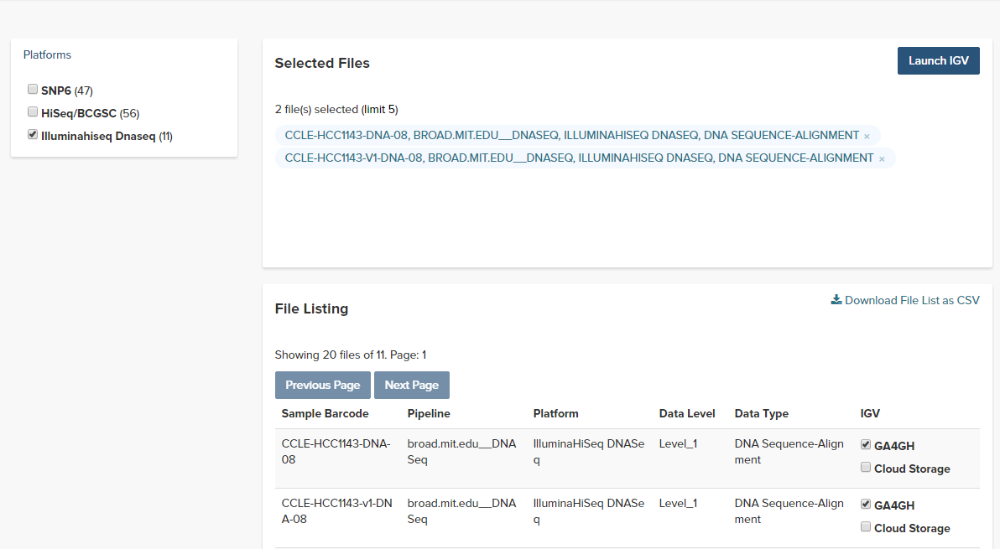

*********************************
Integrative Genomics Viewer (IGV)
*********************************

Accessing the IGV Browser
-------------------------
The IGV Browser is an interactive tool used to explore integrated genomic data sets using a wide variety of data types.  

To access IGV, first select a cohort and then go to the cohort file list page (through the "View Files" link at the top of the page).

The resulting file list can be filtered using the Platforms listed on the left.  Any file that can be displayed in the IGV Browser will have a "GA4GH" (for files with a ReadGroupSet ID in Google Genomics) or a "Cloud Storage" (for files available via Google Cloud Storage) checkbox in the IGV column on the right side of the file table.  Note that many files viewable in IGV may require that the user have dbGaP authorization to view controlled access data.  If the user has been authenticated and authorized through the user details page, the user will be able to select files.  Otherwise the cursor will be disabled when the user hovers over a checkbox.  Open source data such as the CCLE project do not require dbGaP authorization and can be viewed by any authenticated user.

Once a maximum of five files ahs been selected, they can be viewed in the IGV Browser by clicking on the "Launch IGV" button in the upper right of the window

NOTES:
 - You will only be able to view controlled access sequence files if you have `logged in as a registered dbGaP authorized user <Gaining-Access-To-TCGA-Contolled-Access-Data.html>`_.
 - You will need to disable your browser pop-up blocker to view files with IGV.  If you see a 403 error when using the IGV viewer, the pop-up blocker is the cause of that error.  Turn off the blocker and try again.

("ReadGroupSet" is a GA4GH term for a group of aligned DNA- or RNA-seq reads, 
typically from a single sample or a single BAM file.
For the CCLE and TCGA datasets hosted by the ISB-CGC, each ReadGroupSet corresponds to a single BAM file which
in turn corresponds to the aligned DNA- or RNA-seq reads from a single sample. IGV can also view BAM files (with associated BAM Index Files) that are stored on a Google Drive.  These are the type of files that are being viewed with the link "Cloud Storage".).

Acknowledgements
----------------

The copyright to the Integrative Genomics Viewer is held by the Broad Institute, and the software has been 
released under the MIT License.  For more information about IGV please see the 
`IGV home page <http://www.broadinstitute.org/software/igv/home>`_ or the 
`IGV github repo <https://github.com/igvteam/igv>`_.

We are grateful to the IGV team for their assistance in integrating IGV into the ISB-CGC web-app.

Robinson J T, Thorvaldsdottir H, Winckler W, Guttman M, Lander E S, Getz G & Mesirov J P, *Integrative genomics viewer*, 
`Nature Biotechnology 29, 24-26 (2011) <http://www.nature.com/nbt/journal/v29/n1/abs/nbt.1754.html>`_.

Thorvaldsdottir H, Robinson J T, Mesirov J P, 
*Integrative Genomics Viewer (IGV): high-performance genomics data visualization and exploration*,
`Briefings in Bioinformatics 14, 178-192 (2013) <http://bib.oxfordjournals.org/content/14/2/178.full?keytype=ref&%2520ijkey=qTgjFwbRBAzRZWC>`_.
