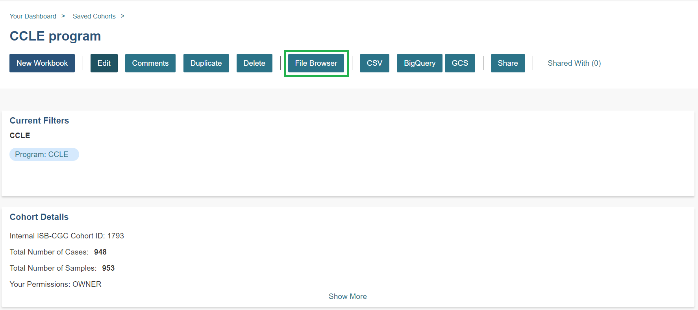
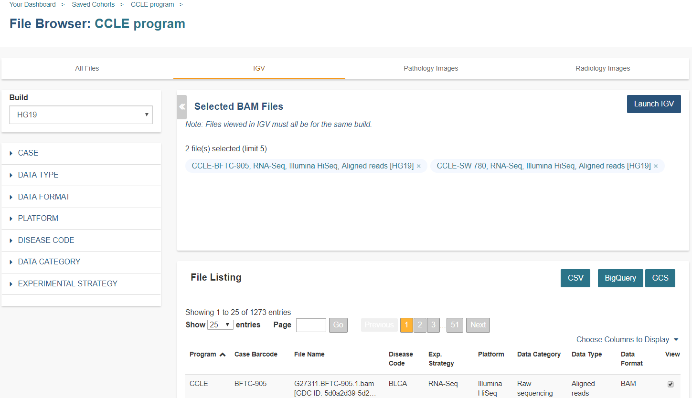

*********************************
Integrative Genomics Viewer (IGV)
*********************************
IGV is a widely used interactive tool for exploring genomic data.  A web-based version is integrated into the ISB-CGC Web App, 
and the IGV desktop version can also be used to access cancer data in Google Cloud Storage (GCS). For more information about IGV, please follow the links in the Acknowledgments section at the bottom of this page.
  
Accessing the IGV Browser from the Web App
--------------------------------------------------

.. note::
   All tissue slide images from the TCGA program are currently unavailable for viewing.

To access IGV, first select a cohort and then go to the cohort file list page by clicking on the "File Browser" button at the top of the page.

On the File Browser page, click on IGV in the top menu bar.

The resulting file list can be filtered using the Build (HG19 or HG38) and the other filters listed on the left.  
Click the View checkbox (far right column) for each file that you want to view in IGV. Sometimes the checkbox cannot be checked; here are some reasons why:
 - Many files viewable in IGV may require that the user have dbGaP authorization to view controlled access data.  If the user has been authenticated and authorized through the user details page, the user will be able to select files.  Otherwise the cursor will be disabled when the user hovers over a checkbox.  Open source data such as the CCLE project do not require dbGaP authorization and can be viewed by any authenticated user.
 - Only a maximum of five files can be selected for viewing at a time.

To view the selected files in the IGV Browser, click on the "Launch IGV" button in the upper right of the window.

NOTES:
 - You will only be able to view controlled access sequence files if you have `logged in as a registered dbGaP authorized user <http://isb-cancer-genomics-cloud.readthedocs.io/en/latest/sections/Gaining-Access-To-Controlled-Access-Data.html>`_.
 - You will need to disable your browser pop-up blocker to view files with IGV.  If you see a 403 error when using the IGV viewer, the pop-up blocker is the cause of that error.  Turn off the blocker and try again.

Using IGV Desktop Application to View Aligned Reads in Google Cloud Storage 
----------------------------------------------------------------------------

You can also download and use the IGV desktop application to view aligned reads stored in BAM files in Google Cloud Storage. To do this, `download <http://www.broadinstitute.org/software/igv/download>`_ the most recent version of IGV.  After launching IGV, go to the "Settings" menu to enable the Google Menu item in the application (`directions <http://googlegenomics.readthedocs.io/en/latest/use_cases/browse_genomic_data/igv.html>`_ on how to do this).

To load BAM files from ISB-CGC Google Cloud Storage, use the "File" > "Load from URL..."  menu item in the IGV application, entering the path to the bam file in GCS.  Paths to BAM files stored by ISB-CGC can be found using the ``cohorts().cloud_storage_file_paths()`` and ``samples().cloud_storage_file_paths()`` APIs described `here <https://isb-cancer-genomics-cloud.readthedocs.io/en/latest/sections/progapi/progAPI-v4/Programmatic-Demo.html>`_.

NOTE:
 - You will only be able to view controlled access sequence files if you have `logged in as a registered dbGaP authorized user <http://isb-cancer-genomics-cloud.readthedocs.io/en/latest/sections/Gaining-Access-To-Controlled-Access-Data.html>`_.

Acknowledgments
----------------

The copyright to the Integrative Genomics Viewer is held by the Broad Institute, and the software has been 
released under the MIT License.  For more information about IGV please see the 
`IGV home page <http://www.broadinstitute.org/software/igv/home>`_ or the 
`IGV github repo <https://github.com/igvteam/igv>`_.

We are grateful to the IGV team for their assistance in integrating IGV into the ISB-CGC Web App.

Robinson J T, Thorvaldsdottir H, Winckler W, Guttman M, Lander E S, Getz G & Mesirov J P, *Integrative genomics viewer*, 
`Nature Biotechnology 29, 24-26 (2011) <http://www.nature.com/nbt/journal/v29/n1/abs/nbt.1754.html>`_.

Thorvaldsdottir H, Robinson J T, Mesirov J P, 
*Integrative Genomics Viewer (IGV): high-performance genomics data visualization and exploration*,
`Briefings in Bioinformatics 14, 178-192 (2013) <http://bib.oxfordjournals.org/content/14/2/178.full?keytype=ref&%2520ijkey=qTgjFwbRBAzRZWC>`_.
