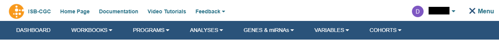

**********
Menu Bar
**********

Clicking on the word Menu in the upper-right corner of your browser window (next to your name) will display the
blue menu bar.  You can make this menu bar disappear by clicking on the blue **X** or the word Menu again.

For additional details about each menu item, see the corresponding section in this user guide.

The **MENU** bar supplies links for the following Web App features: 

* **DASHBOARD** - This menu item takes you to **Your Dashboard**, the Web App home page.

* **WORKBOOKS** - Workbooks store the Analyses you create, and their related data. You can create worksheets as you explore and analyze selected underlying data (i.e. Genes and miRNAs, Variables and Cohorts). From the Workbook menu item, you can select the following:
   
   - Saved Workbooks - Displays all your saved workbooks and allows you to edit, duplicate or delete the workbooks.
   - Create a New Workbook - Allows you to create a new workbook by selecting the data source and analysis type.
     
* **PROGRAMS** - This menu item provides a shortcut to the programs you have created if you uploaded your own data.
   
    - Saved Programs - Here you can: 

      * Edit or delete a Saved Program
      * Start a New Workbook
      * Create a New Program
       
    - Upload Program Data - Here you can:
     
      * Create a new program for analysis. To create a new program you provide a name for program, name for your project, and attach files that meet our Data Type requirements. Please see `Program Data Upload <program_data_upload.html>`_ for more information on data type accepted by the ISB-CGC. 
        
    - Public Programs - Here you can:
        
      *  View the public programs that are currently in the ISB-CGC system. 

* **ANALYSES** - From here you can Create, Edit Details, Duplicate, Delete, or Share Analyses. You can use a specific analysis type to create a new workbook customized with the specific data (Genes and miRNAs, Variables, Cohorts) you have selected.  The plot types that you can select are:
    
    - Bar Chart
    - Histogram
    - Scatter Plot
    - Violin Plot
    - Cubby Hole Plot
    - SeqPeek
    - OncoPrint
    - OncoGrid

* **GENES & miRNA** - From this menu selection you can **Manage Gene and miRNA Favorites**, **Create Gene and miRNA Favorite(s)** or **Select Genes and miRNAs for a New Workbook**. 

    - Manage Gene & miRNA Favorites - Here you can:
    
      * Edit or Delete a Saved Gene and miRNA Favorite(s) 
      * Start a New Workbook
      * Create a New Gene and miRNA Favorites
      
    - Create Gene & miRNA Favorite - Here you can:

      * Create a Gene & miRNA Favorite for Analysis. To Create a New Gene and miRNA Favorite - You provide a name and select the Gene and/or miRNA. You can upload a stored Gene and miRNA List or type in Gene name  or miRNA (**Note:** This will auto fill as you type in Gene name or miRNA name). To aid in Gene selection, you can access the HGNC portal (Hugo Gene Nomenclature Committee) via the "**View Gene Identifiers**" link under this Menu selection. Also, to aid in miRNA selection, you can access the miRBASE via the "**View miRNA Identifier**" link next to the View Gene Identifiers link. 
      
    - Select Genes & miRNA for a New Workbook - This sub-menu has two features:
      
      * Apply to New Analysis - Select a Favorite(s) Gene and miRNA from the list shown of stored Favorites to Analyze 
      * Add (+) Apply to New Analysis - Basically navigates back to the **Create Gene and miRNA Favorite** (See description above)  

* **VARIABLES** -  This menu item allows you to **Manage Variables Favorite** or **Create New Favorite**.
    
    - Manage Variable Favorites Lists - Shows your saved Variables as Favorites:

      * Edit 
      * Delete 
      * Start New Workbook - (Create a New Workbook using the selected Favorite Variables)

    - Create Favorite Variable(s) List - Here you "Name" your new favorite and select variables from four available data sources to incorporate in your analysis:

      * Common Variables
      * Favorite(s) Saved
      * Programs (Previously Uploaded and Saved) 
      
    - Select Variables for a New Workbook - This sub-menu has two features:
      
      * Apply to New Worksheet - Select a Favorite(s) variables from the list shown of stored Favorites to Analyze 
      * Add (+) Apply New Variable List - Basically navigates back to the **Create Variables Favorite** (See description above)  
  
* **COHORTS** - Here you can **Manage Saved Cohorts**, select **Public Cohorts** and **Select Cohorts for a New Workbook** or **Create your First Cohort** if it's empty.

    - Manage Saved Cohorts - There are two tabs:
      
      - Saved Cohorts - Displays previously created cohorts which can be selected. If no cohorts exist, you can create your first Cohort here by selecting the "Create Your First Cohort" link displayed and selecting Donors and Data Types. Within Saved Cohorts you can:
         
         - Create a "New Workbook" from a saved Cohort
         - Delete a Saved Cohort
         - Set Operations (i.e., Union, Intersection or complement) from a Base or Subtracted Cohort.
         
      - Public Cohorts - Displays any public cohorts which can be selected.
         
         - Create a "New Workbook" from a saved Public Cohort
         - Set Operations (i.e., Union, Intersection or complement) from a Base or Subtracted Cohort.
         
    - Create a New Cohort - Allows you to create new cohorts using filters (such as Gender, disease code, sample type) and barcodes.

    - Public Cohorts - This menu item takes you to the same Public Cohorts page described above.
    
    - Select Cohorts for a New Workbook - This menu item takes you to the same Saved Cohorts and Public Cohorts pages described above.
