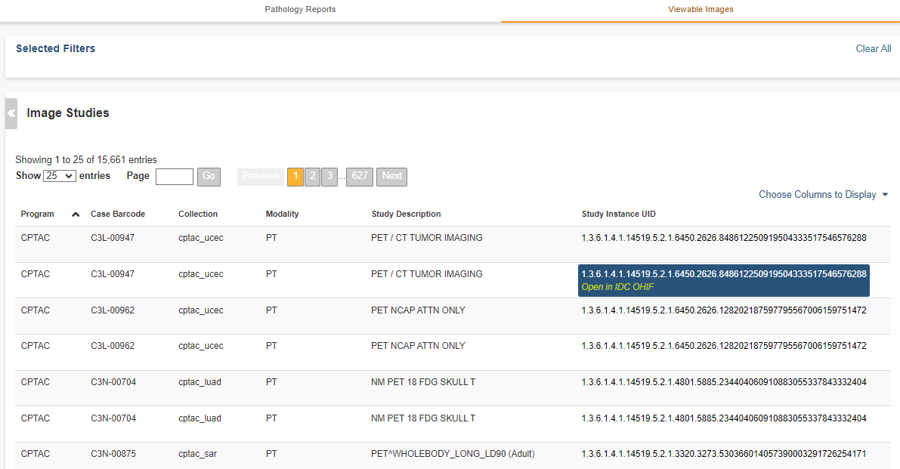
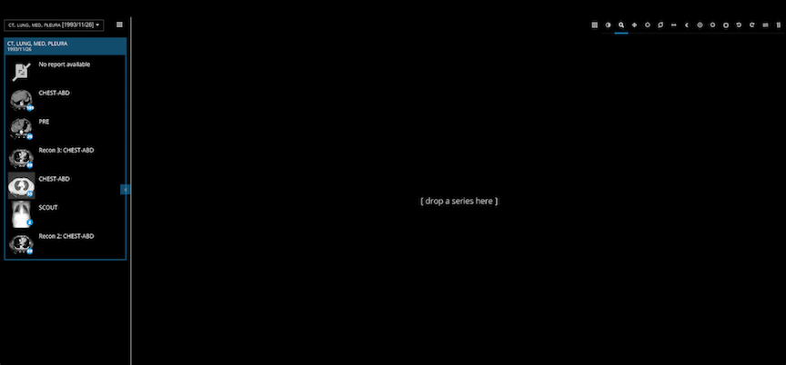

Radiology Viewer
================
Radiology images are viewed in an Osimis Web Viewer, a plug-in to the `Orthanc Image Server`_ (Orthanc). The ISB_CGC web application uses an instance of Orthanc to manage radiology files for the purpose of viewing. Currently only DICOM formatted files from TCGA samples are available for viewing. It may be helpful to review the `DICOM Model of the Real World <http://dicom.nema.org/medical/dicom/current/output/html/part03.html#chapter_7>`_ to understand the relationship between patients DICOM studies, DICOM series and DICOM instances.

.. _Orthanc Image Server: https://www.orthanc-server.com/

The ISB-CGC web application `File Browser page`_ presents a table of DICOM studies associated with patients in some cohort.

.. _File Browser page: https://isb-cancer-genomics-cloud.readthedocs.io/en/latest/sections/webapp/Saved-Cohorts.html#view-file-browser-page

Viewer Components
_________________

Clicking on a study in the table opens an Osimis Web Viewer in a new tab: 

All the DICOM series which comprise the selected study are shown as thumbnail images in the Series Selection Panel. Note that it can take several seconds for these thumnails to appear. By default, the thumbnails are laid out in a grid pattern. This can be changed to a list format by clicking on the **List Display** button |list| above the thumbnails. The list format displays a description of each series. 

Change back again to the grid pattern by clicking on the **Grid Display** button |grid|.

To the lower right of each thumbnail is a small blue circle in which is displayed the number of DICOM instances which comprise the corresponding DICOM series. In addition, when your cursor hovers over a thumbnail, the viewer cycles through the instances comprising the series. (Note these low resolution images are loaded in the background and may not be available for cycling immediately after the viewer window opens.)

To view a larger rendering of a series, drag its thumbnail into the viewport. The first instance of the series is immediately displayed. 

At the same time, at the bottom of the viewport you will notice a grid comprised of a series of rectangles corresponding to the instances in the series. The color of the tabs indicates the following:

* Black: The corresponsing instance is not yet avialable for viewing
* Red: A reduced resolution image of the instance is available for viewing
* Green: The full resolution image of the instance is available for viewing

Typically, the viewer loads reduced resolution images for all series as quickly as possible. It loads full resolution images only when a series is dragged into the viewport.

When instance images have been loaded, you can scroll through the instances using your mouse's thumbwheel or equvalent. As you scroll, the grid at the bottom of the screen highlights the instance currently being displayed. Clicking on a rectangle in the grid causes the corresponding instance to be displayed. The **Play Controls** |play| in the lower left corner of the main window enable you to single step forward or back through the series, and to cycle throught series repeatedly. A frame rate slider pops up when you hover over the play button. 

.. |play| image:: OsimisPlay.png

Viewing Functions
_________________

A set of buttons above the viewport provides a range of functions. 

.. image:: OsimisViewportButtons.png
  :align: center

The **Layout** button |layout| controls subdividing the viewport for the simultaneous display of one, two or four series. Drag a series into any of the subviewports to display it. Clicking in a subviewport gives it focus for mousewheel and cursor drag operations.

.. |layout| image:: OsimisLayout.png

Of the remaining buttons, some are modal, changing the effect of the cursor drag function. A blue line underscores the currently selected mode. Other buttons immediately perform some operation on the subviewport that has focus.

* The **Invert Color** button |invert| immediately inverts the colors of the series in the (sub)viewport having focus.

* The **Zoom** button |zoom| is modal. When selected, dragging the cursor with mouse button depressed expands or contracts the series in the (sub)viewport having focus. Expansion/contraction is around the cursor position at which dragging begins.

* The **Pan** button |pan| is modal. When selected, dragging the cursor with mouse button depressed causes panning of the series in the (sub)viewport having focus. 

* The **Windowing Presets** button |presets| operates both modally and immediately. Hovering the cursor over the button displays a list of windowing presets, one of which can be selected by clicking on it. The selection immediately sets Window Width (WW) and Window Center (WC) values for the series in the (sub)viewport having focus. The WW,WC value pair specifies a linear conversion from stored pixel values to values to be displayed. See here_ for further information on Window Center and Window Width.

  DICOM instances generally include WW,WC value pairs and these are used by default. Other WW,WC value pairs that may be appropriate for specific cases can be selected on the pop-up. The *Preset #1* selection restores WW,WC to the DICOM setting.
  
  The Windowing Presets button operates modally when clicked. In this mode, dragging the cursor left or right in a (sub)viewport changes the Window Width value applied to the series in that (sub)viewport. Dragging the cursor up or down in a (sub)viewport changes the Window Center value applied to the series in that (sub)viewport.

.. _here: http://dicom.nema.org/medical/dicom/current/output/html/part03.html#sect_C.11.2.1.2

.. |presets| image:: OsimisPresets.png
* The **Magnifying Glass** button |glass| is modal. Hovering the cursor over the button displays a pop-up containing two sliders that control the magnification level and size of a virtual magnifying glass. When selected, dragging the cursor with mouse button depressed opens a virtual magnifying glass that displays a magnified rendering of the underlying image in the region of the cursor.

.. |glass| image:: OsimisGlass.png
* The **Length Measurement** button |len| is modal. When selected, the distance in physical units between two points in an instance can be measured. To perform a measurement, click the mouse button once with the cursor over some point of interest, and then again over a second point of interest. Alternatively, depress and hold the mouse button while the cursor is over the first point of interest, then release the mouse button while the cursor is over the second point of interest. A line joining the two points and its length are displayed. The line will scale if the series is zoomed in or out.

  A length measurement can be moved by clicking on it and dragging. To remove a length measurement, drag it or an endpoint outside of the extent of the between instance. Note that if you have "zoomed in" on an instance, its extent may be much larger than the (sub)viewport in which it is displayed. This can make it difficult to drag the measure outside of the extent of the instance. In this case it may be necessary to "zoom out" in order to be able to drag the measure outside of the extent of the instance. 
 
  A length measurement is only visible on the instance on which it was made. There is currently no support for saving length measurements.

.. |len| image:: OsimisLength.png
* The **Angle Measurement** button |ang| is modal. When selected, the angle between features in an instance can be measured. To perform a measurement, click on a point of interest in an instance. A pair of lines are displayed. Drag the end points of the lines as needed to form the angle to be measured. The angle between the lines is displayed continuously as any endpoint is dragged.
  
  An angle measurement can be moved by clicking on one of the lines and dragging it while holding down the mouse button. To remove an angle measurement, drag it or an endpoint outside of the extent of the instance. Note that if you have "zoomed in" on an instance, its extent may be much larger than the (sub)viewport in which it is displayed. This can make it difficult to drag the measure outside of the extent of the instance. In this case it may be necessary to "zoom out" in order to be able to drag the measure outside of the extent of the instance.
  
  An angle measurement is only visible on the instance on which it was made. There is currently no support for saving angle measurements.  

.. |ang| image:: OsimisAngle.png
* The **Pixel Probe** button |probe| is modal. When selected, clicking on a point in an instance displays a circle at the probe point, the X and Y location of the pixel relative to the top left corner of the instance, and the intensity or color of the selected pixel. The value of color instance pixels is specified in RGB coordinates. For monochrome instances, both a Stored Pixel value (SP) and a Modality Pixel value (MO) are displayed. The MO values is calculated as ``SP * RescaleSlope + RescaleIntercept``, where RescaleSlope and RescaleIntercept are DICOM values of the instance. 

  A pixel probe can be moved by clicking on the probe indicator and dragging it while holding down the mouse button. To remove a pixel probe, drag it outside of the extent of the instance. Note that if you have "zoomed in" on an instance, its extent may be much larger than the (sub)viewport in which it is displayed. This can make it difficult to drag the measure outside of the extent of the instance. In this case it may be necessary to "zoom out" in order to be able to drag the measure outside of the extent of the instance.

  A pixel probe is only visible on the instance on which it was made. There is currently no support for saving pixel probes.  

.. |probe| image:: OsimisPixelProbe.png
* The **Elliptical ROI** button |eROI| is modal. When selected, click on an instance and drag either of the small circles to configure an elliptical region of interest. The area, in pixels, of the ellipse is displayed near the ellipse. On monotone instances, the mean and standard deviation of the intensities of the pixels within the ellipse are also displayed. 
  
  An ellipse can be moved by clicking on its border and dragging it while holding down the mouse button. To remove an elliptical ROI, drag the ellipse or one of its control points outside of the extent of the instance. Note that if you have "zoomed in" on an instance, its extent may be much larger than the (sub)viewport in which it is displayed. This can make it difficult to drag the ROI outside of the extent of the instance. In this case it may be necessary to "zoom out" in order to be able to drag the ROI outside of the extent of the instance.

  An elliptical ROI is only visible on the instance on which it was made. There is currently no support for saving elliptical ROIs.
  
.. |eROI| image:: OsimisEllipticalROI.png
* The **Rectangle ROI** button |rROI| is modal. When selected, click on an instance and drag either of the small circles to configure a rectangular region of interest. The area, in pixels, of the rectangle is displayed near the rectangle. On monotone instances, the mean and standard deviation of the intensities of the pixels within the rectangle are also displayed. 
  
  A rectangle can be moved by clicking on its border and dragging it while holding down the mouse button. To remove a rectangular ROI, drag the rectange or one of its control points outside of the extent of the instance. Note that if you have "zoomed in" on an instance, its extent may be much larger than the (sub)viewport in which it is displayed. This can make it difficult to drag the ROI outside of the extent of the instance. In this case it may be necessary to "zoom out" in order to be able to drag the ROI outside of the extent of the instance.

  A rectangular ROI is only visible on the instance on which it was made. There is currently no support for saving rectangular ROIs.
  
.. |rROI| image:: OsimisRectangleROI.png
* The **Rotate Left** button |left| immediately performs a ninety degree left rotation of the image in the (sub)viewport that has focus.

* The **Rotate Right** button |right| immediately performs a ninety degree right rotation of the image in the (sub)viewport that has focus.

* The **Flip Horizontally** button |hflip| immediately performs a flip about the Y axis of the image in the (sub)viewport that has focus.

* The **Flip Vertically** button |vflip| immediately performs a flip about the X axis of the image in the (sub)viewport that has focus.

  

  
  
