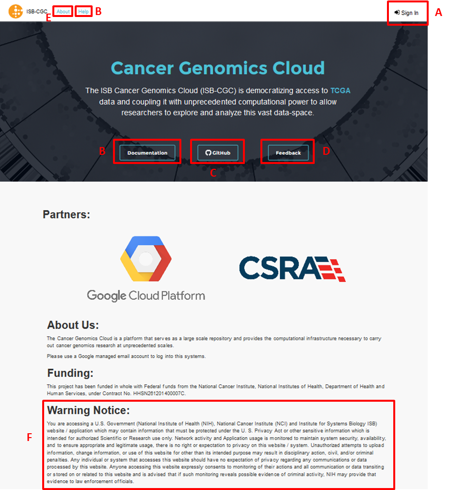
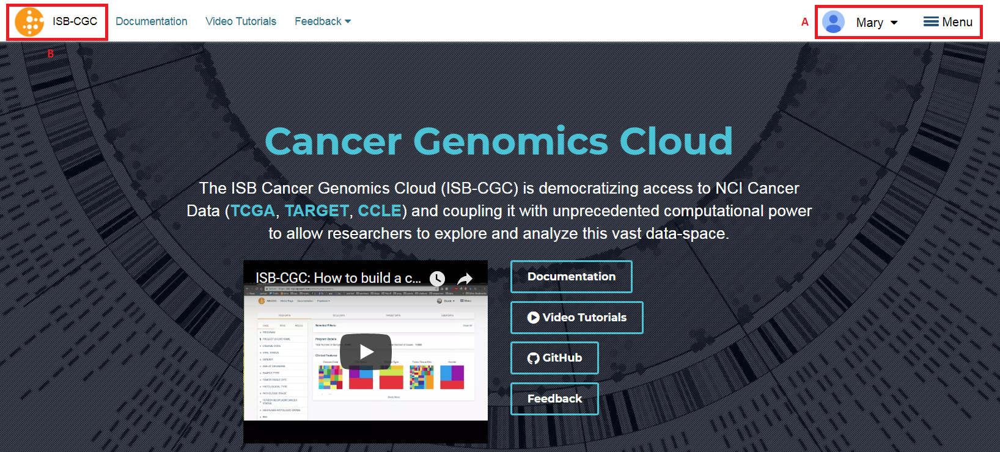

****************
Login to Web App
****************

The ISB-CGC Web App is accessed through a Google Account identity (freely available `with a new account <https://accounts.google.com/signupwithoutgmail?hl=en>`_ or `by linking to an existing email account <https://accounts.google.com/SignUpWithoutGmail>`_).  If you are not logged into the ISB-CGC Web App, you will be presented with this page:

You login through the "Sign In" link in the upper right.  

Also on this page are links to:

- ISB-CGC BigQuery Table Search 
- Cancer Data File Browser
- Chromosomal Aberations & Gene Fusions (Mitelman) database 
- Cohort Builder/Data Explorer
- Pipelines and APIs
- Notebooks
- Controlled Access Data
- Documentation
- ISB-CGC Publications and Citations

**If your screen looks like this:** 

You have successfully logged into ISB-CGC Web App! Please subscribe for updates provided by ISB-CGC. 

