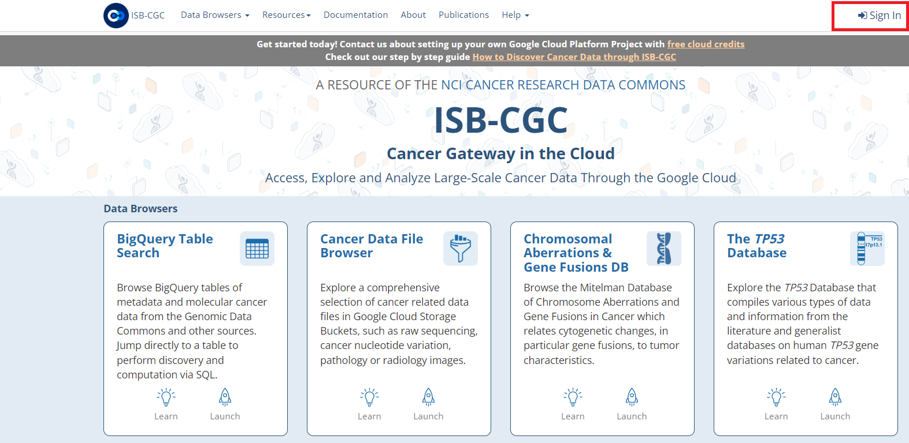
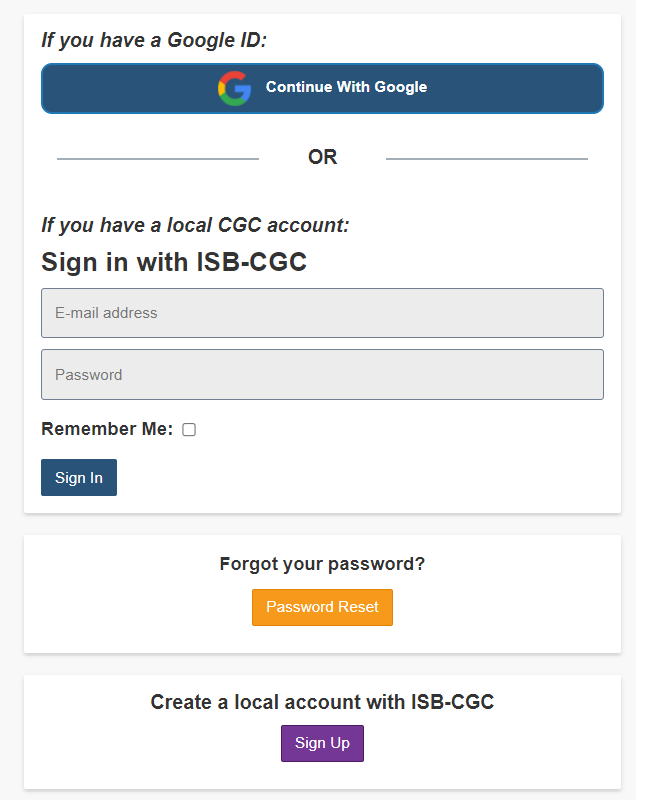

****************
Login to Web App
****************

To access the ISB-CGC Web App, first login by clicking on the "Sign In" link in the upper right. 

A login screen will display. You can log in with an existing Google account or with your email.

If you have a Google ID
=======================

If you have an existing Google account, you can use it to log into the ISB-CGC Web App. 

- Click on the **Continue with Google** button.
- On the next screen, enter your email address which you have previously associated with a Google account.
- Click **Next**.
- On the next screen, enter your Google account password and click **Next**.

If you have saved workbooks, cohorts or other data that you previously entered using this Google account, they will display on **Your Dashboard**.

If you don't have a Google account and would like one, `create a Google account <https://accounts.google.com/SignUpWithoutGmail>`_. You can link the Google account to an existing email or use a Gmail address.

If you have a local CGC account
===============================

To log in with an email only, first you need to create an ISB-CGC Web App account for that email. See the section below **Create a local account with ISB-CGC**. Once you've create that account:

- Enter your email and password for your ISB-CGC Web App account.
- Click the **Sign In** button.

If you have saved workbooks, cohorts or other data that you previously entered using this email, they will display on **Your Dashboard**.

.. note:: If you attempt to log in with an email that is associated with a Google account already registered with the ISB-CGC Web App, a message "Please log into this account using Google (above)." will display.

Forgot your password?
=====================

Create a local account with ISB-CGC
===================================

- Click the **Sign Up** button.
- On the next screen, enter your email, and create a password for your ISB-CGC Web App account.
  - The password must be at least 16 characters.
  - The password must contain at least one each of the following: a lower-case letter, an upper-case letter, a number, and a special character from the set !@#$%^&*+:;?.
- Click **Sign Up >>**.
- The next screen will instruct you to check your email for a verification email. Click the link in this email.
- Clicking this link will display a **Confirm E-mail Address** screen. Click the **Confirm** button.
- A message will indicate that you've confirmed this email address. You can now sign in to ISB-CGC with this email.

.. note:: If you attempt to sign up with an email that is associated with a Google account already registered with the ISB-CGC Web App, a message "Please use Google login with this email address." will display.

Also on the ISB-CGC home page are links to:

- ISB-CGC BigQuery Table Search 
- Cancer Data File Browser
- Chromosomal Aberations & Gene Fusions (Mitelman) database
- The *TP53* Database
- Cohort Builder/Data Explorer
- Pipelines and APIs
- Notebooks
- Controlled Access Data
- Documentation
- ISB-CGC Publications and Citations

**If your screen looks like this:** 

You have successfully logged into ISB-CGC Web App! Please subscribe for updates provided by ISB-CGC. 

.. image:: IfYourScreenLooksLikeThis.png
   :align: center
