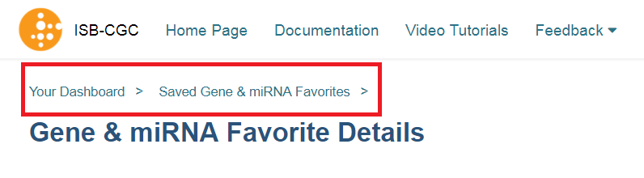

********
Overview
********

The ISB-CGC web application functionality is accessed through a Google account identity (freely available `with a new account <https://accounts.google.com/signupwithoutgmail?hl=en>`_ or `by linking to an existing email account <https://accounts.google.com/SignUpWithoutGmail>`_).  If you have not logged into the ISB-CGC application you will be presented with this page:

.. image:: startscreen-nologin.png
   :scale: 50
   :align: center

You login through the "Sign In" link at the upper right of the initial page (label "A" in the image above).  
Also on this page are links to project documentation (B), our public GitHub repository (C), 
a link to provide feedback (D), a link to submit an issue to Github (E), a link to more information about ISB-CGC (F), and our required "Warning Notice" (G) indicating that this is a U.S. Government Sponsored Website and by using it you are accepting the policies associated with its use.

Upon signing in with a Google account identity, you will be presented with the following page:

.. image:: startscreen-login.png
   :scale: 50
   :align: center

This is your personal "Dashboard" where your Analyses, Gene and miRNA Lists, Variable Lists, Cohorts, and Saved Programs are readily accessible.  Additional documentation describing how to use each component of this user interface are provided in the individual subsections of this documentation.

Multiple Sample Analyses can be grouped into Workbooks (and saved for later use, editing, and sharing).  
Workbooks are used to group together multiple related analyses, and can be used for sharing groups of 
analysis results with specific groups of people.  For example, you may use one Workbook for an on-going study of gene 
mutations and pathways involved in Head and Neck Cancer (with one research group you are part of), 
and use a different Workbook for another on-going study with a different set of collaborators in which you are 
investigating survival-time after diagnosis for patients with different types of lung cancers.
Think of workbooks as containers in which you can create and group related analyses, and which you can share
with specific colleagues.

**IF YOUR SCREEN LOOKS LIKE THIS (how do I get to the main screen?):** 
If your screen looks like the image below (I am logged in (A in image) but I can't see my analyses pages ("Your Dashboard" - image above)) 
that is because some browsers save your Google Login as a cookie, and automatically sign you in.  
To get to "Your Dashboard" click on the "ISB-CGC" icon in the upper left (B in the image).  
This will always take you to the main analysis dashboard screen.

.. image:: IfYourScreenLooksLikeThis.png
   :scale: 50
   :align: center

**Breadcrumbs** show you where you are in the Web Interface as you move from one section to another (figure below).  
These are live links, and can be used to rapidly navigate from one section of the interface to another.

The data that is being manipulated with the Web Application is the same data that is available through the programmatic APIs.  
Details describing how to access these data are provided in detail in specific documentation sections elsewhere in the documentation.

The Web Application was optimized for use with the Google Chrome web browser.  Most of the functionality should work with recent versions 
of other web browsers (e.g. Firefox, Safari, Internet Explorer).  If you find an issue and you are not using Chrome, please
try using Chrome to see if the issue appears to be browser-specific.

 Also please note the system is set in Pacific time, so if you see some inconsistencies with the time in the workbooks or cohorts you generated in the last updated section it could be due to this fact. 

If you encounter issues or have questions, please use our `feedback <https://groups.google.com/a/isb-cgc.org/forum/#!newtopic/feedback>`_ forum.

