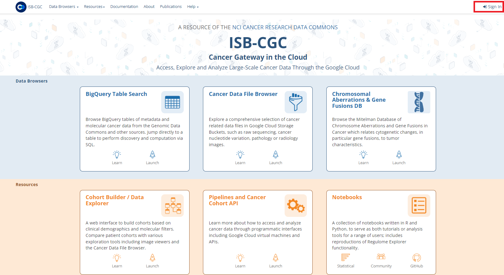

*********************
Log In to the Web App
*********************

There are two distinct ways to log in and access the ISB-CGC Web App:

- Log into ISB-CGC via your Google account
- Create an ISB-CGC account using your email address

**The two ways to log in are not completely equivalent. If you plan to perform any functions that require Google authentication, such as exporting cohorts to BigQuery, then you’ll need to use the first route, and log into ISB-CGC via your Google account.**

To access the ISB-CGC Web App, first log in by clicking on the "Sign In" link in the upper right of the ISB-CGC home page. 

Sign In screen
##############

A **Sign In** screen will display. You can log in with an existing Google account or with your email.

.. image:: Sign-In-page.png
   :align: center

Log in with a Google account
============================

If you have an existing Google account, you can use it to log into the ISB-CGC Web App. If you wish to export cohorts to BigQuery tables, this is the method you *must* use.

- Click on the **Continue with Google** button.
- On the next screen, enter your email address which you have previously associated with a Google account.
- Click **Next**.
- On the next screen, enter your Google account password and click **Next**.

If you have saved cohorts that you previously entered using this Google account, they will display on the **Manage Saved Cohorts** page.

If you don't have a Google account and would like one, `create a Google account <https://accounts.google.com/SignUpWithoutGmail>`_. You can link the Google account to an existing email or use a Gmail address.

Log in with an email address
===============================

Alternatively, you can log in with only an email. As noted above, if you plan to export cohorts to BigQuery, do not use this method. First you need to create an ISB-CGC Web App account for that email. See the section below "Create an account with ISB-CGC using an email". Once you’ve created that account:

- Enter your email and password for your ISB-CGC Web App account.
- Click the **Sign In** button.

If you have saved cohorts that you previously entered using this email, they will display on the **Manage Saved Cohorts** page.

.. note:: If you attempt to log in with an email that is associated with a Google account already registered with the ISB-CGC Web App, a message "Please log into this account using Google (above)." will display.

Forgot your password?
=====================

To reset your password associated with your email for your ISB-CGC Web App account:

- Click the **Password Reset** button.
- On the next screen, enter your email address, and then click on **Reset My Password**.
- You will receive a Password Reset email. Click the link in this email to reset your password.

.. note:: If you need to reset your Google account password, you'll need do to that through the `Google Reset Password option  <https://support.google.com/googleone/answer/41078>`_.

Create an account with ISB-CGC using an email
=============================================

If you are planning to create an ISB-CGC account using a Google email (e.g. ``johnDoe@gmail.com``, or if your company or institution uses Gmail services, or you have made your email into a Google ID), you should instead use that email to log in using the first method ("Log in with a Google account").

- Click the **Sign Up** button.
- On the next screen, enter your email, and create a password for your ISB-CGC Web App account.
  - The password must be at least 16 characters.
  - The password must contain at least one each of the following: a lower-case letter, an upper-case letter, a number, and a special character from the set ``!@#$%^&*+:;``?.
- Click **Sign Up >>**.
- The next screen will instruct you to check your email for a verification email. Click the link in this email.
- Clicking this link will display a **Confirm E-mail Address** screen. Click the **Confirm** button.
- A message will indicate that you've confirmed this email address. You can now sign in to ISB-CGC with this email.

.. note:: If you attempt to sign up with an email that is associated with a Google account already registered with the ISB-CGC Web App, a message "Please use Google login with this email address." will display.

ISB-CGC Home Page
#################

Also on the ISB-CGC home page are links to:

- ISB-CGC BigQuery Table Search 
- Cancer Data File Browser
- Chromosomal Aberations & Gene Fusions (Mitelman) database
- Cohort Builder/Data Explorer
- Pipelines and APIs
- Notebooks
- Documentation
- ISB-CGC Publications and Citations

