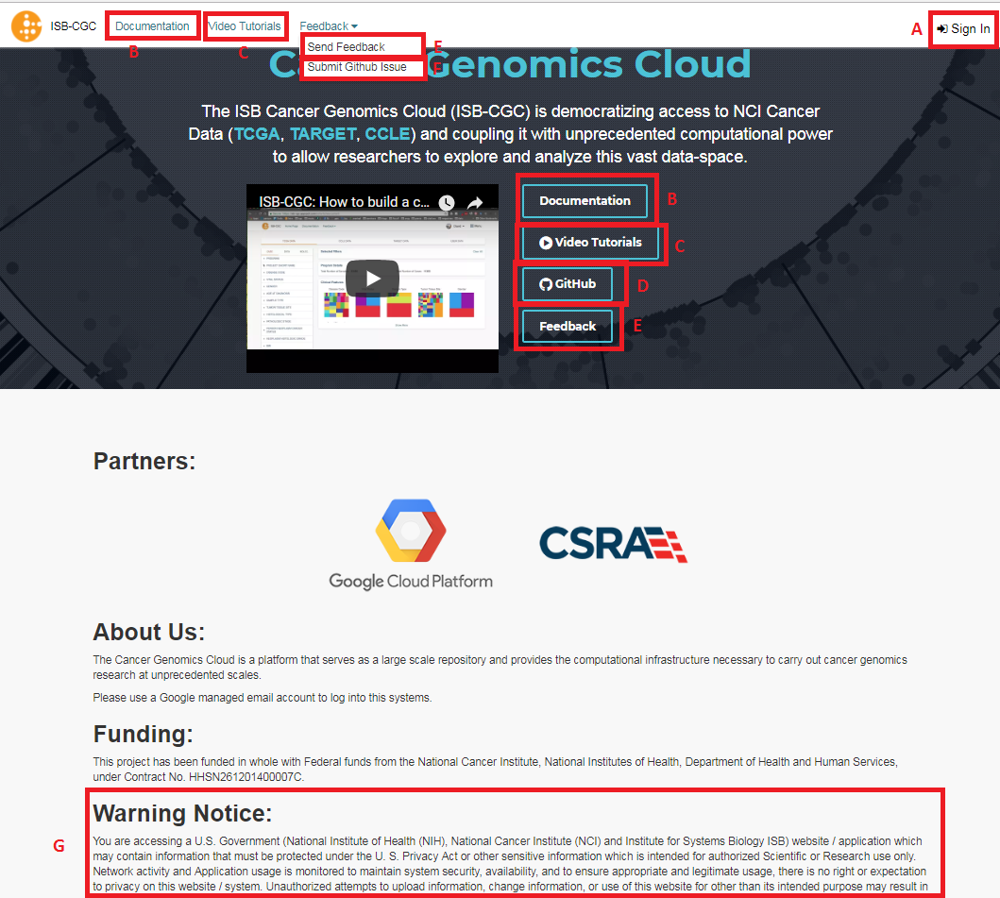

****************
Login to Web-App
****************

The ISB-CGC web application is accessed through a Google account identity (freely available `with a new account <https://accounts.google.com/signupwithoutgmail?hl=en>`_ or `by linking to an existing email account <https://accounts.google.com/SignUpWithoutGmail>`_).  If you have not logged into the ISB-CGC application you will be presented with this page:

You login through the "Sign In" link at the upper right (label "A" in the image above).  

Also on this page are links to project documentation (B), our public video tutorials (C), our public GitHub repository (D), 
a link to provide feedback (E), a link to submit an issue to Github (F), and our required "Warning Notice" (G) indicating that this is a U.S. Government Sponsored Website and by using it you are accepting the policies associated with its use.

**IF YOUR SCREEN LOOKS LIKE THIS:** 
If your screen looks like the image below, indicating that you are logged in, but you don't see "Your Dashboard", 
that is because some browsers save your Google Login as a cookie, and automatically sign you in.  
To get to "Your Dashboard", click on the "ISB-CGC" icon in the upper left (B in the image).  
This will take you to the Dashboard screen.

.. image:: IfYourScreenLooksLikeThis.png
   :scale: 50
   :align: center
