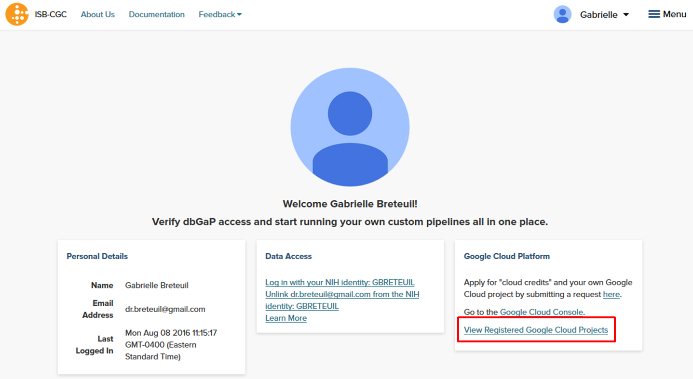
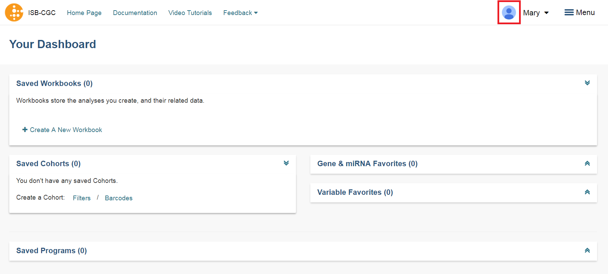

-----------------------------------
Registering a Google Cloud Project
-----------------------------------
This section will show you how to register a Google Cloud Project (GCP), which you can use to store data from ISB-CGC. Users need to have access to a Google Cloud Project to perform the steps in this section. If you don't, see the the  `ISB-CGC Quick-Start Guide <../HowToGetStartedonISB-CGC.html>`_.

To allow flexibility while working with different research teams and different processes, you can have many GCPs registered with ISB-CGC.

Registering your Google Cloud Project
--------------------------------------
Click on screen shots to enlarge them.

To register your Google Cloud Projectwith ISB-CGC, go to the Account Details page. After signing into the ISB-CGC Web App, 
either select the "persona" icon next to your login name or select **Account Details** from the drop down menu under your login name, which takes you to the following page:

   
Click the **Register** button in the Google Cloud Platform section.  That takes you to the following page:

.. image:: ../webapp/RegisterAGCPForm.png
   :scale: 35
   :align: center
   
The instructions will walk you through how to add the necessary ISB-CGC and DCF service accounts to your project. Go to the `Google Cloud Platform <https://console.cloud.google.com/>`_ and follow these steps.
You can hide the instructions by selecting the blue **Instructions** button.  

Please be sure to add both service accounts listed below. If you don't add both service accounts you will run into issues.
Then return to the ISB-CGC Register a Google Cloud Project page, enter your Google Cloud Project ID and, click **Verify**.

.. image:: ../webapp/RegisterServiceAccountsList.png
   :scale: 35
   :align: center

Once you have completed these steps, a listing of the Google Cloud Project members will display:

.. image:: ../webapp/GCPMembers.png
   :scale: 50
   :align: center
   
Click the **Register** button to go to the next screen:

.. image:: ../webapp/kidsprojectregistered.png
   :scale: 35
   :align: center

Managing your Google Cloud Projects
---------------------------------------------------
You can add or delete Google Cloud Projects by following the instructions below.

Adding additional Google Cloud Projects
~~~~~~~~~~~~~~~~~~~~~~~~~~~~~~~~~~~~~~~~~~~
To register additional Google Cloud Projects, select the **+ Register New Google Cloud Project** button from the "Registered Google Cloud Projects" page (see screenshot below).

.. image:: ../webapp/registerAnotherGCP.png
   :scale: 35
   :align: center

Deleting Google Cloud Projects
~~~~~~~~~~~~~~~~~~~~~~~~~~~~~~~~~~~~
To unregister a GCP, select the **Unregister Project** button from the drop down menu beside the project on the "Registered Google Cloud Projects" page (see screenshot below).

.. image:: ../webapp/unregisterGCP.png
   :scale: 35
   :align: center

Registering Cloud Storage Buckets and BigQuery Datasets
---------------------------------------------------

.. _registered:

Registering a Google Cloud Storage Bucket and a BigQuery Dataset is a prerequisite for storing data downloaded from the Web App to your own Google Cloud location. 
(Please note: The names of the buckets and data sets are case sensitive.)

**How To Register Buckets and Datasets**

Once you have created a bucket and a dataset in the Google Cloud Console of your Google Cloud Project, you will need to register them with your project name using the Web App.  

**Step 1**: Click on your user icon in the upper right or **Account Details** from the drop down menu under your name.

**Step 2**: Click on the **View** button under **Google Cloud Projects**.

.. image:: Register_Step_2.png

**Step 3**: Click on the project you wish to use.  If you have not registered a project, follow the instructions above.

.. image:: Register_Step_3.png

**Step 4**: Use the "Register Cloud Storage Bucket" or "Register BigQuery Dataset" links to add buckets and datasets as needed.

.. image:: Register_Step_4.png
