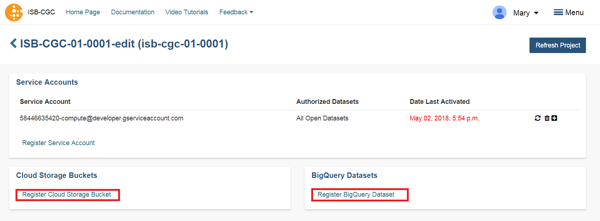

*******************************************************
Registering Cloud Storage Buckets and BigQuery Datasets
*******************************************************

.. _registered:

Registering a Google Cloud Storage Bucket and a BigQuery Data Set is a prerequisite for using your own data in ISB-CGC. (Please note: The names of the buckets and data sets are case sensitive.)

**How To Register Buckets and Data sets**

Once you have created a bucket and a dataset in the Google Cloud Console of your Google Cloud Project, you will need to register them with your project name using the Web App.  

**Step 1**: Click on your user icon in the upper right or **Account Details** from the drop down menu under your name.

.. image:: Register_Step_1.png

**Step 2**: Click on the **View** button under **Google Cloud Projects**.

.. image:: Register_Step_2.png

**Step 3**: Click on the project you wish to use.  If you have not registered a project, follow the instructions `here`_.

.. _here: ../controlled-access/Controlled-data-GCP.html

.. image:: Register_Step_3.png

**Step 4**: Use the "Register Cloud Storage Bucket" or "Register BigQuery Dataset" links to add buckets and datasets as needed.

