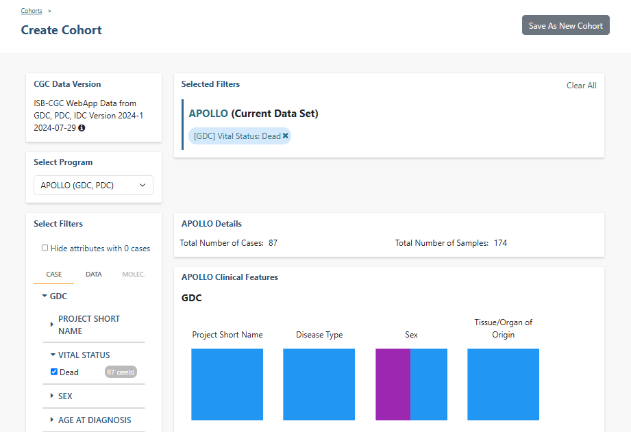

********
Cohorts
********

Cohorts are a way of creating custom groupings of the samples and/or cases that you are interested in analyzing further. You may frequently re-use a cohort in multiple analyses. Creating a "saved cohort" allows you to do this. If you have any existing saved cohorts, they will appear here for you to view, edit and share.

Create a New Cohort
###################

To create a cohort from **Your Dashboard**, click on the **Create a Cohort** link in the **Saved Cohorts** panel at the bottom of the screen and select either "Filter" or the "Barcodes" from the dropdown. The Filter link will display the cohort creation page;  filters are explained below.  The Barcodes link will display a page where you can upload samples/cases barcodes and create a cohort from them. Currently you can only upload from three programs TCGA, CCLE, and TARGET. 

If you already have saved cohorts, they will be listed in the **Saved Cohorts** panel. Click on the **Saved Cohorts** link in that panel and a page that with the details of your saved cohorts will display. Alternatively, to go directly to a given cohort, click on its name and the cohort details page of that cohort will display.

These functions can also be navigated to by using the drop down options in the **COHORTS** item on the menu bar.

Cohort Creation - Filters 
=========================

Using the list of filters on the left panel, you can select the attributes and features that you are interested in either from ISB-CGC data (TCGA, CCLE, TARGET) or user data. You are able to create a cohort with multiple program filters.  

CCLE (The Cancer Cell Line Encyclopedia) data is an open access data set; therefore, a user does not need dbGaP permissions to view its sequence data with the IGV viewer.

By clicking on a feature, the field will expand and provide you with additional filtering options. For example, when you click on "Vital Status", it expands and provides a list containing "Alive", "Dead", and "NA" as options you may choose from. 

Selecting one or more of these will cause the filter(s) to appear in the Selected Filters panel and will update the Program Details panel with the Total Number of Samples based on the selected filters.

Individual selections within a filter group are "ORed" together, meaning if any of the conditions are met, they will be in the results.  On the other hand, filters are "ANDed" together, meaning that data must meet all filter criteria in order to be selected. There may be times where you have no cases and samples in the results, based on the combination of filters you have chosen.

Program Selection Panel
-----------------------
The panel in the center of the screen, with four tabs called "TCGA DATA", "CCLE DATA", "TARGET DATA", and "USER DATA" will allow you to create a cohort with programs in the system and data that you have uploaded.

- The TCGA, CCLE, and TARGET DATA tab each have three tabs called "CASE", "DATA TYPE", and "MOLECULAR" which allow you to apply filters to the cohorts you are creating using ISB-CGC hosted data. 
- For the USER DATA tab, there is one tab called "PROJECTS & STUDIES" which allow you to filter by the projects or studies you have uploaded to the system.

Note: Selecting the program filter will add all samples pertaining to the program. Also there is a mouse over feature that will display the disease code long name if it's part of the TCGA, CCLE, or TARGET data set.

Filter List by Program (Case and Data Tabs)
^^^^^^^^^^^^^^^^^^^^^^^^^^^^^^^^^^^^^^^^^
          
   +-----------------------+------------------------------+---------------------+-----------------------+-----------------------------+
   | TCGA Case Tab         | TCGA Data Tab                | CCLE Case Tab       | TARGET Case  Tab      | TARGET Data Tab             |
   +=======================+==============================+=====================+=======================+=============================+
   | Program               | Pathology Image              | Program             | Program               | mRNA Gene Quantification    |
   +-----------------------+------------------------------+---------------------+-----------------------+-----------------------------+
   | Project Short Name    | Somatic Mutation             | Project Short Name  | Project Short Name    |miRNA Isoform Quantification |
   +-----------------------+------------------------------+---------------------+-----------------------+-----------------------------+
   | Disease Code          | Copy Number Segment Masked   | Disease Code        | Disease Code          | miRNA Gene Quantification   |
   +-----------------------+------------------------------+---------------------+-----------------------+-----------------------------+
   | Vital Status          | mRNA Gene Quantification     | Gender              | Vital Status          | Aligned Reads               |
   +-----------------------+------------------------------+---------------------+-----------------------+-----------------------------+
   | Gender                | DNA Variation VCF            | Sample Type         | Gender                |                             |
   +-----------------------+------------------------------+---------------------+-----------------------+-----------------------------+
   | Age at Diagnosis      | Aligned Reads                | Site Primary        | Age at Diagnosis      |                             |
   +-----------------------+------------------------------+---------------------+-----------------------+-----------------------------+
   | Sample Type           | Protein Quantification       | Histology           | Sample Type           |                             |
   +-----------------------+------------------------------+---------------------+-----------------------+-----------------------------+
   | Tumor Tissue Site     |miRNA Isoform Quantification  | Histological        | Race                  |                             |
   |                       |                              | SubType             |                       |                             |
   +-----------------------+------------------------------+---------------------+-----------------------+-----------------------------+
   | Histological Type     |miRNA Gene Quantification     |                     | Ethnicity             |                             |
   +-----------------------+------------------------------+---------------------+-----------------------+-----------------------------+
   | Pathologic Stage      |mRNA Isoform Quantification   |                     | WBC at Diagnosis      |                             |
   +-----------------------+------------------------------+---------------------+-----------------------+-----------------------------+
   | Person Neoplasm       |                              |                     |                       |                             |
   | Cancer Status         | Genotypes                    |                     | Year of Diagnosis     |                             |
   +-----------------------+------------------------------+---------------------+-----------------------+-----------------------------+
   | Neoplasm Histologic   | DNA Methylation Beta         |                     | Event Free Survival   |                             |
   | Grade                 |                              |                     |                       |                             |
   +-----------------------+------------------------------+---------------------+-----------------------+-----------------------------+
   | BMI (Body Mass Index) |                              |                     | Days to Last Followup |                             |
   +-----------------------+------------------------------+---------------------+-----------------------+-----------------------------+
   | HPV Status            |                              |                     | Days to Last Known    |                             |
   |                       |                              |                     | Alive                 |                             |
   +-----------------------+------------------------------+---------------------+-----------------------+-----------------------------+
   | Residual Tumor        |                              |                     | Days to Birth         |                             |
   +-----------------------+------------------------------+---------------------+-----------------------+-----------------------------+
   | Tobacco Smoking       |                              |                     | Days to Death         |                             |
   | History               |                              |                     |                       |                             |
   +-----------------------+------------------------------+---------------------+-----------------------+-----------------------------+
   | Race                  |                              |                     |                       |                             |
   +-----------------------+------------------------------+---------------------+-----------------------+-----------------------------+
   | Ethnicity             |                              |                     |                       |                             |
   +-----------------------+------------------------------+---------------------+-----------------------+-----------------------------+
   | Year of Diagnosis     |                              |                     |                       |                             |
   +-----------------------+------------------------------+---------------------+-----------------------+-----------------------------+
   | Menopause Status      |                              |                     |                       |                             |
   +-----------------------+------------------------------+---------------------+-----------------------+-----------------------------+
   | Days to Last          |                              |                     |                       |                             |
   | Known Alive           |                              |                     |                       |                             |
   +-----------------------+------------------------------+---------------------+-----------------------+-----------------------------+
   | Preservation Method   |                              |                     |                       |                             |
   +-----------------------+------------------------------+---------------------+-----------------------+-----------------------------+
   
   
Molecular Tab
^^^^^^^^^^^^^

The Molecular Tab is only available for TCGA data. It enables the user to filter by Gene Mutation Status (creating a cohort based on the presence of a mutation (of various types) in a gene or genes).

To combine multiple gene filters, select AND (requires all filters to be met for the data to be filtered) or OR (at least one criteria needs to be met for the data to be displayed).

You can also filter by different genomic builds.
          
NOTES:
 
- If you use AND and do not see the data you are expecting in the filter, try OR instead.  AND is a more restrictive criteria requiring all filters to be met, OR is less restrictive, requiring only one criteria to be met for the data to appear.
- Please add the term "AND" or "OR" in your saved cohort title since the type of combination used in your cohort does not display in the filters list for a saved cohort. 
          
Programs & Projects Tab
^^^^^^^^^^^^^^^^^^^^^^^^
The Programs & Projects Tab is only available for User Data. It displays the programs and projects that are part of the user data set. 

Selected Filters Panel
^^^^^^^^^^^^^^^^^^^^^^

This panel displays selected filters for each program. You have to toggle between program tabs to see the filters selected for each program.

If you have not saved the cohort yet, clicking on “Clear All” will remove all selected filters for that program and selecting an X beside a single filter will remove that filter.  

Note that you cannot removed filters once the cohort has been saved. (See Set Operations below for more ways to add or remove filters from your cohorts.)

Details Panel
^^^^^^^^^^^^^

This panel shows the **Total Number of Samples** and **Total Number of Cases** in a cohort based on the selected filters. If there is a small "timer" icon, the calculation is taking place; the results should appear soon.

Clinical Features Panel
^^^^^^^^^^^^^^^^^^^^^^^

This panel shows a list of images (called "treemaps") that give a high level breakdown of the selected samples for a 
handful of features for the selected program:

   +------------------------------+------------------------------+---------------------------------+
   | TCGA Clinical Features Panel | CCLE Clinical Features Panel | TARGET Clinical Features Panel  |
   +==============================+==============================+=================================+
   | Disease Code                 | Disease Code                 | Disease Code                    |
   +------------------------------+------------------------------+---------------------------------+
   | Vital Status                 | Gender                       | Vital Status                    |
   +------------------------------+------------------------------+---------------------------------+
   | Sample Type                  | Site Primary                 | Gender                          |
   +------------------------------+------------------------------+---------------------------------+
   | Tumor Tissue Site            | Histology                    | Sample Type                     |
   +------------------------------+------------------------------+---------------------------------+
   | Gender                       | Histological SubType         | Age At Diagnosis                |
   +------------------------------+------------------------------+---------------------------------+
   | Age At Initial Pathologic    |                              |                                 |
   | Diagnosis                    |                              |                                 |
   +------------------------------+------------------------------+---------------------------------+

By using the “Show More” button, you can see the last two tree maps.  Mousing over an image shows the details of each specific section of the image and the number of samples associated with it.

Programs & Projects Panel
^^^^^^^^^^^^^^^^^^^^^^^^^

This panel displays a list of images (called "treemaps") similar to the Clinical Features panel, but can only be found when the User Data tab is selected. This panel displays a high level breakdown of the projects and studies you have uploaded to the system. Another similarity to the Clinical Features panel is that hovering over the image will show details of the specific section of the image and the number of samples associated with it. 

Saving the Cohort
^^^^^^^^^^^^^^^^^^

Click the **Save as New Cohort** button when you are ready to save the cohort based on the filters you have set.  You will be asked for a cohort name and the selected filters will be displayed.  Enter the name and click the **Create Cohort** button. 

NOTE: When working with multiple programs you will see a yellow notification box stating, "Your cohort contains samples from multiple programs. Please note that filters will only apply to samples from the program indicated by the tab they were chosen on - they will not apply to samples from other programs in this cohort." 

Cohort Creation - Barcodes
==========================

This feature will allow you upload or enter your own list of sample or cases barcodes from multiple programs.  There is a blue instructions button present on both the **UPLOAD** and **ENTER** tabs.  

Upload Tab
-----------

This feature allows uploading files with barcodes to create a cohort. Files must be in GDC Data Portal case manifest format, or in comma/tab-delimited case/sample/program format. The file can be a maximum of 32MB.  Also, files must be in tab- or comma-delimited 
format (TSV or CSV) and have an extension of .txt, .csv, or .tsv. After selecting the file and uploading it, the entries will be validated. Any entries which are found to be invalid will be listed, and you can choose to omit them and continue with cohort creation, or select a new file for verification and upload. 

**GDC Data Portal Case Manifest Files**

GDC Data Portal case manifests can be obtained on the 'Cases' tab of the Exploration section of the data portal `here <https://portal.gdc.cancer.gov/exploration>`_.
JSON case manifests must have a .json extension, and will be validated against the GDC's JSON schema. The minimum required properties for each entry in the JSON file are the project object and the submitter_id field. The project object must include the project_id property. All other properties will be ignored.

TSV case manifests must have a .tsv extension, and must contain the first three columns of the GDC TSV case manifest in the following order: Case UUID, Case ID, Project. Any other columns will be ignored. Do not remove the header row of the TSV case manifest.

Because the GDC Data Portal case manifest entries are cases, all samples from a case will be included in the cohort.

Below are the instructions which display when the **Show Instructions** button is clicked.

.. image:: CreateCohorts-Barcodes-Upload-Instructions1.png
   :align: center

.. image:: CreateCohorts-Barcodes-Upload-Instructions2.png
   :align: center

Enter Tab
---------

This feature will allow you to manually input barcodes for cohort creation.  There is a maximum length of 10000 characters for the text box.
Please use the file upload option if you need to upload more barcodes than will fit in that space.

Below are the instructions which display when the **Show Instructions** button is clicked.

.. image:: CreateCohorts-Barcodes-Enter-Instructions.png
   :align: center

Manage Saved Cohorts
####################

Selecting **Manage Saved Cohorts** from the **COHORT** menu dropdown displays the **Cohorts** screen, **SAVED COHORTS** tab. This screen displays your saved cohorts and allows you to view, edit, delete, set operations, and share them. In addition, you can start a new workbook using selected cohorts.

To view a cohort, click on the name of the cohort to display the cohort details. Alternately, you can view the cohort details by
clicking on its name in the "Saved Cohorts" panel on the "Your Dashboard" page. 
 
From **Cohorts** screen, **SAVED COHORTS** tab, you can perform the following functions. Except for Set Operations, these functions are described in detail in the Cohort Details Screen section, as they are also available there.

* New Workbook
* Delete
* Set Operations
* Share

Set Operations
==============

Clicking the **Set Operations** button displays a **New Cohort** screen where you can create new cohorts from two or more existing cohorts using the union, intersection or complement operations. The Set Operations button will only be available if at least two cohorts are selected on the **Cohorts** screen. 

On the **New Cohort** screen, enter a name for the new cohort and select a set operation. The intersect and union operations can take any number of cohorts and in any order. The complement operation requires that there is a base cohort, from which the other cohorts will be subtracted.

Click **Okay** to complete the set operation and create the new cohort.

Note: To combine the user uploaded data and the ISB-CGC data, use the Set Operations function. This is possible since the list of barcodes is what is used to create the set operation. For example, to make a cohort of user data samples and ISB-CGC curated samples, Set Union must be used, and to filter user data which is an extension of TCGA or TARGET samples, Set Intersection must be used.

The figure below shows what the results of the set operations will be (represented by I for Intersect, U for Union, and C for Complement).  There are two types of sets shown, those that overlap (on the left) and those that are nested (on the right).  For the last row (complement operations), the "Subtracted" area is removed from the "Base" area to result in the Complement (C). 

.. image:: SetOperations.PNG
   :align: center

Cohort Details Screen
#####################

The cohort details screen displays the details of a specific cohort.  The title of the cohort is displayed at the top of the page.

.. image:: CreateDetails.png
   :align: center

The screen is divided into the following sections:

**Current Filters Panel**

This panel displays current filters on this cohort or any of its ancestors. Saved filters cannot be removed, but new ones can be added using Edit.

**Cohort Details Panel**

This panel displays the Internal ISB-CGC Cohort ID (the identifier you use to programmatically use this cohort through the `APIs <../progapi/Programmatic-API.html#id4>`_), and the number of samples and cases in this cohort. The number of samples may be larger than the number of cases because some cases may have provided multiple samples. This panel also displays "Your Permissions" which can be either Owner or Reader, as well as Revision History.  If you have edited the cohort, the filters that were used to originally create the cohort are displayed under the "Creation Filters" header. The newly applied filters (afteroriginal creation) are displayed under the "Applied Filters" header.

**TCGA DATA, CCLE DATA, TARGET DATA and USER DATA Tabs**

A program tab will be enabled if there are selected filters for that program. When a tab is selected, the Clinical Features panel and the Data File Availability panels for that program display. 

**Clinical Features Panel**

This panel shows a list of tree maps that give a high level break of the samples for a handful of features for the program view selected:

   +------------------------------+------------------------------+---------------------------------+------------------------------------+
   | TCGA Clinical Features Panel | CCLE Clinical Features Panel | TARGET Clinical Features Panel  | USER DATA Programs & Projects Panel|
   +==============================+==============================+=================================+====================================+
   | Disease Code                 | Disease Code                 | Disease Code                    | Program                            |
   +------------------------------+------------------------------+---------------------------------+------------------------------------+
   | Vital Status                 | Gender                       | Vital Status                    | Project                            |
   +------------------------------+------------------------------+---------------------------------+------------------------------------+
   | Sample Type                  | Site Primary                 | Gender                          |                                    |
   +------------------------------+------------------------------+---------------------------------+------------------------------------+
   | Tumor Tissue Site            | Histology                    | Sample Type                     |                                    |
   +------------------------------+------------------------------+---------------------------------+------------------------------------+
   | Gender                       | Histological SubType         | Age At Diagnosis                |                                    |
   +------------------------------+------------------------------+---------------------------------+------------------------------------+
   | Age At Initial Pathologic    |                              |                                 |                                    |
   | Diagnosis                    |                              |                                 |                                    |
   +------------------------------+------------------------------+---------------------------------+------------------------------------+

**Data File Availability Panel**

This panel shows a parallel sets graph of available data files for the selected samples in the cohort. The large headers over the vertical bars are data types. Each vertical bar may be broken up to represent different platforms used to generate that type of data (and "NA" for samples for which data type is not available).

The sets of lines that "flow" from left to right indicate the number of samples for which each type of data files are
available. If you hover over a horizontal segment between two bars, you will see the number of samples that have both those data
type platforms. You can also reorder the vertical categories by dragging the headers left and right and reorder the
platforms by dragging the platform names up and down.

.. _viewfilelist:

The Cohort Details Screen provides the following functions:

Create a New Workbook
=====================

Clicking the **New Workbook** button brings you to a screen where you can create a new workbook using this cohort.

Edit a cohort
=============

Clicking the **Edit** button displays the Filters panel. Any filters selected will be added to existing filters. To return to the previous view, save any newly selected filters using the **Save Changes** button, or cancel adding any new filters by clicking the **Cancel** link.

Comment on a cohort
===================
Clicking the **Comments** button displays the Comments panel. Here anyone who can see this cohort (such as an owner or someone who has shared access to the cohort) can comment on it. Comments are shared with anyone who can view this cohort.  They are ordered by newest on the bottom.  Selecting the "X" on the Comments panel will close the panel.  

Copy a cohort
=============

To create a copy of the cohort, click on the **Duplicate** button. This will take you to a new copy of the cohort which has the same list of samples and cases and make you the owner of the copy.  

This is how you create a copy of another researcher's cohort that they have shared with you. (Note: If they later change their cohort, your cohort will not be updated; it will remain the same as it was at the time you duplicated it).

Delete a cohort
=================

Click the **Delete** button to delete the cohort. Confirm by clicking the second **Delete** button presented.

File Browser
============

Clicking the **File Browser** button displays a screen with a list of data files associated with your current cohort.  
This list includes all files which have been uploaded to the ISB-CGC Google Cloud Project, including both controlled access and open access data.

.. image:: CohortFileBrowser.png
   :align: center

You can use "Show", "Page", "Previous" and "Next" to navigate through the list.  The columns are sortable by selecting the column header.  You can select a subset of the default columns to show by using the "Choose Columns to Display" tool.

You can filter by Genomic Build (HG19 or HG38) and view which platforms and files are available for the build selected. 

You can filter by full or partial Case Barcode on all tabs. To remove the search key word, click the "X" button adjacent to it. Filtering by Case Barcode updates the number to the right of all the other filters. 

You may also filter by data type, data format, platform, disease code, disease strategy, and/or experimental strategy.  Selecting a filter will update the associated list.  The numbers next to the filter refers to the number of files available for that filter.

The tabs "IGV", "Pathology Images" and "Radiology Images" allow you to filter for files that show you respectively read-level sequence data (viewed using the IGV viewer), pathology images, and radiology images.  Please note: only if you have authenticated as a dbGaP authorized user will you be able to select controlled access files to view in the IGV viewer (CCLE data does not require authorization to view the sequence data in the IGV viewer).  Details of how to view Sequences, and Pathology and Radiology Images are provided below.

Viewing a Sequence
------------------

When available, sequences in a cohort can be viewed using the IGV viewer.  To find those sequences that can be viewed, select the **IGV** link on the **File Browser** screen. The File Listing panel will display the files that can be viewed with the IGV viewer.  Selecting the checkbox in the "View" column (maximum of 5 files) and clicking the **Launch IGV** button in the upper panel will display an IGV view of the selected sequence(s) data.  

Controlled access files will be viewable by sequence ONLY if you have `authenticated as a dbGaP-authorized user <http://isb-cancer-genomics-cloud.readthedocs.io/en/latest/sections/Gaining-Access-To-Contolled-Access-Data.html>`_. 

`More information about Viewing a Sequence in the IGV Viewer <IGV-Browser.html>`_.

Using the Image Pathology Viewer
--------------------------------

When available, pathology images can be viewed using the caMicroscope tool (see more about caMicroscope provide `here <http://camicroscope.org>`_).  These are the pathology images that are associated with TCGA samples. To find images that can be viewed, open a saved cohort and select the **File Browser** button. You can also select the **File Browser** link from the Dashboard Saved Cohorts panel.  The files associated with your cohort will be shown. Click on **Pathology Images** to see a list of available pathology images. Hovering over the File Name and clicking on "Open in caMicroscope" will open the image file in a new tab using caMicroscope. (HINT: using a smaller cohort will provide faster response in creating the list of files available).

To zoom into the image, either click the left button or use your wheel to zoom in.  Use your mouse to move around the image.  To zoom out of the image, shift-slick the left mouse button or use your wheel to zoom out.  Selecting caMicroscope at the top of page will send you to the caMicroscope homepage. If you hover over the Slide Barcode section on the top right hand side you will see metadata information listed.

Viewing a Radiology Image
-------------------------

To find images that can be viewed, open a saved cohort and select the **File Browser** button. You can also click the **File Browser** link from the Dashboard Saved Cohorts panel. The files associated with your cohort will be shown. Click the **Radiology Images** tab to view a list of available radiology images. Hovering over the Study Instance UID column and clicking on "Open in CHIF Viewer" will open the series Selection panel in a new tab using Osimis DICOM. (HINT: Using a smaller cohort will provide faster response in creating the list of files available.)

For a more detailed step-by-step process of Viewing Radiology Images using the Osimis DICOM viewer please go `here <http://isb-cancer-genomics-cloud.readthedocs.io/en/latest/sections/webapp/OsimisWebViewer.html>`_.

Download File List as CSV
-------------------------

To download a list of files that are part of this cohort, select the **CSV**button in the upper right on the File Listing panel (on all tabs) on the **File Browser** screen. 

The file contains the following information for each file:

* Case Barcode
* Sample Barcode
* Program
* Platform
* Experimental Strategy 
* Data Category
* Data Type
* Data Format
* Genomic Data Commons(GDC) File UUID
* Google Cloud Storage(GCS) location
* Genomic Data Commons(GDC) Index
* Index File Google Cloud Storage(GCS) location
* File Size
* Access Type (open or controlled access)

Export File List to BigQuery
----------------------------

To export the File List to BigQuery, select the **BigQuery** button on the **File Browser** screen.  You will need to have registered a Google Cloud Project and a BigQuery dataset to be able to export to BigQuery. More information on how to register a BigQuery Dataset can be found `here <http://isb-cancer-genomics-cloud.readthedocs.io/en/latest/sections/webapp/program_data_upload.html#registering-cloud-storage-buckets-and-bigquery-datasets-a-pre-requisite-for-using-your-own-data-in-isb-cgc>`_. You can either make a new table or append to an existing table.  You can also give the table a unique name; if left blank, a name will be provided for the table.

The table will contain the following information (for each of the data type tabs):

* row
* cohort_id
* case_barcode
* sample_barcode
* project_short_name
* date_added
* build 
* gdc_file_uuid
* gdc_case_uuid
* platform 
* exp_strategy
* data_category
* data_type
* data_format
* cloud_storage_location
* file_size_bytes
* index_file_gdc_uuid
* index_file_cloud_storage_location

Export File List to Google Cloud Storage
----------------------------------------

To export the File List to Google Cloud Storage (GCS), select the **GCS** button on the **File Browser** screen.  You will need to have registered a Google Cloud Project and a GCS Object to be able to export to GCS. More information on how to register a GCS bucket can be found `here <http://isb-cancer-genomics-cloud.readthedocs.io/en/latest/sections/webapp/program_data_upload.html#registering-cloud-storage-buckets-and-bigquery-datasets-a-pre-requisite-for-using-your-own-data-in-isb-cgc>`_. You can also give the object a unique name; if left blank, a name will be provided for the bucket. You will be able to select either CSV or JSON as the file format for exporting into Cloud Storage. All exported files are converted into zip files.  

The file will contain the following information (for each of the data type tabs):

* sample_barcode
* case_barcode
* cloud_storage_location
* file_size_bytes
* platform
* data_type
* data_category 
* exp_strategy
* data_format
* gdc_file_uuid 
* gdc_case_uuid
* project_short_name
* cohort_id
* build
* index_file_storage_location
* index_file_gdc_uuid
* date_added

Cohort export to CSV
===================

Click the **CSV** button to download the cohort in CSV format. The file will contain a list of sample and cases IDs in the cohort.

Cohort export to BigQuery
=========================

Clicking the **BigQuery** button allows you to create a new table or append to an existing table. You must have registered a BigQuery data set with a Google Cloud Project on the registered Google Cloud Projects details page. More information on how to register a BigQuery data set can be found `here <program_data_upload.html#registering-cloud-storage-buckets-and-bigquery-data-sets>`_.

  If a user wants to export a cohort to their own premade table, it is required to have the following columns: 

.. code-block:: JSON

  {
        'fields': [
            {
                'name': 'cohort_id',
                'type': 'INTEGER',
                'mode': 'REQUIRED'
            },{
                'name': 'case_barcode',
                'type': 'STRING',
                'mode': 'REQUIRED'
            },{
                'name': 'sample_barcode',
                'type': 'STRING',
                'mode': 'REQUIRED'
            },{
                'name': 'project_short_name',
                'type': 'STRING',
                'mode': 'REQUIRED'
            },{
                'name': 'date_added',
                'type': 'TIMESTAMP',
                'mode': 'REQUIRED'
            },{
                'name': 'case_gdc_uuid',
                'type': 'STRING'
            }
        ]
    }
  
Note: You shouldn't ever set UUID to 'required' because sometimes a sample doesn't have a UUID, and the attempt to insert a 'null' will cause the cohort export to fail.

Cohort export to Cloud Storage
==============================

Clicking the **GCS** button allows you to save the details of the cohort in a specified Google Cloud Storage location. You must have a registered Google Cloud Storage (GCS) bucket with a Google Cloud Project on the registered Google Cloud Projects details page. More information on how to register a GCS bucket can be found `here <http://isb-cancer-genomics-cloud.readthedocs.io/en/latest/sections/webapp/program_data_upload.html#registering-cloud-storage-buckets-and-bigquery-datasets-a-pre-requisite-for-using-your-own-data-in-isb-cgc>`_.  You will be able to select either CSV or JSON as the file format for exporting into Cloud Storage. All exported files are converted into zip files.  

Share a cohort
==============

Clicking the **Share** button allows you to share the cohort in the Web App with users you select by entering the user's email. 

If the email address you entered is not registered with ISB-CGC, a message displays, "The following user emails could not be found; please ask them to log into the site first:(email entered)."

Public Cohorts
##############

Selecting **Public Cohorts** from the **COHORT** menu dropdown displays the **Cohorts** screen, **PUBLIC COHORTS** tab. This screen displays details about any public cohorts currently available in the Web App. It displays the cohort name, number of cases, number of samples and the last date each program was updated.  Public cohorts can be used for "New Workbook" and "Set Operations".

To create new workbooks based on a public cohort, check the checkbox adjacent to the public cohort and click on the **New Workbook** button.
