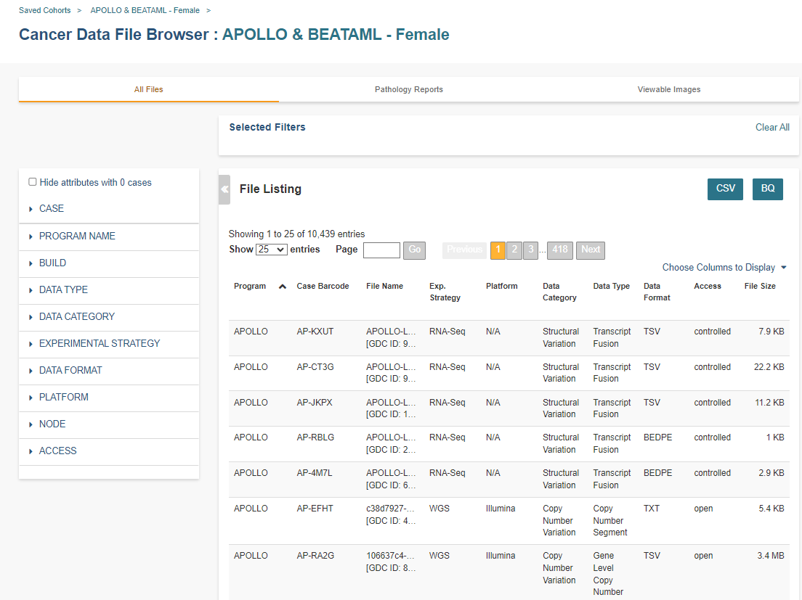

********
Cohorts
********

Cohorts are a way of creating custom groupings of the samples and/or cases that you are interested in analyzing further. You may frequently reuse a cohort in multiple analyses. Creating a "saved cohort" allows you to do this. If you have any existing saved cohorts, they will display here for you to view, edit and share.

Create a New Cohort
###################

When you first log into the ISB-CGC Web App, the Create Cohort screen will be displayed. To get to it when you are on other screens, select "Create Cohort" from the Cohorts dropdown. If you are on the **Manage Saved Cohorts** screen, you can click on the **New Cohort** button.

If you already have saved cohorts, they will be listed in the **Saved Cohorts** panel. Click on the **Saved Cohorts** link in that panel and a page with the details of your saved cohorts will display. Alternatively, to go directly to a given cohort, click on its name and the cohort details page of that cohort will display.

.. image:: CreateCohort.png
   :align: center

Cohort Creation
===============

Using the list of data sets and filters on the left, you can select the attributes and features that interest you from ISB-CGC data. For a specific program, you can select data across nodes (GDC, PDC, IDC).

Select Program
-----------------
This panel in the top left of the screen allows you to pick the programs and user data sets that you want included in the cohort.

The drop down list will display the ISB-CGC programs that the Web App is currently supporting. Next to each progam, it will list the origin of this data (Genomics Data Commons (GDC), Proteomics Data Commons (PDC), Imaging Data Commons (IDC)).

To select more than one program for your cohort, after you **Select Filters** for a program, return to the **Select Program** drop down list. Select another program and then select filters for that program.  

Selected programs and filters will display in the **Selected Filters** section.

.. image:: SelectDataSet.png
   :align: center

Select Filters
-----------------

When an ISB-CGC hosted data set is selected, appropriate filters will display under three tabs. All tabs are not available for all programs, but all programs will have some features available on the CASE tab.

  - The CASE tab displays clinical and demographic features applicable to the selected program.
  - The DATA tab displays data attributes (ex. Build, Data Type, Data Category, Experimental Strategy, File Type, Data Format, Platform, Access) applicable to the selected program.
  - The MOLECULAR tab is not currently in use.
  
On the CASE tab, expand the GDC, PDC or IDC headings to see the available filters. At that point, click on a filter name to see the selection values. For example, when you click on "Vital Status", it expands and provides a list containing "Alive" and "Dead" values you may choose. You may select multiple filters and multiple values.

On the DATA tab, click on a filter name to see the selection values.

Selected filters will display in the **Selected Filters** panel. The Data Set Details panel will update the Total Number of Cases and the Total Number of Samples based on the selected filters.

Individual selections within a filter group are "ORed" together, meaning if any of the conditions are met, they will be in the results.  On the other hand, filters are "ANDed" together, meaning that data must meet all filter criteria in order to be selected. There may be times where you have no cases and samples in the results, based on the combination of filters you have chosen.

 - If you use AND and do not see the data you are expecting in the filter, try OR instead. AND is a more restrictive criteria requiring all filters to be met; OR is less restrictive, requiring only one criteria to be met for the data to display.
 - You may want to consider adding the term "AND" or "OR" in your saved cohort title since the type of combination used in your cohort does not display in the filters list for a saved cohort.
          
Selected Filters Panel
^^^^^^^^^^^^^^^^^^^^^^

This panel displays the selected filters for the cohort. Filters are listed under the program name. If you click on the program name, the screeb will change to display the information for that program.

Selecting an X beside a single filter will remove that filter. Selecting **Clear All** in the top right of the panel will remove all the filters.
Note that you cannot removed filters once the cohort has been saved. (See Set Operations below for more ways to add or remove filters from your cohorts.)

Data Set Details Panel
^^^^^^^^^^^^^

This panel shows the **Total Number of Cases** and **Total Number of Samples** for the currently displayed data set based on the selected filters. If there is a small "timer" icon, the calculation is taking place; the results should appear soon.

Data Set Clinical Features Panel
^^^^^^^^^^^^^^^^^^^^^^^

This panel shows a list of images (called "treemaps") that give a high level breakdown of the selected samples for a 
handful of features (ex. Project Short Name, Disease Type, Gender, Tissue/Organ of Origin, Vital Status, etc.) for the currently displayed data set based on the selected filters. 

Mousing over an image shows the details of each specific section of the image and the number of samples associated with it.

Saving the Cohort
^^^^^^^^^^^^^^^^^^

Click the **Save as New Cohort** button when you are ready to save the cohort based on the filters you have set.  You will be asked for a cohort name and the selected filters will be displayed.  Enter the name and click the **Create Cohort** button. 

Manage Saved Cohorts
####################

Selecting **Manage Saved Cohorts** from the **COHORT** menu dropdown displays the **Cohorts** screen, **SAVED COHORTS** tab. This screen displays your saved cohorts and allows you to view, edit, delete, set operations, and share them. 

To view a cohort, click on the name of the cohort to display the cohort details. 
 
From **Cohorts** screen, **SAVED COHORTS** tab, you can perform the following functions. 

* Delete
* Share

Cohort Details Screen
#####################

The cohort details screen displays the details of a specific cohort.  The title of the cohort is displayed at the top of the page.

.. image:: CreateDetails.png
   :align: center

The screen is divided into the following sections:

**Current Filters Panel**

This panel displays current filters on this cohort or any of its ancestors. Saved filters cannot be removed, but new ones can be added using **Edit**.

**Cohort Details Panel**

This panel displays the Internal ISB-CGC Cohort ID (the identifier you use to access this cohort through the `APIs <../progapi/progAPI-v4/Programmatic-Demo.html>`_), and the number of samples and cases in this cohort. The number of samples may be larger than the number of cases because some cases may have provided multiple samples. This panel also displays "Your Permissions" which can be either Owner or Reader, as well as Revision History.  If you have edited the cohort, the filters that were used to originally create the cohort are displayed under the "Creation Filters" header. The newly applied filters (after original creation) are displayed under the "Applied Filters" header.

**Select Data Set**

This panel displays all the programs and user data sets that are included in the cohort; click on the drop down to see them.

By default, the list is sorted by Node (Genomics Data Commons, Proteomics Data Commons, User) with programs listed below each node header. The sort order can be changed by selecting Program next to **Sort By**. To see details about a program or data set, select it from the drop down list.

**Data Set Details Panel**

This panel shows the **Total Number of Samples** and **Total Number of Cases** for the currently displayed data set (selected from the Data Set drop down) based on the selected filters.

**Data Set Clinical Features Panel**

This panel shows a list of images (called "treemaps") that give a high level breakdown of the selected samples for a 
handful of features (ex. Disease Code, Vital Status, Gender, Sample Type, Age at Diagnosis, etc.) for the selected program. 

By using the “Show More” button, you can see additional tree maps.  Mousing over an image shows the details of each specific section of the image and the number of samples associated with it.

**Cohort Details Screen functions:**

Create a New Workbook
=====================

Clicking the **New Workbook** button brings you to a screen where you can create a new workbook using this cohort.

Edit a cohort
=============

Clicking the **Edit** button displays the Filters panel. Any filters selected will be added to existing filters. To return to the previous view, save any newly selected filters using the **Save Changes** button, or cancel adding any new filters by clicking the **Cancel** link.

Comment on a cohort
===================
Clicking the **Comments** button displays the Comments panel. Here anyone who can see this cohort (such as an owner or someone who has shared access to the cohort) can comment on it. Comments are shared with anyone who can view this cohort.  They are ordered by newest on the bottom.  Selecting the "X" on the Comments panel will close the panel.  

Copy a cohort
=============

To create a copy of the cohort, click on the **Duplicate** button. This will take you to a new copy of the cohort which has the same list of samples and cases;  you will be the owner of the copy.  

This is how you create a copy of another researcher's cohort that they have shared with you. (Note: If they later change their cohort, your cohort will not be updated; it will remain the same as it was at the time you duplicated it).

Delete a cohort
=================

Click the **Delete** button to delete the cohort. Confirm by clicking the second **Delete** button presented.

.. _file-browser-page:

File Browser
============

Clicking the **File Browser** button displays a screen with a list of data files associated with your current cohort.  
This list includes all files which are stored on the Google Cloud, including both controlled access and open access data.

You can use "Show", "Page", "Previous" and "Next" to navigate through the list.  The columns are sortable by selecting the column header.  You can select a subset of the default columns to show by using the "Choose Columns to Display" tool.

You can filter by full or partial Case Barcode on all tabs. To remove the search key word, click the "X" button adjacent to it. Filtering by Case Barcode updates the number to the right of all the other filters. 

You may also filter by data type, data category, data format, platform, program, disease code, disease strategy, node (GDC, PDC), build (Hg38, Hg19) and/or experimental strategy.  Selecting a filter will update the associated list.  The numbers next to the filter refers to the number of files available for that filter.

The tabs "IGV", "Pathology Images" and "Radiology Images" allow you to filter for files that show you respectively read-level sequence data (viewed using the IGV viewer), pathology images, and radiology images.  Please note: only if you have authenticated as a dbGaP authorized user will you be able to select controlled access files to view in the IGV viewer (CCLE data does not require authorization to view the sequence data in the IGV viewer).  Details of how to view Sequences, and Pathology and Radiology Images are provided below.

Viewing a Sequence
------------------

When available, sequences in a cohort can be viewed using the IGV viewer.  To find those sequences that can be viewed, select the **IGV** link on the **File Browser** screen. The File Listing panel will display the files that can be viewed with the IGV viewer.  Selecting the checkbox in the "View" column (maximum of file files) and clicking the **Launch IGV** button in the upper panel will display an IGV view of the selected sequence(s) data.  

Controlled access files will be viewable by sequence ONLY if you have `authenticated as a dbGaP-authorized user <http://isb-cancer-genomics-cloud.readthedocs.io/en/latest/sections/Gaining-Access-To-Controlled-Access-Data.html>`_. 

`More information about Viewing a Sequence in the IGV Viewer <IGV-Browser.html>`_.

Using the Image Pathology Viewer
--------------------------------

.. note::
   All tissue slide images from the TCGA program are currently unavailable for viewing. (Diagnostic images will display.)

When available, pathology images can be viewed using the caMicroscope tool (see more about caMicroscope provide `here <http://camicroscope.org>`_).  These are the pathology images that are associated with TCGA samples. To find images that can be viewed, open a saved cohort and select the **File Browser** button. You can also select the **File Browser** link from the Dashboard Saved Cohorts panel.  The files associated with your cohort will be shown. Click on **Pathology Images** to see a list of available pathology images. Hovering over the File Name and clicking on "Open in caMicroscope" will open the image file in a new tab using caMicroscope. (HINT: using a smaller cohort will provide faster response in creating the list of files available).

To zoom into the image, either click the left button or use your wheel to zoom in.  Use your mouse to move around the image.  To zoom out of the image, shift-slick the left mouse button or use your wheel to zoom out.  Selecting caMicroscope at the top of page will send you to the caMicroscope homepage. If you hover over the Slide Barcode section on the top right hand side you will see metadata information listed.

Viewing a Radiology Image
-------------------------

To find images that can be viewed, open a saved cohort and select the **File Browser** button. You can also click the **File Browser** link from the Dashboard Saved Cohorts panel. The files associated with your cohort will be shown. Click the **Radiology Images** tab to view a list of available radiology images. Hovering over the Study Instance UID column and clicking on "Open in CHIF Viewer" will open the series Selection panel in a new tab using Osimis DICOM. (HINT: Using a smaller cohort will provide faster response in creating the list of files available.)

For a more detailed step-by-step process of Viewing Radiology Images using the Osimis DICOM viewer please go `here <OsimisWebViewer.html>`_.

Download File List as CSV
-------------------------

To download a list of files that are part of this cohort, select the **CSV** button in the upper right on the File Listing panel (on all tabs) on the **File Browser** screen. 

The file contains the following information for each file:

* Case Barcode
* Sample Barcode
* Program
* Platform
* Experimental Strategy 
* Data Category
* Data Type
* Data Format
* Genomic Data Commons(GDC) File UUID
* Google Cloud Storage(GCS) location
* Genomic Data Commons(GDC) Index
* Index File Google Cloud Storage(GCS) location
* File Size
* Access Type (open or controlled access)

Export File List to BigQuery
----------------------------

To export the File List to BigQuery, select the **BigQuery** button on the **File Browser** screen.  You will need to have registered a Google Cloud Project and a BigQuery dataset to be able to export to BigQuery. More information on how to register a BigQuery Dataset can be found `here <http://isb-cancer-genomics-cloud.readthedocs.io/en/latest/sections/webapp/program_data_upload.html#registering-cloud-storage-buckets-and-bigquery-datasets-a-pre-requisite-for-using-your-own-data-in-isb-cgc>`_. You can either make a new table or append to an existing table.  You can also give the table a unique name; if left blank, a name will be provided for the table.

The table will contain the following information (for each of the data type tabs):

* row
* cohort_id
* case_barcode
* sample_barcode
* project_short_name
* date_added
* build 
* gdc_file_uuid
* gdc_case_uuid
* platform 
* exp_strategy
* data_category
* data_type
* data_format
* cloud_storage_location
* file_size_bytes
* index_file_gdc_uuid
* index_file_cloud_storage_location

Cohort export to CSV
===================

Click the **CSV** button to download the cohort in CSV format. The file will contain a list of sample and cases IDs in the cohort.

Cohort export to BigQuery
=========================

Clicking the **BigQuery** button allows you to create a new table or append to an existing table. You must have registered a BigQuery data set with a Google Cloud Project on the registered Google Cloud Projects details page. More information on how to register a BigQuery data set can be found `here <program_data_upload.html#registering-cloud-storage-buckets-and-bigquery-data-sets>`_.

  If a user wants to export a cohort to their own premade table, it is required to have the following columns: 

.. code-block:: JSON

  {
        'fields': [
            {
                'name': 'cohort_id',
                'type': 'INTEGER',
                'mode': 'REQUIRED'
            },{
                'name': 'case_barcode',
                'type': 'STRING',
                'mode': 'REQUIRED'
            },{
                'name': 'sample_barcode',
                'type': 'STRING',
                'mode': 'REQUIRED'
            },{
                'name': 'project_short_name',
                'type': 'STRING',
                'mode': 'REQUIRED'
            },{
                'name': 'date_added',
                'type': 'TIMESTAMP',
                'mode': 'REQUIRED'
            },{
                'name': 'case_gdc_uuid',
                'type': 'STRING'
            }
        ]
    }
  
Note: You shouldn't ever set UUID to 'required' because sometimes a sample doesn't have a UUID, and the attempt to insert a 'null' will cause the cohort export to fail.
 

Share a cohort
==============

Clicking the **Share** button allows you to share the cohort in the Web App with users you select by entering the user's email. 

If the email address you entered is not registered with ISB-CGC, a message displays, "The following user emails could not be found; please ask them to log into the site first:(email entered)."

