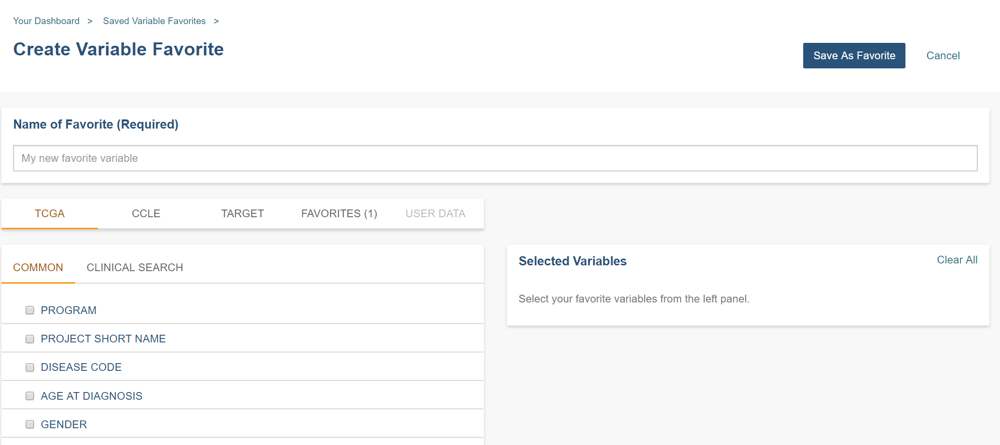

**********
Variables
**********
Creating a variable favorites list is a way of creating custom groupings of the samples and/or cases that you are interested in analyzing further. For example, you can create a variable favorites list that spans across multiple projects, only contains samples for which certain types of data are available, or focuses on specific phenotypic characteristics. A Variable Favorites list can be included in a workbook.

Create Variable Favorites List
##############################

To create a variable list from **Your Dashboard**, click on the **Create Variable Favorites** link which will display the **Create Variable Favorite** screen. 

Or, from the menu dropdown, select **Create Variables Favorite List** from the **VARIABLES** menu dropdown. 

To create a new Variable Favorite:

- Name your new favorite; you can create many favorites and use them later when working with workbooks.
  
- Select attributes and features for your variable list by performing one or more of these actions:
  
  - Select a data set (program) from the **Select Data Set** drop down list. This will display features for that data set under the **COMMON** and **CLINICAL SEARCH** tabs.

  - *Common Filter Selection* - Filters (attributes and features) that are fairly common across programs are displayed under the **COMMON** tab. Changing the data set will change the list of available filters.
  
    * Check the checkbox adjacent to each feature that you are interested in. They will display in the **Selected Variables** panel. 
    
  - *Clinical Filter Feature Search* - Click the  **CLINICAL SEARCH** tab. This filter allows the user to search by any clinical feature in the selected data set (program). Changing the data set will change the list of available filters. 
  
    * Enter one or more characters in the **Feature Search** field. A list of features containing these characters displays. Select a feature from the list and it will display in the **Selected Variables** panel.
    
  - *Favorites Filter Selection* - From the Data Set drop down list, select **Favorites**. This displays your existing Variable Favorite lists, and their component features. These features can now be selected for a new Variable Favorite list by checking the checkbox adjacent to each feature that you are interested in. They will display in the **Selected Variables** panel. 

  - *User Data Filter Search*- From the Data Set drop down list, select **User Data-User**. This option allows you to select from filters that you have uploaded using the upload data functionality. It's separated by projects within your program; a drop down list will display the associated features.
  
- Verify that all your selected filters are displayed in the **Selected Variables** panel on the right-hand side. Clicking **Clear All** will remove all selected filters. 
  
- Click **Save As Favorite** to save the Variable list.

Manage Variable Favorites List
###############################

Selecting **Manage Variable Favorites List** from the **VARIABLES** menu dropdown displays the **Saved Variable Favorites** screen. This screen displays your saved Variables Favorites and allows you to edit or delete them, as well as start a new workbook using your favorite.

* Editing a Variable Favorites List - Clicking the **Edit** button displays the **Edit Variable Favorite** screen, which shows all filters in the selected variable list. Any variables selected will be added to any existing variables in the list. Variables can also be removed from the favorite list. The title of the variable favorite list can be changed. To return to the previous view, you must either save any selected filters, or choose to cancel adding any new filters.

* Deleting a Variable Favorites List - Clicking the Delete button will delete the variable list.

* Apply To New Workbook button - Clicking on the **Apply to New Workbook** button will take you to a screen where you can create a new workbook using your variable list.

Select Variables for a New Workbook
########################################

Selecting **Variables for a New Workbook** from the **VARIABLES** menu dropdown displays the **Data Source | Variables** screen. This screen allows you to create a new workbook with the selected variables.

- Click the **Create New Workbook With Selected Variables** button to create a new workbook using your selected variables.

