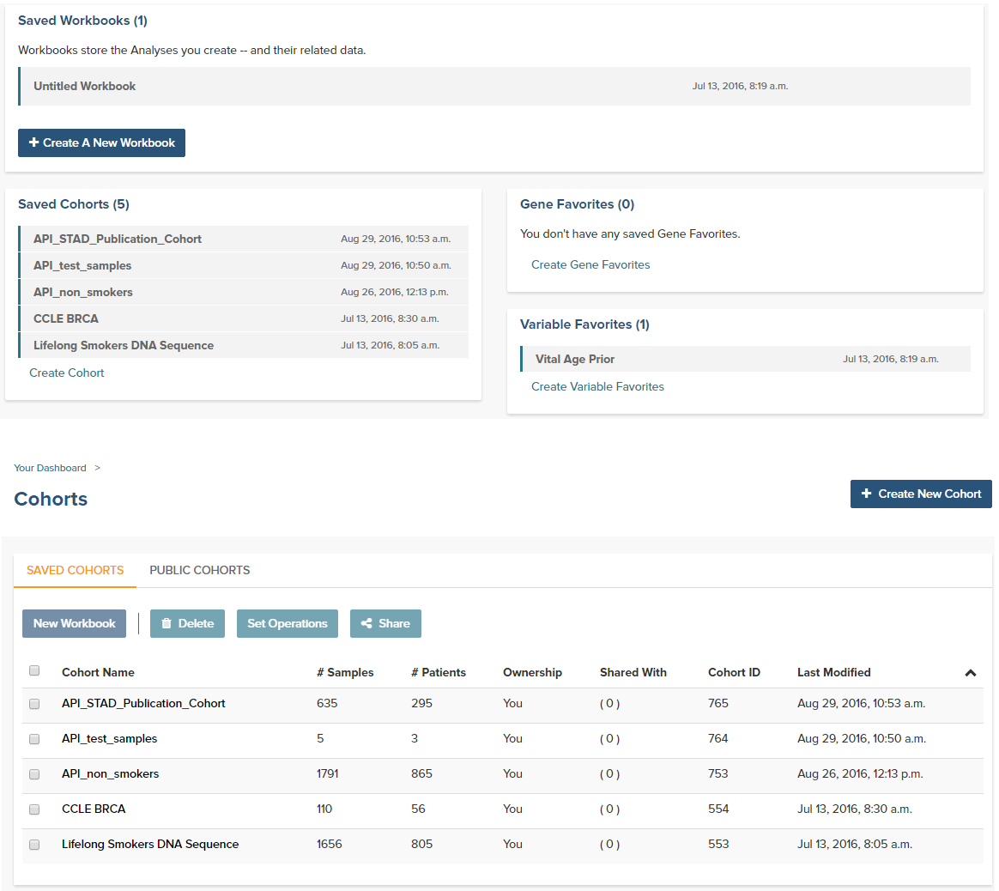
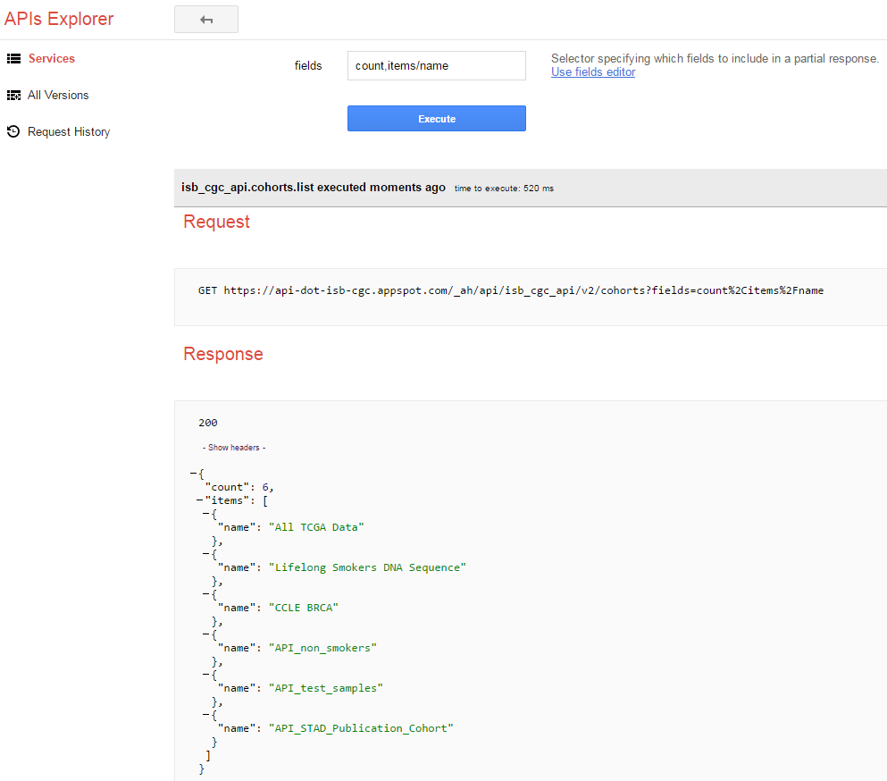

***********************************************
Viewing and using cohorts in the Webapp and API
***********************************************
Cohorts are one of the central concepts that researchers use when analyzing large datasets.  As has been discussed elsewhere in the documentation, cohorts can be created either in the Webapp or via the ISB-CGC REST API.  What may not be as clear is that cohorts created by one of the systems can be viewed and used in the other.  In other words, you can create a cohort using the API and use it in the webapp or you can create a cohort in the webapp and use it in the API.  This can give researchers significant flexibility in creating and sharing their cohorts.  

It should be noted that the details of how to use the APIs can differ significantly depending on how users access the REST APIs.  The examples given here are assuming users only have access to a console and not a higher-level language like Python where the APIs can be used more programmatically.  Additionally, the examples shown here are using the TCGA endpoint, but exactly the same functionality is available for TARGET and CCLE using the endpoints specific to those programs.

Related documents:

* `Creating Saved Cohorts in the Web Application`_
* `Details of "Cohorts... APIs" in the ISB-CGC API documentation`_

.. _Creating Saved Cohorts in the Web Application: http://isb-cancer-genomics-cloud.readthedocs.io/en/latest/sections/webapp/Saved-Cohorts.html
.. _Details of "Cohorts... APIs" in the ISB-CGC API documentation: http://isb-cancer-genomics-cloud.readthedocs.io/en/latest/sections/progapi/Programmatic-API.html

Listing Cohorts
===============
Any cohort you've previously created can be seen using either the Webapp or the API.  In the Webapp, cohorts can be viewed both on the front page of the app as well as on the Cohorts page as shown in Figure 1.  For ease of use, there is A) a shortcut to go to a cohort's "File browser" page (A in the top diagram), and B) a "Collapse/Expand" arrow (B in the top diagram) to collapse or expand a long list of items in your lists as needed. 

*Figure 1: Cohorts shown on the front page (top) and Cohorts page (bottom) in the Webapp*

Similarly, the **cohorts().list()** endpoint of the ISB-CGC API will return exactly the same set of cohort.  The `Google API Explorer`_ is a convenient tool for examining API output from within a browser.  In addition to showing the data returned from a query, it will also show a constructed query that can be used in a script (see Figure 2).

.. _Google API Explorer: https://apis-explorer.appspot.com/apis-explorer/?base=https%3A%2F%2Fapi-dot-isb-cgc.appspot.com%2F_ah%2Fapi#p/isb_cgc_api/v2

*Figure 2: Google API Explorer*

Creating Cohorts
================

`Creating cohorts using the Webapp`_ has been fully documented and needs no further explanation.  Creating cohorts using the API uses two different endpoints, `cohorts().preview()`_ and `cohorts().create()`_.  These two endpoints have exactly the same query capabilities and differ only in that the preview endpoint will return the results of the query without creating a cohort while the create endpoint will create the cohort and name it using the name provided with the name attribute.  In addition, due to the authentication requirement for the create endpoint, the query is sent as a JSON object.

In the following example, the first query creates a cohort of patients from the UCS and CESC studies who were 20 years old or younger at the time of diagnosis.  Since this query is run against the **preview** endpoint, no cohort is actually created, only the results shown in Figure 3 are returned. ::

                https://api-dot-isb-cgc.appspot.com/_ah/api/isb_cgc_tcga_api/v3/cohorts/preview?age_at_initial_pathologic_diagnosis_lte=20&project_short_name=TCGA-UCS&project_short_name=TCGA-CESC
  
.. code-block:: none

  https://api-dot-isb-cgc.appspot.com/_ah/api/isb_cgc_tcga_api/v3/cohorts/preview?age_at_initial_pathologic_diagnosis_lte=20&project_short_name=TCGA-UCS&project_short_name=TCGA-CESC

*Figure 3: Using Google API Explorer to preview creating a cohort*

Due to the need for authentication and cohort naming, actually creating the cohort requires some modifications of the preview query.  First, the *name* attribute needs to be specified with the name users will see in both the Webapp and in the **cohorts().list()** endpoint.::

    https://api-dot-isb-cgc.appspot.com/_ah/api/isb_cgc_tcga_api/v3/cohorts/create?name={COHORT NAME}
  
Additionally a JSON object containing the query needs to be created. ::

    {"Study": ["TCGA-UCS", "TCGA-CESC"], "age_at_initial_pathologic_diagnosis_lte": 20}

The commands above will create a cohort via the API.

.. _Creating cohorts using the Webapp: http://isb-cancer-genomics-cloud.readthedocs.io/en/latest/sections/webapp/Saved-Cohorts.html
.. _cohorts().preview(): http://isb-cancer-genomics-cloud.readthedocs.io/en/latest/sections/progapi/progapi3_tcga/cohorts_preview.html
.. _cohorts().create(): http://isb-cancer-genomics-cloud.readthedocs.io/en/latest/sections/progapi/progapi3_tcga/cohorts_create.html
