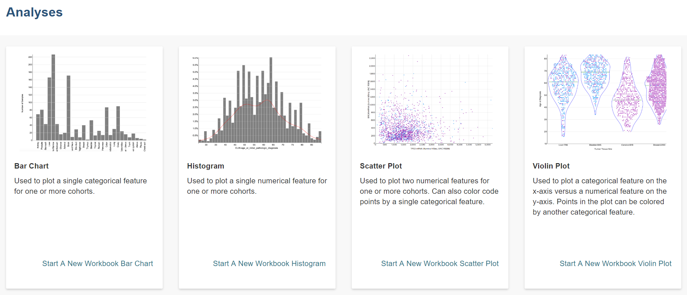
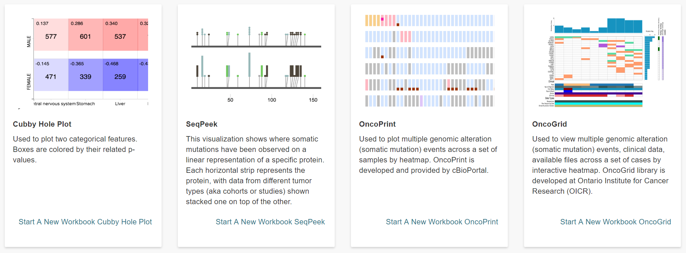

********
Analyses
********

This feature allows you to create, edit details, duplicate, delete, or share analyses. You can customize new workbooks with selected
data (Genes and miRNAs, Variables, Cohorts) and the following plot types:
    - Bar Chart
    - Histogram
    - Scatter Plot
    - Violin Plot
    - Cubby Hole Plot
    - SeqPeek
    - OncoPrint
    - OncoGrid

Start New Workbook With...<Plot Type>
#####################################

Selecting **Start New Workbook With** and one of the above plot types from the **Analyses** menu dropdown displays a screen which enables you to create, edit details, duplicate, delete, or share analyses.

The **Edit Details** button displays a popup in which you can enter a **Name** for the Workbook, the **Build** (HG38 or HG19) and an optional Workbook **Description**.

On the left panel, is a list of types of **Source Data**. These types of source data are favorite lists which the user can create in the Web App, for use in analyses and workbooks. They are described in the next sections of this documentation. 

Select one or more **Source Data** by clicking on the type of source data or the adjacent '+' sign:

    - Genes & miRNAs
    - Variables
    - Cohorts

An appropriate Data Source screen displays, which allows the user to select a favorites list:

    - After selecting favorite(s), click **Apply to Worksheet** to add to the worksheet which you are creating, or
    - Click **Apply New <Favorite Type>** to open the corresponding **Create** screen and create and apply a new favorite to the worksheet.
    
The **Analysis Type** has been prepopulated depending upon the plot type which you selected previously. However, it can be changed here.

The "To complete this analysis" section provides a checklist listing what you need to select. For instance, it will tell you if you need to select Genes & miRNAs, Variables, and/or a Cohort. The checkboxes will be filled in by the system after you have selected all necessary data. 

Browse All Analyses
###################

Selecting **Browse All Analyses** from the **Analyses** menu dropdown displays a screen which provides a visual example and a written description of each type of plot. This information can help you determine which type of plot would be useful in your analysis.

From here, click on the **Start a New Workbook <Plot Type>** link to go to a screen which enables you to build your analysis.

