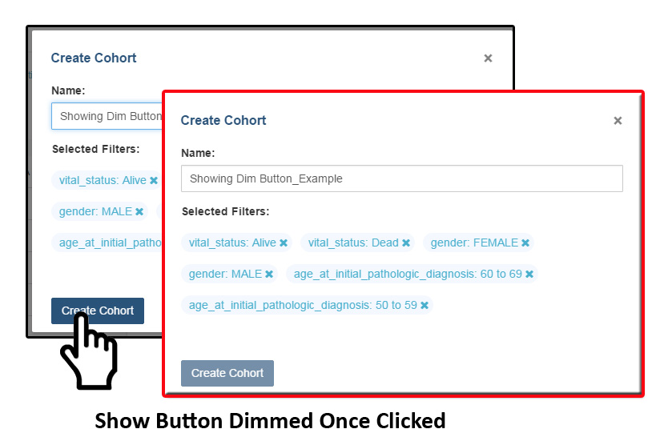
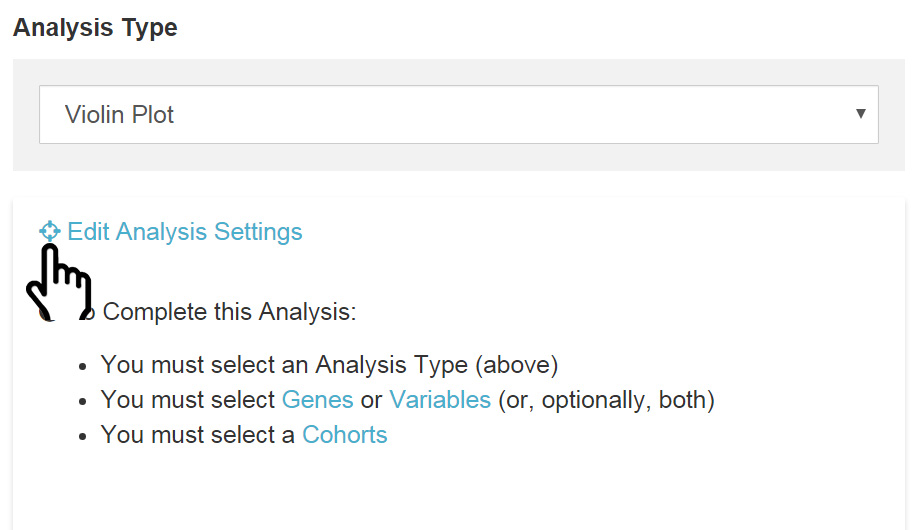

Workbooks
*********

Workbooks store the Analyses you create -- and their related data. Basically, the worksheets you create to conduct analysis based on the source data selected (i.e. Genes, Variables and Cohorts).  Workbooks can be used to:
  • Group together multiple related analyses,
  • Share analysis results with specific groups of people,

For example, you can create a workbook (i.e., Study A) which consists of identifying gene mutations and pathways involved in Head and Neck Cancer (and share it with research Group A). 

And create another workbook (i.e., Study B) with a different group of researchers (Group B) investigating the average time after diagnosis of death for different lung cancers.  Think of workbooks as virtual "excel spreadsheets" that various related analyses can be created in individual Worksheets (“Tabs” within the spreadsheet) and grouped together in one Workbook (the overall spreadsheet).

Additionally, you can:
  • Save a workbook for later use, or
  • Edit an existing workbook.

Creating and Saving a Workbook
##############################

From your dashboard, under Sample Analysis you will find the “Saved Workbooks” panel.  This panel displays any previously created and save workbooks and allows you to “Create a New Workbook”. If you do not have any saved workbooks you will see “Saved Workbooks (0)".

To create a **workbook** from Your Dashboard, click on the **“Create a New Workbook”** link in the "Saved Workbooks" panel. This will take you to the workbook creation page.

1. From the Workbook creation panel you will first select one of six analysis types (i.e., Bar chart, Histogram, Scatter Plot, Violin Plot, Cubby Hole Plot or SeqPeek). 

  * **Analysis Type Description**

    - **Bar Chart** - This chart is used to plot a single categorical feature for one or more cohorts. It generates vertical lines to represent the type of data being used. The X axis shows categorical information being used while the other y axis,  displays categorical data chosen in the edit analysis settings. 

    - **Histogram** - This chart is used to plot a single numerical feature for one or more cohorts. It generates vertical lines to represent the type of data being used. The X axis shows numerical information being used while the other y axis,  displays numerical data chosen in the edit analysis settings.

    - **Scatter Plot** - This chart is used to plot two numerical features (x & y axis) for one or more cohorts. Can also color code points by a single categorical feature.

    - **Violin Plot** - This chart is used to plot a categorical feature on the x-axis versus a numerical feature on the y-axis. Points in the plot can be colored by another categorical feature.

    - **Cubby Hole Plot** - This chart is used to plot two categorical features. Boxes are colored by their related p-values.

    - **SeqPeek** - This visualization shows where somatic mutations have been observed on a linear representation of a specific protein. Each horizontal strip represents the protein, with data from different tumor types (aka cohorts or studies) shown stacked one on top of the other.

    - **Browse All Analyses** - This will direct you to a visual sample of the different analysis types along with a brief description of how to generate each type.

2. You will then select **Genes or Variables** (or, optionally both)

  * **Genes** - This will display previously created “Gene Favorites” which can be “Applied to Analysis" (see `Gene Favorites <http://isb-cancer-genomics-cloud.readthedocs.org/en/latest/sections/webapp/Gene-Favorites.html>`_ for details) or you can apply / create a “New Gene List”).

You begin by naming the data set (Gene Type or Project Specific); the Gene list you create here will automatically be added to your Gene Favorites list and can be selected for additional analysis later.

Next select the Gene(s) you’re interested in (you can upload a specific list you’ve previously created/stored, select new Genes by typing them into the input box (you will see that Genes will auto-display). If duplicate listings are entered they will be marked for your deletion or automatically dropped when saved. If an error or unknown item is entered it will also be flagged for your attention. 

To aid in Gene selection, you can access the HGNC portal (Hugo Gene Nomenclature Committee) via the "`View Gene Identifiers <http://www.genenames.org/>`_
" link under this Menu selection. This allows you to focus on specific results or queries.

  * **Variables** - (this will display previously created “Variable Favorites” which can be “Applied to Analysis" (see `Variable Favorites <http://test>`_ for details) or you can apply / create a “New Variable List”).

You begin by naming the new Variable; the Variable you create here will automatically be added to your Variable Favorites list and can be applied to other analysis later.

Next you can select variables from four (4) available data sources to incorporate in your Variable-
  * *Common Variables* (14 options)
  * *Favorite(s)* (previously created variables which were Saved)
  * *Clinical* (over 46 options)
  * *MIRNA* (filter by - miRNA Name, Platform, Value, Feature)

Then **“Apply to Worksheet”**

3. Select your **Cohort** - Cohorts allow the user to create custom groupings of the samples and/or participants that can be used for further analysis.

By clicking 'Cohorts' or the '+' symbol you will be directed to the Cohorts table where the user can either create a new cohort or choose from an existing cohorts. When creating a new cohort, after selecting your criteria you click the "Create Cohort" button. The button will become disabled (dimmed) as the Cohort builds (shown in the image below).  

Once completed you can proceed.  The user can also add multiple Cohorts to the worksheet if desired. More information about Cohorts can be found here (link to `Cohorts documentation <http://test>`_).

4. Select **Edit Analysis Settings** - This will trigger the Plot setting displaying the applicable x & y axis settings (i.e. Categorical or Numerical based on analysis type selected). Depending on the analysis type selected (i.e., Bar chart, Histogram, Scatter Plot, Violin Plot, Cubby Hole Plot, or SeqPeek) additional specifications may appear for selection.

Sample Workbooks
----------------
The sample workbooks (future Function) is found in the Menu bar under the Workbooks tab. This will contain guides for the user to see what is the different functionality of the workbooks are.

Sharing Workbooks
-----------------
This will share the web view of workbooks with users you select by entering the users e-mail.  The User will receive an e-mail message with a link to your shared workbook explaining that (you) wanted to share a workbook with (them) and that you have invited them to join.  

Manipulation of Workbooks
-------------------------

**Creating A Worksheet** - By selecting the "+" next to an existing worksheet a user can create a new worksheet to create a new analysis. You can give the new worksheet an unique identifier and also give a description for the worksheet. This is ideal by allowing the user to easily have access to different graphs with the same data in the same workbook.

**Worksheet Menu** - The worksheet will have a section similar to the workbook menu where user can edit, duplicate or delete the worksheet. You can find the worksheet menu bar by clicking the arrow pointing down located next to the name of the worksheet that is opened.

**Edit Analysis Settings** - This function allows you to select new Plot Setting for selected analysis type.

Please Note: When selecting a gene for either the x-axis or y-axis variable you be promted with selecting a specification. If you select Gene Expression you have the option of choosing a Platform Filter and a Center Filter. If you select the Methylation specification you can select a CpG Probe Filter, a Platform Filter, a Gene Region Filter, and a CpG Island Region Filter. If you select the Copy Number specification you can choose a Value Filter. If you select the Protein specification you can selelct a Protein Filter. If you select the Mutation specification you select select a Value Filter. 
 
.. _selectionicon:

**Edit Analysis Settings Selection Icon** - This function (shown in the image below) allows you to select samples from displayed analysis and save that selection to a new Cohort for further drill down analysis. 

**Edit Details** - This function allows the user to edit the name of the worksheet and also give a brief description on the worksheet being used for analysis.

**Duplicate** - This function allows the user to create a duplicate worksheet in the workbook for further analysis and comparison.

**Delete** - This function will only appear when you are working with multiple worksheets. This will permanently delete the worksheet from the workbook.

Comments Section
=================
Any user who owns or has had a cohort shared with them can comment on it. To open comments, use the comments button at the top right and select “Comments”. A sidebar will appear on the right side and any previously created comments will be shown.

On the bottom of the comments sidebar, you can create a new comment and save it. It should appear at the bottom of the list of comments.

