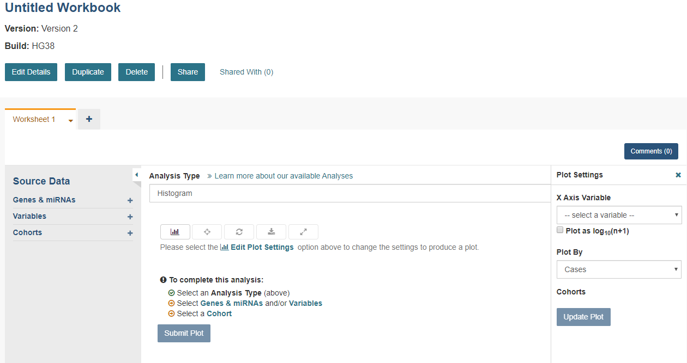
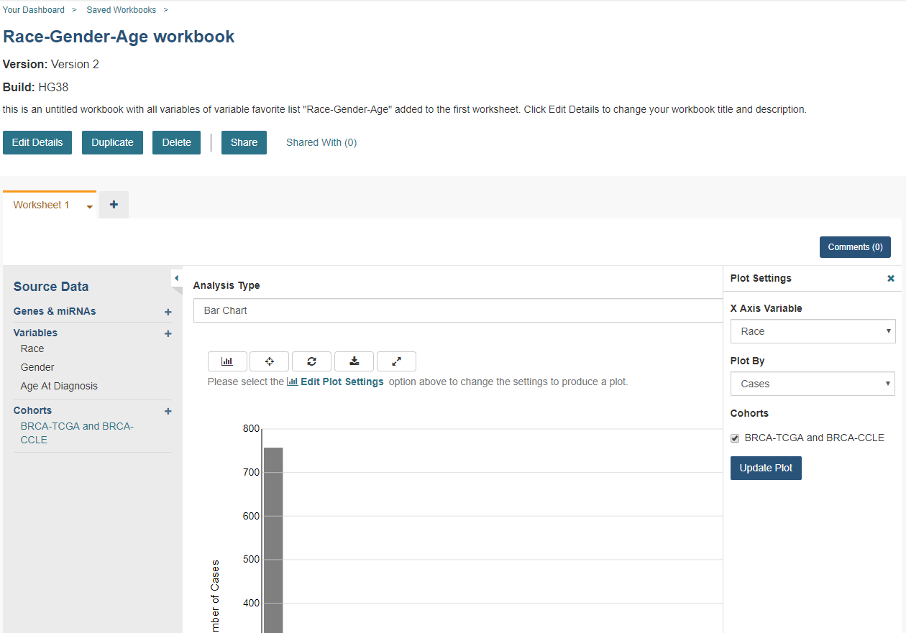
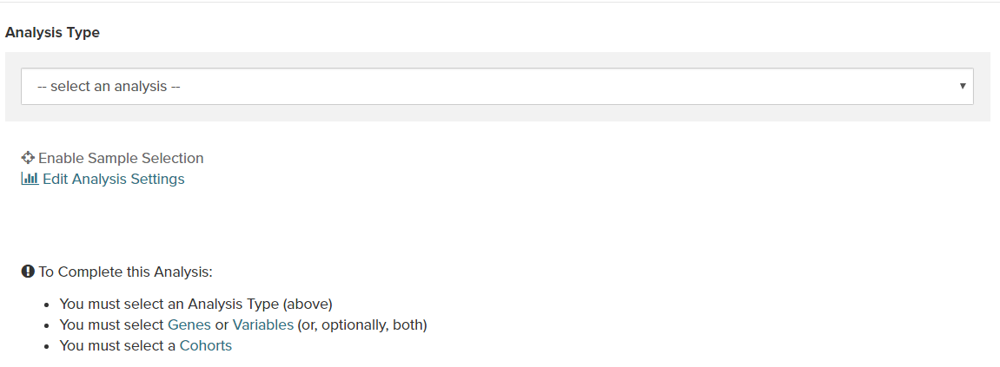

*********
Workbooks
*********

Workbooks store the analyses you create, and their related data. You can create multiple analyses in a workbook and store them on separate worksheets within the workbook. The worksheets you create to conduct analysis are based on the source data selected (i.e. Genes and miRNAs, Variables and Cohorts).  Workbooks can be used to:

  * Group together multiple related analyses.
  * Share analysis results with specific groups of people.

For example, you can create a Workbook (i.e., Disease A) which consists of identifying gene mutations and pathways involved in Head and Neck Cancer (and share it with research Group A). And then you could create another Workbook (i.e., Disease B) with a different group of researchers (Group B) investigating the average time after diagnosis of death for different lung cancers. Think of workbooks as virtual "excel spreadsheets". Various related analyses can be created in individual worksheets (“Tabs” within the spreadsheet) and grouped together in one workbook (the overall spreadsheet).

Create a New Workbook
#####################

On **Your Dashboard**, there is a **Saved Workbooks** panel.  This panel displays any previously created, saved workbooks. If you do not have any saved workbooks you will see “Workbooks store the analyses you create, and their related data." text in the panel. To create a new workbook, click on the **Create a New Workbook** link. 

Selecting **Create a New Workbook** from the **WORKBOOKS** menu dropdown also displays a screen where you can create a new workbook. 

Follow these steps to create a workbook:

1. From the Workbook creation panel, select an Analysis Type (i.e., Bar Chart, Histogram, Scatter Plot, Violin Plot, Cubby Hole Plot, SeqPeek, OncoPrint or OncoGrid). 

   **Analysis Type Description**

   - **Bar Chart** - This chart is used to plot a single categorical feature for one or more cohorts. It generates vertical lines to represent the type of data being used. The X axis shows categorical information being used while the other axis (Y axis) displays categorical data chosen in the edit analysis settings. 

   - **Histogram** - This chart is used to plot a single numerical feature for one or more cohorts. It generates vertical lines to represent the type of data being used. The X axis shows numerical information being used while the other axis (Y axis) displays numerical data chosen in the edit analysis settings.

   - **Scatter Plot** - This chart is used to plot two numerical features (X & Y axis) for one or more cohorts. Can also color code points by a single categorical feature.

   - **Violin Plot** - This chart is used to plot a categorical feature on the X axis versus a numerical feature on the Y axis. Points in the plot can be colored by another categorical feature.
    
   - **Cubby Hole Plot** - This chart is used to plot two categorical features. Boxes are colored by their related p-values.
    
   - **SeqPeek** - This visualization shows where somatic mutations have been observed on a linear representation of a specific protein. Each horizontal strip represents the protein, with data from different tumor types (aka cohorts or studies) shown stacked one on top of the other.
    
   - **OncoPrint** - This chart is used to plot multiple genomic alterations (somatic mutation) events across a set of samples using color-coded glyphs. OncoPrint is developed and provided by cBioPortal.
    
   - **OncoGrid** - This chart is used to visualize the top mutated genes across programs/projects and the number of cases affected. You can also view the mutation frequency, clinical data, data format types, number of gene sets and the number of cases affected.

   **Notes:** 
   
    - A user has the option to make the axis logarithmic if the plot can display continuous numerical data, e.g. mRNA expression levels.
     
    - For Violin Plot and Scatter Plot you can select multiple cohorts as your Color By Feature. This will cause the Legend to list all the cohorts that the sample is associated to. Please be aware you'll end up with lots of permutations if you have lots of samples that belong to many different cohorts.
     
    - For OncoPrint, OncoGrid, and SeqPeek analyses, a default gene list is provided. Genes with consensus score of 6 or higher are added to the default gene list. (Ref: `Bailey et al., Cell. 2018 Apr 5;173(2):371-385.e18. doi: 10.1016/j.cell.2018.02.06 <https://www.sciencedirect.com/science/article/pii/S009286741830237X?via%3Dihub>`_ )

2. You will then select **Genes and miRNAs or Variables** (or, optionally both).

   **Genes and miRNAs** 
   
   Selecting this link (or the '+' adjacent to it) displays the **Data Source | Gene & miRNA Favorites** screen showing previously created “Gene and miRNA Favorites”.  Click the **Apply to Worksheet** to apply or click **Apply New Gene & miRNA List** to create a new list and apply. Any Gene and miRNA List you create here will automatically be added to your Gene and miRNA Favorites list and can be selected for additional analysis later. (See `Gene and miRNA Favorites <Gene-and-miRNA-Favorites.html>`_ for details.)

   **Variables** 
   
   Selecting this link (or the '+' adjacent to it) displays the **Data Source | Variable Favorites** screen showing previously created “Variables Favorites”. Click the **Apply to Worksheet** to apply or click **Apply New Variable List** to create a new list and apply. Any Variable Favorites you create here will automatically be added to your Variable Favorites and can be selected for additional analysis later. (See `Variable Favorites <Variable-Favorites.html>`_ for details.)

3. Select your **Cohort** - Cohorts allow the user to create custom groupings of the samples and/or cases that can be used for further analysis.
   
   Selecting this link (or the '+' adjacent to it) displays the **Data Source | Cohorts** screen showing previously created "Cohorts". Click the **Apply to Worksheet** to apply or click **Filter** or **Barcodes** button to create a new cohort and apply. Any Cohorts you create here will automatically be added to your Cohorts list and can be selected for additional analysis later.
    
   The user can also add multiple Cohorts to the worksheet if desired. More information about Cohorts can be found `here <http://isb-cancer-genomics-cloud.readthedocs.io/en/latest/sections/webapp/Saved-Cohorts.html>`_.

4. Select **Edit Plot Settings** - This will display the **Plot Settings** panel displaying the applicable X & Y axis settings (i.e. Categorical or Numerical based on the analysis type selected). Depending on the analysis type selected (e.g., Bar chart, Histogram, Scatter Plot, Violin Plot, Cubby Hole Plot, SeqPeek, OncoPrint or OncoGrid) additional specifications may appear for selection.

5. Select **Toggle Sample Selection** - After a plot has been displayed, using the Toggle Sample Selection button allows you to create a smaller cohort from within the plot itself.

6. Select **Redraw** - After a plot has been displayed, using the Redraw button will reset the analysis to its original setting after being zoomed-in or moved. 

7. Select **Download** - After a plot has been displayed, using the Download button will allow you to download the analysis as a SVG, PNG, or a JSON file. 

8. Select **Toggle Full Screen** -  After a plot has been displayed, using this button will display the plot to the full screen.

**Note:** If you wish to use your own data in graphing, please review the documentations on `how to upload your own data`_ and on `how to graph your own data`_.  Using your own data uses a slightly different approach than is described here.

.. _how to upload your own data: program_data_upload.html
.. _how to graph your own data: GraphingUserData.html

Saved Workbooks
###############

Selecting **Saved Workbooks** from the **WORKBOOKS** menu dropdown displays a screen which lists all of your saved workbooks, and information about the workbooks, including Version and Build, Name, number of Worksheets, Ownership and Last Updated.

To the left of each Workbook, dropdown options allow you to Edit, Duplicate or Delete the Workbook.

* Edit - Selecting **Edit** displays a popup screen which allows you to update the Workbook name, build and description.
* Duplicate - Selecting **Duplicate** enables you to make a copy of the worksheet. Note that this will create a copy of the worksheet and reference the cohorts, variables, and gene lists used in the workbook, but will not make duplicates of the cohort, variables, and gene lists used in the workbook.
* Delete - This option will delete the workbook.

Clicking on the workbook **Name** will display the Workbook Details screen.

Workbook Details Screen
#######################

On the top of the Workbook Details Screen are the **Edit Details**, **Duplicate** and **Delete** buttons. They perform the same functions as described for the workbook dropdown menu options on the **Saved Workbooks** screen, described above.

Share a Workbook
=================

Clicking the **Share** button allows you to share the workbook in the Web App with users you select by entering the user's email. 

The User will receive an email message with a link to your shared workbook explaining that you want to share a workbook with them and that you have invited them to join. If the email address you entered is not registered with ISB-CGC, a message displays, "The following user emails could not be found; please ask them to log into the site first:(email entered)."

Manipulation of Workbooks and Worksheets
========================================

**Creating A Worksheet** - By selecting the "+" next to an existing worksheet, a user can create a new worksheet to create a new analysis. You can give the new worksheet a unique name and provide a worksheet description. This is an ideal way for the user to easily have access to different graphs with the same data in the same workbook.

**Worksheet Drop Down Menu** - The worksheet will have a drop down menu that allows the user to edit, duplicate or delete the worksheet. Click the downward pointing arrow next to the name of the worksheet that is open.

  **Edit Details** - This item allows the user to edit the name of the worksheet and also give a brief description on the worksheet being used for analysis. You can also change the build from HG19 to HG38 using this feature. Changing the build allows you to graph data from either builds. 

  **Duplicate** - This item allows the user to create a duplicate worksheet in the workbook for further analysis and comparison.

  **Delete** - This item will only appear when you are working with multiple worksheets. This will permanently delete the worksheet from the workbook.

**Edit Plot Settings** - This function allows you to select new Plot Settings for the selected analysis type.

Note: When selecting a gene or miRNA for either the X-axis or Y-axis variable, you will be prompted to select a specification. If you select Gene Expression you have the option of choosing a Select Feature.  If you select the Copy Number specification you can choose a Value Filter. If you select the Protein specification you can select a Protein Filter. If you select the Mutation specification you can select a Value Filter. If you select a miRNA expression you can select a Select Feature.
 
.. _selectionicon:

**Enable Sample section and Edit Analysis Settings** - Enable Sample Selection (shown in the image below) allows you to select samples from displayed analysis and save that selection to a new cohort for further drill down analysis. The Edit Analysis Settings allows you to change the variables you wish to use for your analysis (varies by which analysis you choose). Finally, if you select miRNA you can select specification miRNA Expression and you will be prompted to select a feature.

Comment on a Workbook
=====================

Any user who owns or has had a workbook shared with them can comment on it. To open comments, use the **Comments** button at the top right. A right sidebar will appear and any previously comments will be shown.

On the bottom of the comments sidebar, you can create a new comment and save it. It should appear at the bottom of the list of comments.

