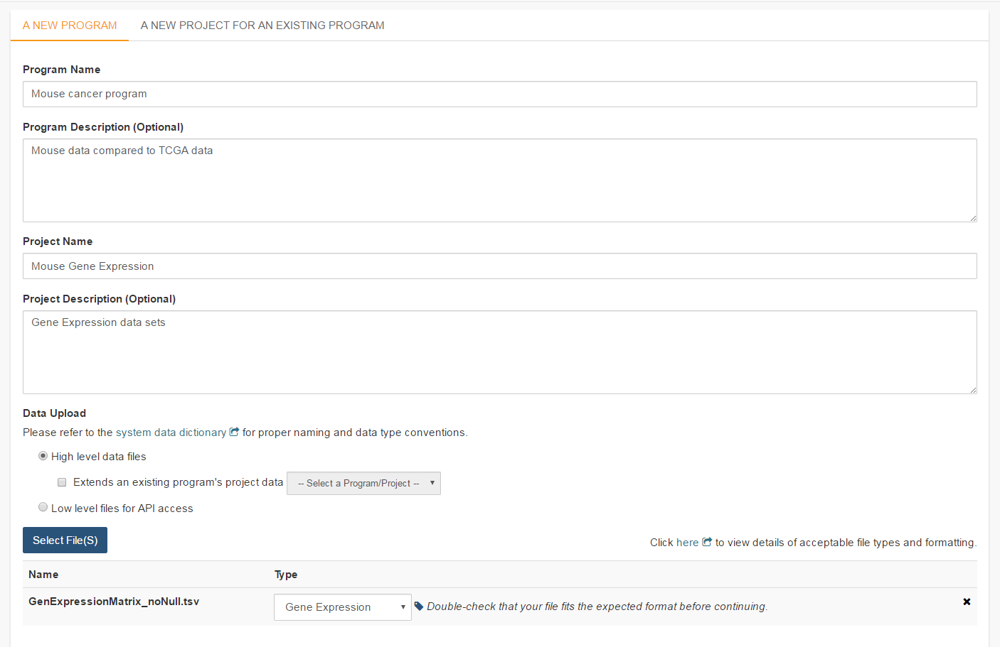

********************
Program Data Upload
********************
Uploading your own data is a way of creating custom groupings of the samples and/or cases that you are interested in analyzing further with the data that is already preexisting in our system or tools that we have on the system. You may frequently re-use the data that was uploaded in multiple analyses. Creating a “Program” allows you to do this. If you have any existing Programs with data uploaded, they will appear here for you to view, edit and share (see below for details).

Files and File Formats
######################

  .. _page:

The Program Data Upload uses a number of pre-defined file formats to get data into the system and make it available for use.  The **Other/Generic** file format is the most flexible.  This format assumes that the first row of the file contains the column headers and all subsequent rows contain data.  The remaining file formats are all matrix formats where the first column (or columns in some data types) contain identifiers like gene or miRNA name, the first row contains sample identifiers and the "cells" contain the actual data values.  Examples of the accepted matrix format files are shown below:

**NOTE:** For the matrix files, the text case matters for the required columns (lower case is different from upper case).  In addition, the ISB-CGC system will not validate any identifiers such as barcodes or gene names.  It is up to the user to make sure that uploaded data is correctly identified.

* DNA Methylation

  This is a simple matrix file.  The first column should have the header **Probe_ID**.  Sample barcodes should be the headers for all remaining columns.

  +-----------+-----------+----------+----------+
  | Probe_ID  | Barcode 1 | Barcode 2| Barcode N|
  +===========+===========+==========+==========+
  |Probe ID 1 | Value 1   | Value 2  | Value N  |
  +-----------+-----------+----------+----------+
  |Probe ID 2 | Value 1   | Value 2  | Value N  |
  +-----------+-----------+----------+----------+
  |Probe ID N | Value 1   | Value 2  | Value N  |
  +-----------+-----------+----------+----------+

* Gene Expression

  The Gene Expression matrix file has two required columns:
  
  * **Name**: This is the accession number for the gene 
  * **Description**: This is the gene symbol for the gene

  +------------+-------------+----------+-----------+-----------+
  | Name       | Description | Barcode 1| Barcode 2 |Barcode N  |
  +============+=============+==========+===========+===========+
  |Accession 1 | Gene name 1 |  Value 1 | Value 2   | Value N   |
  +------------+-------------+----------+-----------+-----------+
  |Accession 2 | Gene name 3 |  Value 1 | Value 2   | Value N   |
  +------------+-------------+----------+-----------+-----------+
  |Accession N | Gene name N |  Value 1 | Value 2   | Value N   |
  +------------+-------------+----------+-----------+-----------+

* microRNA

  There is one required and one optional column for microRNA:
  
  * **miRNA_ID** is required and is generally the ID for the miRNA_ID
  * **miRNA_name** is optional and can be used to provide alternative names for the miRNA.  If not present, the BigQuery data table will have **null** in this column
  
  +------------+-------------+----------+-----------+-----------+
  | miRNA_ID   | miRNA_name  | Barcode 1| Barcode 2 |Barcode N  |
  +============+=============+==========+===========+===========+
  |miRNA ID 1  | Alt name 1  |  Value 1 | Value 2   | Value N   |
  +------------+-------------+----------+-----------+-----------+
  |miRNA ID 2  | Alt name 2  |  Value 1 | Value 2   | Value N   |
  +------------+-------------+----------+-----------+-----------+
  |miRNA ID N  | Alt name N  |  Value 1 | Value 2   | Value N   |
  +------------+-------------+----------+-----------+-----------+

* Protein Expression

  Protein Expression has three required columns:
  
  * **Protein_Name**: This is the name or symbol for the protein
  * **Gene_Name**: This is the name of the gene associated with the protein
  * **Gene_Id**: This is the accession number for the gene
  
  +--------------+-------------+-----------+-----------+-----------+-----------+
  | Protein_name |  Gene_Name  | Gene_Id   | Barcode 1 |Barcode 2  |Barcode N  |
  +==============+=============+===========+===========+===========+===========+
  | Protein 1    | Gene Name 1 | Gene ID 1 | Value 1   | Value 2   | Value N   |
  +--------------+-------------+-----------+-----------+-----------+-----------+
  | Protein 2    | Gene Name 2 | Gene ID 2 | Value 1   | Value 2   | Value N   |
  +--------------+-------------+-----------+-----------+-----------+-----------+
  | Protein 3    | Gene Name 3 | Gene ID 3 | Value 1   | Value 2   | Value N   |
  +--------------+-------------+-----------+-----------+-----------+-----------+

* Other/Generic

Files in Other/Generic format are not matrix files, but rather have the data in columns.  The order of the columns is very flexible, and the upload interface will allow users to define what kind of data is in each of the columns.  The only requirement is that one, and only one, of the columns should be sample barcodes.  In addition, all rows must have the same number of columns.  Any completely blank columns will be flagged and should be removed.  Any columns containing blank entries will have *null* used for the blanks in the BigQuery data table.

**NOTE:** Currently, each Sample Barcode can only be represented once in a file.  Files with the same barcode on multiple rows will cause a failure.  If you have multiple data values for a single barcode (like gene expression values for multiple genes) you will either have to create a matrix file or upload multiple files to Other/Generic.

Creating and Saving a New Program
#################################
To create a new program from Your Dashboard, if you do not have a program created, click on the “Upload Program Data” link in the “Saved Programs” panel at the bottom of the page. This will take you to the Data Upload page.

If you already have Programs created, they will be listed in the “Saved Programs” panel. Click on the “Saved Programs” link in that panel and this will take you to a page that displays the details of your existing Programss. Alternatively, to go directly to a given Program, click on its name and you will be taken to the program details page of that program.

Registering Cloud Storage Buckets and BigQuery Datasets - a pre-requisite for using your own data in ISB-CGC
==============================================================================================================

.. _registered:

You will need to have a BigQuery Dataset and a Google Cloud Storage bucket registered to your Google Cloud Project through the Google Project details page in the UI. (Please note: the names of the buckets and datasets are case sensitive.)

**How To Register Buckets and Datasets**

Once you have created a bucket and a dataset in the Google Cloud Console of your Google Cloud Project, you will need to register them with your project name using the Webapp.  

**Step 1**: Click on your user icon in the upper right.

.. image:: Register_Step_1.png

**Step 2**: Click on "View Registered Google Cloud Projects"

.. image:: Register_Step_2.png

**Step 3**: Click on the project you wish to use.  If you have not registered a project, follow the instructions `here`_.

.. _here: http://isb-cancer-genomics-cloud.readthedocs.io/en/latest/sections/webapp/Gaining-Access-To-TCGA-Contolled-Access-Data.html#requirements-for-registering-a-google-cloud-project-service-account

.. image:: Register_Step_3.png

**Step 4**: Use the "Register Cloud Storage Bucket" or "Register BigQuery Dataset" links to add buckets and datasets as needed

.. image:: Register_Step_4.png

Data Upload Page
================

A New Program
-------------
To start an entirely new program, users should click on the **Upload Program Data** link on the front page of the Webapp (*Your Dashboard*).  This will bring up a form where a new program can be defined.  Users should fill out the required fields and any optional fields that would be helpful.  Clicking on **Select File(S)** button will bring up a dialog to select the file with data. 

**NOTE:** You can upload multiple files in a single step.  The **Type** drop-down should be used to indicate what data type the file represents.  If the data type is one of the choices besides **Other**, the file will have to conform to the specifications listed at the top of this page_.  For a more complete description of the options on this page, see the `Data Upload Page Components`_ section.

**Project description and file selection**

Clicking on the **Next** button brings up a form where users will select which bucket and BigQuery dataset the file upload should use.  These buckets and datasets were registered_ according to the process above.  The **Platform** and **Pipeline** fields can contain any useful description a user wishes to provide.

.. image:: Mouse_bucket_and_dataset.png

Lastly, the user should click on the **Upload Data** button to start the process.  Users will first see a page with a message indicating their data is being processed.  Refresh the screen occasionally until either the final page is displayed or an error is shown indicating a problem with loading the file. Your data is being loaded into the BigQuery table you specified earlier for this data set.

.. image:: Mouse_processing.PNG

Correcting Data Uploaded As Other
---------------------------------
If your data does not fit into any of the existing pre-defined matrix formats, the *Other* data type will allow users to upload data that is in a tabular format.  In this format, the first row of the file is assumed to be the description of each of the columns and all subsequent rows are assumed to be data.  The system will attempt to define what kind of data are in each column, however this process may not always be correct and users must review the column data type assignments before proceeding.

In the example shown below, the automated process has identified two columns as potentially containing Sample Barcodes and has further misidentified a column containing decimal data (numeric float values) as containing categorical (text) data.  The user will need to correct both instances so there is only one Sample Barcode column and define the expression data as decimal.

.. image:: OtherExample.PNG

A New Project For An Existing Program
------------------------------------
Adding a new project to an existing program follows the same steps as creating a new program.  However, instead of filling out the new program information fields, users should click on the **A New Project For An Existing Program** tab and select an existing program from the drop-down menu.  All other steps for describing and uploading the file will remain the same.

  .. image:: MouseExisting.PNG

Data Upload Page Components
=============================
This section describes the features found on the Data Upload page.

System Data Dictionary Link
---------------------------
This link goes to the System Data Dictionary which is a comprehensive list of all clinical data fields and possible values.  This dictionary can be helpful in aligning metadata from the imported program to ISB-CGC data fields.

High Level Data Files
---------------------
High level data files usually represent some level of data analysis as opposed to raw files.  High level files can be used in Workbooks and visualized alongside ISB-CGC data.

Low Level Files for API Access
-------------------------------
Files uploaded as low-level files for API access will not be usable in the Webapp, but rather will appear in the user's Google Storage Bucket.  This feature is intended for files like BAM or VCF files that contain more raw data.

File Type
----------
This is the data type that the uploaded file represents.  Currently the allowed data types are:

* Gene Expression
* miRNA Expression
* Protein Expression
* Methylation
* Other

File Format Requirements
-------------------------
All files must be tab delimited and meet the formatting requirements described in `Files and File Formats`_.

