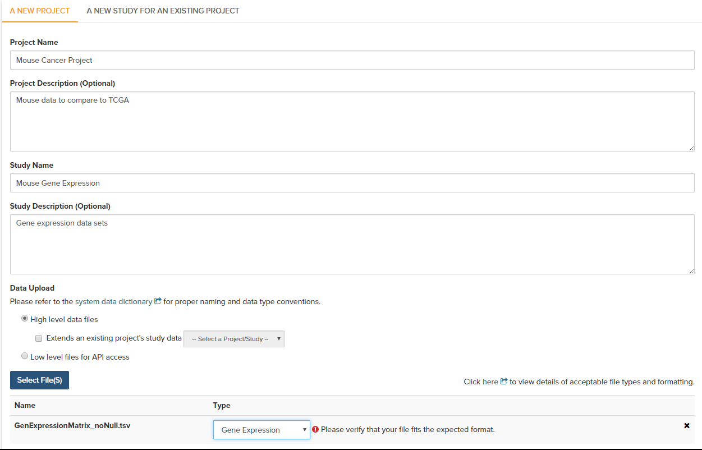
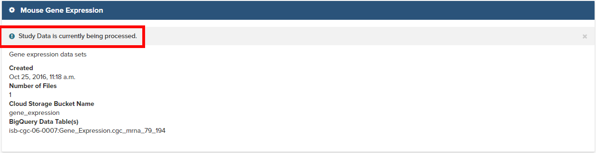
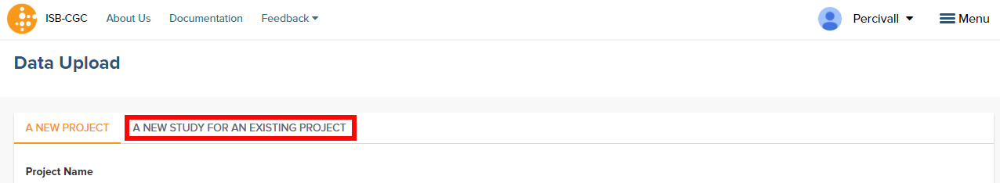

********************
Project Data Upload
********************
Uploading your own data is a way of creating custom groupings of the samples and/or participants that you are interested in analyzing further with the data that is already preexisting in our system. You may frequently re-use the data that was uploaded in multiple analyses. Creating a “Project” allows you to do this. If you have any existing Projects with data uploaded, they will appear here for you to view, edit and share (see below for details).

Files and File Formats
######################

.. _page:

The Project Data Upload uses a number of pre-defined file formats to get data into the system and available for use.  The **Other/Generic** file format is the most flexible.  This format assumes that the first row of the file contains the column headers and all subsequent rows contain data.  The remaining file formats are all matrix formats where the first column (or columns in some data types) contain identifiers like gene or miRNA name, the first row contains sample identifiers and the "cells" contain the actual data values.  Examples of the accepted matrix format files is shown below:

Note that for the matrix files, the text case matters for the required columns.  In addition, the ISB-CGC system will not validate any identifiers such as barcodes or gene names.  It is up to the user to make sure that uploaded data is correctly identified.

* DNA Methylation

  This is a simple matrix file.  The first column should have the header **Probe_ID**.  Sample barcodes should be the headers for all remaining columns.

  +-----------+-----------+----------+----------+
  | Probe_ID  | Barcode 1 | Barcode 2| Barcode N|
  +===========+===========+==========+==========+
  |Probe ID 1 | Value 1   | Value 2  | Value N  |
  +-----------+-----------+----------+----------+
  |Probe ID 2 | Value 1   | Value 2  | Value N  |
  +-----------+-----------+----------+----------+
  |Probe ID N | Value 1   | Value 2  | Value N  |
  +-----------+-----------+----------+----------+

* Gene Expression

  The Gene Expression matrix file has two required column:
  
  * **Name**: This is the accession number for the gene 
  * **Description**: This is the gene symbol for the gene

  +------------+-------------+----------+-----------+-----------+
  | Name       | Description | Barcode 1| Barcode 2 |Barcode N  |
  +============+=============+==========+===========+===========+
  |Accession 1 | Gene name 1 |  Value 1 | Value 2   | Value N   |
  +------------+-------------+----------+-----------+-----------+
  |Accession 2 | Gene name 3 |  Value 1 | Value 2   | Value N   |
  +------------+-------------+----------+-----------+-----------+
  |Accession N | Gene name N |  Value 1 | Value 2   | Value N   |
  +------------+-------------+----------+-----------+-----------+

* microRNA

  There is one required and one optional column for micorRNA:
  
  * **miRNA_ID** is required and is generally the ID for the miRNA_ID
  * **miRNA_name** is optional and can be used to provide alternative names for the miRNA.  If not present, the database will have **null** in this column
  
  +------------+-------------+----------+-----------+-----------+
  | miRNA_ID   | miRNA_name  | Barcode 1| Barcode 2 |Barcode N  |
  +============+=============+==========+===========+===========+
  |miRNA ID 1  | Alt name 1  |  Value 1 | Value 2   | Value N   |
  +------------+-------------+----------+-----------+-----------+
  |miRNA ID 2  | Alt name 2  |  Value 1 | Value 2   | Value N   |
  +------------+-------------+----------+-----------+-----------+
  |miRNA ID N  | Alt name N  |  Value 1 | Value 2   | Value N   |
  +------------+-------------+----------+-----------+-----------+

* Protein Expression

  Protein Expression has three required columns:
  
  * **Protein_Name**: This is the name or symbol for the protein
  * **Gene_Name**: This is the name of the gene assocaited wtih the protein
  * **Gene_Id**: This is the accession number for the gene
  
  +--------------+-------------+-----------+-----------+-----------+-----------+
  | Protein_name |  Gene_Name  | Gene_ID   | Barcode 1 |Barcode 2  |Barcode N  |
  +==============+=============+===========+===========+===========+===========+
  | Protein 1    | Gene Name 1 | Gene ID 1 | Value 1   | Value 2   | Value N   |
  +--------------+-------------+-----------+-----------+-----------+-----------+
  | Protein 2    | Gene Name 2 | Gene ID 2 | Value 1   | Value 2   | Value N   |
  +--------------+-------------+-----------+-----------+-----------+-----------+
  | Protein 3    | Gene Name 3 | Gene ID 3 | Value 1   | Value 2   | Value N   |
  +--------------+-------------+-----------+-----------+-----------+-----------+

* Other/Generic

Files in Other/Generic format are not matrix files, but rather have the data in columns.  The order of the columns is very flexible, and the upload interface will allow users to define what kind of data is in each of the columns.  The only requirement is that one, and only one, of the columns should be sample barcodes.  In addition, all rows must have the same number of columns.  Any completely blank columns will be flagged and should be removed.  Any columns containing blank entries will have *null* used for the blanks.

**NOTE:** Currently, each Sample Barcode can only be represented once in a file.  Files with the same barcode on multiple rows will cause a failure.  If you have multiple data values for a single barcode (like gene expression values for mutliple genes) you will either have to create a matrix file or upload multiple files to Other/Generic.

Creating and Saving a New Project
#################################
To create a new project from Your Dashboard, if you do not have a project created, click on the “Upload Project Data” link in the “Saved Projects” panel at the bottom of the page. This will take you to the Data Upload page.

If you already have Projects created, they will be listed in the “Saved Projects” panel. Click on the “Saved Projects” link in that panel and this will take you to a page that displays the details of your existing Projects. Alternatively, to go directly to a given Project, click on its name and you will be taken to the project details page of that project.

To create a new project, use the “Upload Project Data” link.

Registering Cloud Storage Buckets and BigQuery Datasets
=======================================================

.. _registered:

You will need to have a BigQuery Dataset and a Google Cloud Storage bucket registered to you Google Cloud Project through the Google Project details page in the UI. (Please note: the names of the buckets and datasets are case sensitive.)

**How To Register Buckets and Datasets**
Once you have created a bucket and a dataset in the Google Cloud Console, you will need to register them with your project using the Webapp.  

**Step 1**: Click on your user icon in the upper right.

.. image:: Register_Step_1.png

**Step 2**: Click on "View Registered Google Cloud Projects"

.. image:: Register_Step_2.png

**Step 3**: Click on the project you wish to use

.. image:: Register_Step_3.png

**Step 4**: Use the "Register Cloud Storage Bucket" or "Register BigQuery Dataset" links to add buckets and datasets as needed

.. image:: Register_Step_4.png

Data Upload Page
================

A New Project
-------------
To start an entirely new project, users should click on the **Upload Project Data** link on the front page of the Webapp.  This will bring up a form where a new project can be defined.  Users should fill out the required fields and any optional fields that would be helpful.  Clicking on **Select File(S)** button will bring up a dialog to select the file with data.  Note that you can upload multiple files in a single step.  The **Type** drop-down should be used to indicated what data type the file represents.  If the data type is one of the choices besides **Other**, the file will have to conform to the specifications listed at the top of this page_.

**Project description and file selection**

Clicking on the **Next** button brings up a form where users will select which bucket and BigQuery dataset the file upload should use.  These buckets and datasets were registered_ according to the proccess above.  The **Platform** and **Pipleline** fields can contain any useful description a user wishes to provide.

.. image:: Mouse_bucket_and_dataset.png

Lastly, user should click on the **Upload Data** button to start the process.  Users will first see a page with a message indicating their data is being processed.  Refresh the screen occaisionally until either the final page is displayed or an error is shown indicating a problem with loading the file.

A New Study For An Existing Project
------------------------------------
Adding a new study to an existing project follows the same steps as creating a new project.  However, instead of filling out the new project information fields, users should click on the **A New Project For An Existing Study** tab and select an existing project from the drop-down menu.  All other steps for describing and uploading the file will remain the same.

Data Upload
-----------

System Data Dictionary Link
^^^^^^^^^^^^^^^^^^^^^^^^^^^^

High Level Data Files
^^^^^^^^^^^^^^^^^^^^^

Low Level Files for API Access
^^^^^^^^^^^^^^^^^^^^^^^^^^^^^^

Data Types That Can Be Uploaded
-----------------------------------------

* DNA Methylation
* Gene Expression
* microRNA
* Protein Expression
* Other

Review Files
-------------

On this page you select which Google Cloud Bucket and BigQuery dataset you upload your data to. 
The System Data Dictionary link can be found on this page as well for reference. 
You must label a platform and pipeline for the file(s) you choose to upload.  Selecting the Upload Data button will submit your files for processing. 

(Please Note: If you select Other for Data Type you will need to label each column of file with the proper type i.e Integer, decimal, categorical.)

Projects Page
=============

Saved Projects
--------------
Drop Down Arrow
^^^^^^^^^^^^^^^
* Edit
* Delete
* New Workbook

Plus Symbol(+)
^^^^^^^^^^^^^^^

Public Projects
----------------

Drop down Arrow
^^^^^^^^^^^^^^^^
* New Workbook

Plus Symbol(+)
^^^^^^^^^^^^^^

Upload Data Button
--------------------

Existing Projects Details Page
==============================

New Workbook Button
--------------------

Upload Data Button
-------------------

Edit Details Button
---------------------

Delete Button
-------------

Share Button
-------------

Studies Description Panel(s)
----------------------------

This section displays the description of the study added to the project if one was provided. The date of creation, number of files,and which cloud storage buckets and BigQuery Dataset each is associated to. The settings gear to the left of the Study name allows you to create a new Workbook with only the one study or delete the study. 
