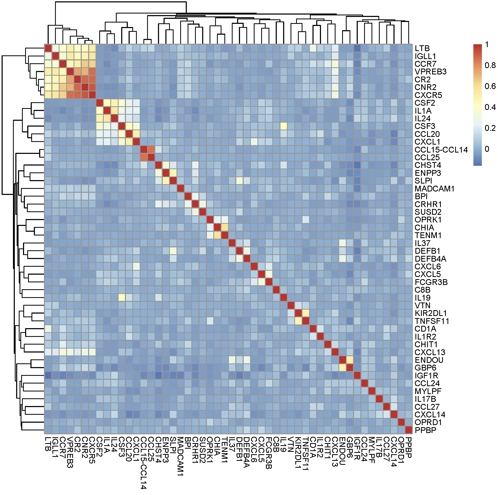

****************************
Analysis with R and BigQuery
****************************

Computing on the BigQuery side; making correlation matrices
###########################################################

In this example, we are going to compute a correlation matrix (or co-expression)
entirely on the BigQuery side. Since we're in R-land, we can easily visualize
the matrix as a heatmap. We are also going to query for gene lists using
Gene Ontology annotation, and access the End Points API to get a list of samples.

Loading libraries
=================

.. code-block:: r

    require(bigrquery, quietly = TRUE) || install.packages('bigrquery',verbose = FALSE)
    require(httpuv, quietly = TRUE) || install.packages('httpuv',verbose=FALSE)
    require(ggplot2, quietly = TRUE) || install.packages('ggplot2',verbose = FALSE)

The ISB-CGC R Examples Package
==============================

The collection of examples can be found at:
https://github.com/isb-cgc/examples-R

To install the package, we use the devtools package.

.. code-block:: r

    require(devtools, quietly = TRUE) || install.packages('devtools',verbose = FALSE)
    require(ISBCGCExamples, quietly = TRUE) || install_github("isb-cgc/examples-R", build_vignettes=F)
    

If you needed to install any of the packages, remember, you still need to import it!

Your project ID
===============

You will be using your own project ID. At certain points in the code, it will
be necessary to complete the code.

.. code-block:: r

    my_cloud_project   = "your_project_id"
    tcga_data_set      = "TCGA_hg38_data_v0"

First query
===========

Now let's see if things are working.

.. code-block:: r

    bigrquery::list_tables("isb-cgc", tcga_data_set)

Using BigQuery to compute correlation matrices
==============================================

A correlation matrix using gene expression is going to take the correlation
between each pair of genes. Usually, this matrix can then be clustered to
discover gene modules.

In this query, we're going to use the BigQuery CORR function (one of the
many built-in mathematical functions) to compute a Pearson's correlation.

You can find all the function information at:
https://cloud.google.com/bigquery/query-reference

The general structure of the query is going to be:

.. code-block:: sql

    select
      genes and correlation
    from
      subtable with genes and samples of interest
    joined to
      same subtable of genes and samples

.. code-block:: r

    q <- "
	SELECT
	  a.gene_name AS gene1,
	  b.gene_name AS gene2,
	  CORR(a.HTSeq__FPKM,
	    b.HTSeq__FPKM) AS corr
	FROM (
	  SELECT
	    *
	  FROM
	    `isb-cgc.TCGA_hg38_data_v0.RNAseq_Gene_Expression`
	  WHERE
	    gene_name IN ('APLN',
	      'CCL26',
	      'IL19',
	      'IL37')
	    AND project_short_name = 'TCGA-COAD' ) AS a
	JOIN (
	  SELECT
	    *
	  FROM
	    `isb-cgc.TCGA_hg38_data_v0.RNAseq_Gene_Expression`
	  WHERE
	    gene_name IN ('APLN',
	      'CCL26',
	      'IL19',
	      'IL37')
	    AND project_short_name = 'TCGA-COAD' ) AS b
	ON
	  a.aliquot_barcode = b.aliquot_barcode
	GROUP BY
	  gene1,
	  gene2"

    corrs <- query_exec(q,my_cloud_project, use_legacy_sql=F)

    # transform to a matrix, and give it rownames
    library(tidyr)
    corrmat <- spread(corrs, gene1, corr)
    rownames(corrmat) <- corrmat$gene2

    # visualize the matrix
    library(pheatmap)
    pheatmap(corrmat[,-1])

It's easy to make a couple changes to this query, enabling a correlation
matrix *per* study. Try it!

Getting a list of high variance genes
=====================================

When we make queries from R, the results come back as a data.frame.
Let's use the GO annotation, and get a list of genes that are
related to the immune system. The GO Annotation table is found
in the genome_reference data set, and GO:0006955 references the
immune response.

.. code-block:: r

    q <- "
    SELECT 
      DB_Object_Symbol
    FROM
      `isb-cgc.genome_reference.GO_Annotations`
    WHERE
      GO_ID = 'GO:0006955'"

    query_exec(q, my_cloud_project, use_legacy_sql=F)

That query returns 472 genes. But let's suppose we want the top 50 by
coefficient of variance.

.. code-block:: r

    q <- "
	SELECT
	  gene_name,
	  STDDEV(HTSeq__FPKM+1) / AVG(HTSeq__FPKM+1) AS cv
	FROM
	  `isb-cgc.TCGA_hg38_data_v0.RNAseq_Gene_Expression`
	WHERE
	  gene_name IN (
	  SELECT
	    DB_Object_Symbol
	  FROM
	    `isb-cgc.genome_reference.GO_Annotations`
	  WHERE
	    GO_ID = 'GO:0006955')
	  AND project_short_name = 'TCGA-BRCA'
	GROUP BY
	  gene_name
	ORDER BY
	  cv DESC
	LIMIT
	  50"

    result <- query_exec(q, my_cloud_project, use_legacy_sql=F)
    genes <- result$gene_name

Now we have a list of genes that we can carry to further analysis.

Getting a list of samples from the endpoints
============================================

From R we can access the cohorts we created using the web app. To do that we
use the End Points API. The API is essentially a set of html requests. A
small wrapper is included as part of the isb-cgc examples-R package.

https://github.com/isb-cgc/examples-R/blob/master/inst/doc/Working_With_Barcode_Lists.md

To get started, import the ISBCGCExamples library.

.. code-block:: r

    library(ISBCGCExamples)

The first step is creating a token. This token contains your authentication status,
and lets the service know about what information is available to you.

.. code-block:: r

    my_token <- isb_init()

To get a listing of the previously created cohorts, we can use the list_cohorts
function that takes a token, and returns a list with items including
'count', 'items', 'kind', and 'etag'. The count shows the number of saved
cohorts and the items contains information about the cohorts.

.. code-block:: r

    # first get a list of my saved cohorts.
    my_cohorts <- list_cohorts(my_token)
    names(my_cohorts)

    # to get the names of my saved cohorts
    lapply(my_cohorts$items, function(x) x$name)

Now that we have the cohort IDs, we can collect the various barcodes contained
in the cohort. These include patient barcodes, sample barcodes, and 
aliquot barcodes. To do this, we can use the barcodes_from_cohort function.

HERE I'm using my cohort #4, but change this to whatever you have saved.

.. code-block:: r

    # get the cohort IDs
    my_cohort_id <- lapply(my_cohorts$items, function(x) x$id)[[4]]

    # then ping the endpoints with the cohort ID
    my_barcodes <- cohort_barcodes(my_cohort_id, my_token)
    names(my_barcodes)

The object returned from barcodes_from_cohort is again a list, this time with
elements 'cohort_id', 'sample_count', 'case_count', 'cases', and 'samples'.
The cases and samples elements are also lists, but lists of cases or sample barcodes.

.. code-block:: r

    samples <- unlist(my_barcodes$samples)
    # 836 samples

Programmatically constructing Queries
=====================================

One of the great things about working in a scripting environment, is that our
analysis -- the queries -- we write, can be constructed programmatically.
That makes it easy to apply the same structured queries to many questions.
But also we can incorporate long lists of samples or genes into a query.

.. code-block:: r

    #function for formatting lists..
    sqf <- function(x) {
        paste("('",paste(x, collapse="','"),"')", sep="")
    }

    q <- paste("
    SELECT
      a.gene_name as gene1,
      b.gene_name as gene2,
      CORR(a.HTSeq__FPKM, b.HTSeq__FPKM) as corr
    FROM (
      SELECT
        *
      FROM
        `isb-cgc.TCGA_hg38_data_v0.RNAseq_Gene_Expression`
      WHERE
        gene_name IN ", sqf(genes), "
        AND sample_barcode IN ", sqf(samples), "
      ) AS a
    JOIN (
      SELECT
        *
      FROM
        `isb-cgc.TCGA_hg38_data_v0.RNAseq_Gene_Expression`
      WHERE
        gene_name IN ", sqf(genes), "
        AND sample_barcode IN ", sqf(samples), "
      ) AS b
    ON
      a.aliquot_barcode = b.aliquot_barcode
    GROUP BY
      gene1,
      gene2", sep=" ")

    corrs <- query_exec(q,my_cloud_project, use_legacy_sql=F)

    # transform to a matrix, and give it rownames
    library(tidyr)
    corrmat <- spread(corrs, gene1, corr)
    rownames(corrmat) <- corrmat$gene2

    # visualize the matrix
    library(pheatmap)
    pheatmap(corrmat[,-1])

From Lists to Matrices
======================

Transform gexp_affected_genes_df into a gexp-by-samples feature matrix

.. code-block:: r

	gexp_fm = tidyr::spread(gexp_affected_genes,HGNC_gene_symbol,normalized_count)

	gexp_fm[1:5,1:5]
